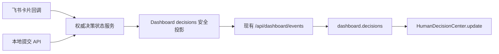

## Context

VO 当前已有工具栏固定入口、带徽标的 SMS 收件箱、窄屏列表/详情切换、通用确认弹窗，以及一条集中式 Dashboard SSE。新能力需要在控制面板内提供“人工决策中枢”，但第一阶段只验收 UI：实现可复用组件和可删除的静态展览宿主，不接入正式页面、飞书回调、权威状态存储或生产 SSE。

组件最终会同时承接任务、会议和聊天产生的决策。飞书与本地 UI 必须投影同一份权威状态；飞书完成处理后，VO 不刷新页面即可把事项从待决策迁移到历史。因此第一阶段的组件输入必须先固定为与未来 `dashboard.decisions` 相同的版本化快照契约，展览页只负责模拟该契约。

代码约束如下：新能力放入聚焦的新文件；不向大型 `app/index.html`、`app/style.css` 或 `app/server.py` 添加第一阶段业务逻辑；不引入前端框架或第三方运行时；动态内容只通过 DOM 安全文本 API 渲染；组件不自行发起网络连接。

## Goals / Non-Goals

**Goals:**

- 提供可嵌入 VO 控制面板的独立人工决策中枢组件，覆盖固定入口、徽标、待处理列表、完整决策卡和已处理历史。
- 固定版本化完整快照、组件生命周期和提交回调契约，使本期模拟数据与后续 Dashboard SSE 使用同一输入形状。
- 支持普通事项静默更新徽标，高风险或临近超时事项自动打开；支持桌面双栏和窄屏列表/详情切换。
- 正确协调飞书外部处理结果：清理本地草稿、阻止重复提交、迁移历史，并拒绝重复或过期快照回滚状态。
- 使用零第三方依赖的契约测试保护业务规则、DOM 行为、无网络副作用及临时宿主可删除性。

**Non-Goals:**

- 第一阶段不修改正式控制面板入口或 `dashboard-realtime.js`，不新增生产 `decisions` SSE 分区。
- 不实现权威决策状态服务、数据库模型、飞书卡片发送/回调、通知机器人降级、提醒调度或 VO 执行器。
- 不创建正式决策 Skill，也不接入任务、会议和聊天的运行链路。
- 不在组件中实现 fetch、EventSource、WebSocket、轮询、localStorage 或示例数据。
- 不提供搜索、统计、批量操作、拖拽或可调整尺寸的管理后台能力。

## Decisions

### 1. 使用无框架 UMD 组件并由宿主注入 DOM 节点

新增 `app/human-decision-center.js`，导出 `HumanDecisionCenter`、`sortPendingDecisions`、`shouldAutoOpenDecision` 和 `resolveDecisionAnswer`。浏览器通过 `window.HumanDecisionCenter` 使用，Node 契约测试通过 CommonJS 加载，沿用 `app/project-orchestration-task-dialog.js` 的双用边界。

组件入口为：

```js
const center = HumanDecisionCenter.mount(
  { toggle, panel },
  snapshot,
  { onSubmit, onRequestChange }
);

center.update(nextSnapshot);
center.open({ decisionId, reason });
center.close();
center.selectDecision(decisionId);
center.destroy();
```

`toggle` 是控制面板工具栏已有位置提供的按钮，`panel` 是宿主提供的内容容器。组件只管理其作用域内生成的 DOM、事件监听器和临时交互状态，不查找或改写页面其他区域。

选择该方式是为了直接复用仓库现有运行环境和测试惯例，并让展览宿主删除后组件仍可挂载到正式控制面板。替代方案是 Web Component，但它会引入 Shadow DOM 样式和现有全局令牌传递问题；React/Vue 会增加项目当前不需要的运行时和构建链。

### 2. 使用版本化完整快照作为唯一渲染输入

组件输入采用完整快照而不是 UI 内部维护业务实体：

```js
{
  revision: 12,
  generatedAt: "2026-08-03T03:00:00+08:00",
  decisions: [
    {
      id: "decision-001",
      status: "pending" | "resolved" | "executing" | "locked",
      source: { type: "task" | "meeting" | "chat", id: "...", label: "..." },
      title: "...",
      situation: "...",
      reason: "...",
      risk: "low" | "medium" | "high",
      urgency: "normal" | "urgent" | "critical",
      deadlineAt: "...",
      timeoutConsequence: "...",
      options: [{ id: "A", label: "...", impact: "..." }],
      recommendation: { optionId: "B", reason: "..." },
      reminder: { count: 1, limit: 3, nextAt: "..." },
      taskDetail: { summary: "...", completed: [], blocked: "...", context: "...", nextStep: "..." },
      resolution: null | { answer: "...", optionId: "B" | null, channel: "feishu" | "local" | "timeout", resolvedAt: "...", nextAction: "..." },
      execution: { started: false, impact: "..." }
    }
  ]
}
```

`revision` MUST 是非负安全整数并单调递增。`update(snapshot)` 的协调顺序为：

1. 校验快照最小结构；无效快照保持当前可用 UI，并报告开发期错误。
2. 若 `revision <= snapshotRevision`，忽略更新。
3. 记录旧快照中的待处理 ID、选中 ID和关注状态，再原子替换 `decisionSnapshot` 与 `snapshotRevision`。
4. 删除新快照中已不存在或已处理事项的本地草稿。
5. 若选中事项仍存在则保持选择；若它刚被外部处理则保持选中但切到只读结果；若已不存在则选择排序后的首项。
6. 重新计算待处理徽标、列表、历史和详情。
7. 只对本 revision 新增或首次进入高风险/临近超时关注态的事项执行一次自动打开。

完整快照便于在断线重连和 fetch 降级后恢复一致状态，也避免客户端拼接差量造成飞书处理结果丢失。替代方案是组件消费逐条事件，但它需要维护事件顺序、删除语义和重放逻辑，会把实时基础设施职责泄漏进 UI。

### 3. 业务快照与本地交互状态分离

`decisionSnapshot` 是只读业务投影；`centerState` 只保存 UI 状态：

```js
{
  isOpen,
  activeTab: "pending" | "history",
  selectedDecisionId,
  narrowView: "list" | "detail",
  expandedDetailIds: Set,
  drafts: Map<decisionId, { optionId, customAnswer }>,
  lastAutoOpenedRevision
}
```

选项与自由输入仅存于 `drafts`，自由输入 trim 后非空时由 `resolveDecisionAnswer` 优先采用；否则采用 A-D 选择。提交只调用 `callbacks.onSubmit({ decisionId, answer, optionId })`，不乐观地篡改业务快照。宿主随后提供新 revision 才完成队列迁移，这使本地提交与飞书提交遵循相同状态路径。

当新快照将事项变为已处理时，无论当前草稿内容为何都立即删除草稿并禁用提交。这样权威状态胜过尚未提交的本地输入。替代方案是保留冲突草稿并提示合并，但单个决策只能有一个最终结果，合并会制造第二状态权威。

### 4. 关注排序和自动打开使用纯函数

`sortPendingDecisions` 按以下稳定优先级排序：高风险、临近超时、紧急程度、deadline、创建时间、原始顺序。`shouldAutoOpenDecision(previous, next, now)` 仅在事项是高风险，或进入预先计算好的 `nearTimeout: true` 状态时返回 true。组件不自行运行时钟；临近超时由快照生产方决定，展览页通过状态切换模拟。

普通新增只改变徽标和列表，不抢占用户焦点。高风险或临近超时自动打开后，用户仍可关闭；相同 revision 的重复渲染不得再次打开。

把规则写成纯函数便于 Node 测试，并防止渲染代码隐藏时间与优先级副作用。替代方案是在 DOM 渲染中直接判断，但难以覆盖状态转换和重复事件。

### 5. 渲染结构复用现有控制面板产品范式，不复制 SMS 代码

`app/human-decision-center.css` 使用 `.human-decision-center*` 作用域，读取现有 `--ui-*` 与 `--gold` 令牌。桌面为左侧待处理/历史列表与右侧详情；900px 以下为单视图，选择事项后进入详情并提供返回列表。

入口徽标沿用现有工具栏数量徽标视觉语言，超过 99 显示 `99+`。风险、推荐项、提醒进度和只读结果通过语义化标签、`aria-live`、`aria-selected`、`aria-expanded` 与焦点回退表达。动态值使用 `textContent`、属性白名单和显式节点创建，不拼接不可信 HTML。

执行已开始后的变更请求调用现有 `window.VODialogs.showConfirm`，组件只在确认后触发 `onRequestChange`。如果宿主未提供该能力，则明确禁用该操作并展示原因，不降级为浏览器原生 `confirm`。

直接复用 SMS DOM/CSS 会耦合联系人、消息、拖拽和缩放状态，因此只复用信息架构、设计令牌和响应式原则。

### 6. 临时展览宿主模拟控制面板和 `dashboard.decisions`

`app/human-decision-center-prototype.html` 只包含模拟 VO 工具栏、状态切换控件、入口按钮和 panel host，并加载组件 CSS/JS。`app/human-decision-center-prototype.js` 保存 `DEMO_SNAPSHOTS` 与：

```js
const simulatedDashboard = { decisions: DEMO_SNAPSHOTS.default };
```

状态选择器每次提供更高 revision 的完整快照。专门的“飞书已处理”场景将当前待处理事项改为 `resolved`、填写 `resolution.channel = "feishu"`，再调用 `center.update(simulatedDashboard.decisions)`，用于验收无刷新迁移。

本地提交回调也只生成新的示例快照，不写服务器或 localStorage。HTML 与示例控制器可在 UI 确认后整体删除，不影响组件、CSS 或测试。

### 7. 正式实时接入复用 Dashboard SSE，但作为下一阶段独立修改

后续接入链路固定为：



`build_dashboard_snapshot` 后续增加 `decisions` 分区，`diff_dashboard_events` 自然按签名产生 `decisions` 事件；现有 `DashboardRealtimeStream`、`/api/dashboard/events`、断线重连和 fetch 降级保持唯一实时通道。`dashboard-realtime.js` 只增加状态字段、`applyDecisions` 和事件监听，再通过薄适配调用组件。

本阶段不写这段生产代码，因为权威存储、回调幂等、鉴权与提交 API 尚需下一阶段规格化。提前只固定快照边界，可以避免 UI 返工而不越过用户要求的阶段门禁。

### 8. 契约测试覆盖状态转换而非像素实现

`tests/check_human_decision_center.mjs` 使用 Node `assert`、`fs`、`createRequire` 和 Fake DOM，覆盖：

- 排序、关注转换、答案优先级、超时风险分支等纯规则。
- mount/update/open/close/select/destroy 生命周期与监听器清理。
- 普通新增只更新徽标；高风险和临近超时只自动打开一次。
- 飞书处理的新 revision 迁移历史、清理草稿、禁用提交；重复/旧 revision 不回滚。
- 锁定变更复用确认框、提交回调参数及文本安全渲染。
- CSS 作用域、响应式规则、展览宿主独立性和源码中不存在网络/持久化能力。

像素、颜色和真实视口体验由浏览器打开临时 HTML 验收。第一阶段不引入 jsdom 或 Playwright，以保持改动小且遵循现有测试方式。

### 9. 聊天决策使用持久化续跑状态机

聊天 Agent 创建决策时以当前 `conversationId` 作为 `source.id`，服务端仅从可信 `X-VO-Agent-Id` 绑定 Agent。`HumanDecisionStore` 在决策内部保存不公开的 `_continuation`，状态为 `waiting -> queued -> running -> completed|retry_wait|failed|uncertain`；claim token、租约和状态转换都在 Store 锁内原子落盘。

新增 `app/services/human_decision_chat_continuation.py` 负责领取、XML 续跑 Prompt、投递结果分类及状态提交，并通过显式注入复用 `VOAgentCommunicationService`。动态答案与原情景放入 formatter 的不可信数据边界；投递使用稳定来源消息 ID `human-decision-resume:{decisionId}`、原 Agent 和原 conversation。明确发生在 Provider 调用前的临时失败最多重试三次；可能已投递却失去结果时进入 `uncertain`，防止重复副作用。

`HumanDecisionWorkflow` 在本地、飞书或低风险超时首次形成有效终态后只负责排队和触发，不等待 Provider 返回；现有周期处理同时恢复 `queued/retry_wait`。本期不恢复会议或项目生命周期，也不新增前端实时连接。

## Risks / Trade-offs

- [完整快照随事项数量增长] → 第一阶段为轻量收件箱且不提供全量长期归档；后续安全投影可限制历史窗口，但不能破坏当前选中项与 revision 语义。
- [高风险更新反复抢焦点] → 只对新事项或首次进入关注态且 revision 更新时自动打开，并记录 `lastAutoOpenedRevision`。
- [飞书结果覆盖用户未提交草稿] → 权威结果必须获胜；清除草稿并在只读结果中明确显示处理入口和时间，避免误以为本地输入已提交。
- [前端 revision 与后端重启策略不一致] → 正式阶段要求权威状态服务生成持久、单调安全整数；本期示例严格遵守同一规则。
- [UMD + 手工 DOM 增加渲染代码量] → 将纯规则、状态协调、节点构建和事件处理拆成小函数，并通过作用域 CSS 与契约测试限制复杂度。
- [第一阶段模拟 SSE 可能被误认为真实联通] → 展览页显著标识“模拟状态”，不创建网络连接；规格和验收文案明确生产接线在 UI 确认之后。
- [临时 HTML 删除时误删组件] → 宿主仅限两个带 `-prototype` 的文件，组件、样式和测试名称不带 prototype；测试验证宿主与组件边界。

## Migration Plan

1. 第一阶段新增组件、作用域样式、临时展览宿主和契约测试，不修改生产入口与 API。
2. 本地打开展览页，依次验收普通、高风险、临近超时、提醒、超时、提交、锁定、历史和飞书已处理模拟状态。
3. 用户确认 UI 后，删除 `app/human-decision-center-prototype.html` 与 `app/human-decision-center-prototype.js`，保留组件、样式和测试。
4. 下一阶段另行设计权威决策状态服务、飞书回调幂等、提交 API、Dashboard `decisions` 投影及正式控制面板挂载。
5. 正式接入采用可回滚的独立接线：移除控制面板入口和 `decisions` 分区即可回退，现有 Dashboard SSE 其他分区不受影响。

## Open Questions

无。第一阶段 UI 范围、快照契约、飞书处理协调语义和后续 SSE 复用边界均已确认；权威存储与飞书回调细节留待 UI 验收后的下一阶段规格化。
