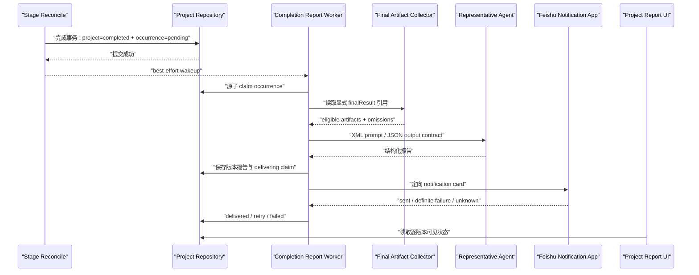

## Context

项目的 stage pipeline 在最终 stage 达到 accepted terminal outcome 时，会在 `project_stage_dispatch.reconcile_stage` 的仓储事务内将项目写为 `completed`、生成当前 `orchestration.finalReport`，然后在事务外调用一个完成通知 callback。现有 callback 直接发送一张只含任务数量的飞书卡片，并以“项目 ID + 已完成任务数”去重。它不具备项目级开关、重跑版本、持久化投递状态、Agent 整理、自动恢复或手动重发能力。

项目任务已经通过 `task.finalResult.markdownPath` 与 `task.finalResult.artifactRefs` 标识最终产物，`services.artifacts.read_artifact` 已提供 workspace 边界、关联性、符号链接和单文件大小校验。现有宽泛 artifact source 聚合还会包含 changed files、测试证据和执行 evidence，不能作为本功能的输入源。

当前部署有两个飞书机器人职责：聊天机器人承载用户对话，通知机器人负责主动通知。已确认本功能复用 `feishu.chatApp.representativeAgentId` 指向的主 Agent 生成报告内容，但不通过聊天机器人发送；投递严格使用 notification app。当前产品按单用户部署处理，通知配置中的定向 `receiveId` 就是项目 owner 的飞书映射；`project.createdBy` 仍是审计 actor，不直接当作飞书 ID。

本变更跨越项目模型、完成状态机、Agent 调用、安全产物收集、飞书投递、后台恢复与项目 UI，必须保持以下仓库约束：新业务逻辑放入聚焦模块；`app/server.py` 只做依赖装配和薄路由；所有 provider-visible prompt 使用共享 `services.bridge_input_output_formatting` 生成 XML 外层结构，动态产物只能进入转义后的不可信数据边界。

## Goals / Non-Goals

**Goals:**

- 为每个项目持久化默认开启的飞书完成报告偏好，并在首次成功完成后锁定。
- 为每个不同的成功 completion occurrence 建立一个幂等、版本化、可恢复的报告 outbox 记录。
- 只读取显式最终产物，交给确认的主 Agent 生成结构化、人类可读的报告。
- 只通过 notification app 的定向接收人发送，并展示 pending、delivered、failed 状态。
- 支持有限自动重试、进程重启恢复和失败后的 owner 手动重发，同时不改变项目完成状态。
- 保持现有失败/取消通知行为和其他飞书通知行为不变。

**Non-Goals:**

- 不建设多租户用户鉴权或 `createdBy -> Feishu open_id` 身份目录。
- 不允许项目参与者、群聊、备用接收人或 chat bot conversation 接收完成报告。
- 不发送日志、中间文件、review prompt、隐藏推理、凭据或任意 workspace 文件。
- 不用本功能替换现有项目本地 `PROJECT_FINAL_REPORT.md` 或失败通知。
- 不承诺外部飞书 API 层面的 exactly-once；对结果不确定的发送不会自动重试，以避免自动重复。

## Decisions

### 1. 项目偏好使用显式布尔字段，锁定事实复用首次完成时间

在 canonical project base 增加：

```text
feishuCompletionReportEnabled: bool  # 缺省 True
```

所有创建路径继续统一经过 `materialize_project_base`。`project_store` 将该字段作为普通 frontmatter scalar 写入和读取；历史项目缺少字段时按 `True` 解释，并在下一次正常写入时物化。不会为历史已完成项目补发报告，因为只有新的完成 transition 才会创建 occurrence。

偏好是否锁定由 `orchestration.completedAt` 是否存在决定。现有完成逻辑用 `state.get("completedAt") or timestamp` 保留首次成功完成时间，重跑时不会清除它，因此不增加第二份锁定状态。`update_project` 在请求改变偏好且 `completedAt` 已存在时返回 `409` 和稳定错误码 `feishu_completion_report_preference_locked`；相同值的幂等更新可成功但不写活动记录。

选择该方案而不是个人默认值，是为了符合项目级选择语义。选择复用 `completedAt` 而不是新增 `lockedAt`，是为了避免两个可能漂移的首次完成事实。

### 2. 成功完成事务内建立 occurrence，事务外处理副作用

新增 `app/services/project_completion_reporting.py`，提供不依赖 HTTP、Provider 或飞书的纯状态函数：

```text
stage_completion_report_occurrence(project, run_id, completed_at) -> StageResult
claim_due_completion_report(project, now, token) -> ClaimResult
finish_generation(...)
finish_delivery(...)
fail_attempt(...)
request_manual_resend(...)
```

在 `reconcile_stage` 最终完成分支中，`ensure_project_final_report` 之后、仓储事务提交之前调用 `stage_completion_report_occurrence`。该函数无论开关是否开启都依赖既有 `completedAt` 锁定偏好；仅在开关开启时向 `orchestration.completionReports` 追加 occurrence。

Occurrence 的稳定 ID 为 `stage-run:<final-stage-run-id>`。stage reservation 在没有显式 `runId` 时分配新 UUID，stage 间推进也分配新 run ID；同一 run 的 reconcile 重入会命中已有 occurrence，新一次 rerun 的最终 stage run 则得到新 occurrence。版本号为项目现有最大 `version + 1`，从 1 开始。即使调用方重复提交同一个显式 run ID，也被视为同一 occurrence，不产生重复报告。

完成 callback 不再直接发送基础卡片，只负责唤醒 worker。即使 callback 抛错，pending occurrence 已经随项目完成状态持久化，周期恢复器仍会处理。

选择 transactional outbox 而不是“完成后直接发送”，是为了消除项目已完成但进程在投递前退出造成的永久丢失，也保证外部故障不回滚项目完成。

### 3. 每个 occurrence 保存独立状态与有界 attempt 审计

`orchestration.completionReports` 的每个元素采用以下版本化结构：

```json
{
  "schemaVersion": 1,
  "occurrenceId": "stage-run:<run-id>",
  "version": 1,
  "runId": "<run-id>",
  "completedAt": "<ISO-8601>",
  "state": "pending|generating|ready|delivering|retry|delivered|failed",
  "visibleStatus": "pending|delivered|failed",
  "reportingAgentId": "<agent-id>",
  "reportMarkdownPath": "",
  "reportDigest": "",
  "attemptCount": 0,
  "nextAttemptAt": null,
  "lastError": null,
  "messageId": null,
  "claim": null,
  "attempts": []
}
```

内部状态映射到三个产品可见状态：`pending/generating/ready/delivering/retry -> pending`，`delivered -> delivered`，`failed -> failed`。每个 occurrence 的 attempt 审计只保留最近 20 条；报告 occurrence 元数据不因重跑而覆盖，以支持版本比较。claim 包含随机 token、claim 时间和过期时间，所有 claim/finish 操作通过 `ProjectRepository.update` 原子校验 token。

生成后的 Markdown 写入：

```text
.vo/project-completion-reports/v<version>-<safe-occurrence-id>/FEISHU_COMPLETION_REPORT.md
```

项目只保存安全相对路径和 SHA-256 digest，不把原始产物、完整 prompt、接收人 ID 或凭据复制进 frontmatter。新增聚焦的 artifact writer 负责安全路径和原子写入，不扩大 `ProjectStore._write_project` 的业务职责。

### 4. 最终产物收集采用显式 allowlist 和两层上限

新增 `app/services/project_completion_report_artifacts.py`。输入源只包括：

- 每个任务 `finalResult.markdownPath`
- 每个任务 `finalResult.artifactRefs`
- 当前项目 `orchestration.finalReport.markdownPath`

收集器先规范化、去重，再通过注入的 `read_artifact(..., allow_text=True, associated_only=True)` 读取。路径 basename 命中 `.env`、credential、secret、token、private-key 等敏感名称时直接拒绝；允许内联的文本扩展名为 `.md`、`.txt`、`.json`、`.yaml`、`.yml`、`.csv`、`.html`。文本在进入 prompt 前必须经过独立的敏感值 scrubber，复用并扩展现有飞书 redaction 规则，将 authorization、API key、access/refresh token、password、secret、webhook 和私钥块替换为 `[REDACTED]`。其他最终产物只保留经过安全校验的引用、类型和大小，不读取二进制内容。

边界固定为：最多 20 个引用、单个文本沿用 artifact service 的 512 KiB 硬上限、送入 Agent 的总文本最多 512 KiB。超过总上限时按“项目报告、stage 顺序、task 顺序、引用顺序”稳定截取，并形成 omission 记录。缺失、不可读、越界、超限或不支持内联的产物都会生成用户可理解的 omission，但绝不回退读取 logs、evidence、changedFiles 或 workspace 扫描结果。

选择显式 finalResult 引用而不是现有宽泛 artifact context，是为了让“最终产物”成为可审计的安全边界。收集器的测试必须断言敏感路径不被读取、敏感正文在 Agent port 收到前已经完成替换。

### 5. 报告 Agent 接口独立于聊天会话语义

新增 `app/services/project_completion_report_prompt.py` 与 `app/services/project_completion_report_generation.py`。生成服务通过注入端口：

```text
generate(agent_id, prompt, conversation_id, timeout_seconds) -> ProviderResult
```

调用现有 Agent/provider adapter，但不走 `_dispatch_representative_agent_message`，因为该函数把来源标记为 Feishu human message，会制造错误的会话审计。`app/server.py` 只负责将已有 agent lookup/provider ports 注入新服务。

Agent ID 读取已确认的 `VO_CONFIG.feishu.chatApp.representativeAgentId`。这里仅复用 Agent 身份；不创建 chat bot 消息、不使用 chat ID，也不回复 chat conversation。缺少 Agent、Agent 不可用或返回空结果都进入报告 occurrence 的可见失败/重试流程。

Provider prompt 必须由 `services.bridge_input_output_formatting.render_document` 生成 XML 外层，包含独立的 `<role>`、`<task>`、`<rules>`、`<context>`、`<final_artifacts>` 与最终 `<output>`。所有项目字段、产物文本和 omission 都使用 `untrusted_text` 或不可信 JSON data boundary；不得拼接裸 XML。`output` 要求严格 JSON：

```json
{
  "goal": "...",
  "conclusion": "...",
  "keyResults": ["..."],
  "nonFatalExceptions": ["..."],
  "followUps": ["..."],
  "importantArtifacts": [{"label": "...", "path": "...", "note": "..."}]
}
```

生成服务解析并限制字段数量与长度，拒绝额外的内部推理字段；再由确定性 renderer 添加项目名、项目 ID、`vN`、完成时间和 run marker，生成本地 Markdown 与飞书 card intent。Agent 不负责选择接收人或调用飞书。

选择结构化 JSON 再确定性渲染，而不是让 Agent 直接输出任意卡片，是为了稳定满足必需章节、长度和安全约束。

### 6. 飞书投递只允许 notification app 的定向接收人

新增 `app/services/project_completion_report_delivery.py`。它将结构化报告映射为 notification card：summary 放目标与结论，details 依次承载版本、关键结果、非致命异常、后续建议和重要产物，所有字段遵守现有卡片的 1800/500/20 项上限，并提供“打开项目报告” jump action。

目的地 resolver 在单用户部署中只读取：

```text
notifications.feishuAppId
notifications.feishuAppSecret
notifications.feishuReceiveIdType
notifications.feishuReceiveId
```

它不读取 `project.createdBy` 作为飞书 ID，不使用 chat app，不接受请求体覆盖 recipient。任一 notification app 定向字段缺失时，occurrence 进入 `failed`，错误码为 `project_owner_feishu_destination_missing`，且不回退到 webhook、群或其他接收人。

为保持其他通知兼容，给 `send_feishu_notification` 增加默认值为 `True` 的薄参数 `allow_webhook`；本服务调用时传 `False`。其他调用点行为不变。

### 7. 自动恢复使用持久化 worker，未知发送结果不自动重试

新增 `ProjectCompletionReportWorker`，由现有 `services.periodic_timer.PeriodicTimer` 每 15 秒触发一次，并在服务启动时立即扫描。每批最多 claim 10 个 due occurrence，避免长时间占用单轮 worker。

每次自动周期最多 3 次，退避为立即、30 秒、120 秒。以下失败可自动重试：Agent busy/timeout 前未产生结果、无效/空 Agent 输出、明确的飞书 429/5xx/连接前失败。配置错误、目的地缺失、安全校验失败和不合规产物是永久失败。

为降低自动重复发送风险：

- `delivering` claim 必须在调用飞书前持久化。
- 飞书明确返回成功时写 `delivered + messageId`。
- 飞书明确返回未发送的可恢复错误时可进入 `retry`。
- 网络超时、进程在 send 后崩溃、或 stale `delivering` 等“可能已经发送但结果未知”的情况写 `failed`，错误码 `delivery_outcome_unknown`，不自动重试；owner 可查看原因后手动重发。

这牺牲了结果未知时的自动恢复率，以满足“自动处理不得重复投递”的优先级。没有飞书侧幂等 API 时，无法同时严格保证不丢失和 exactly-once。

### 8. 手动重发针对同一 occurrence/version，并重新开启一个有界周期

新增 endpoint：

```text
POST /api/projects/{projectId}/completion-reports/{occurrenceId}/resend
```

仅 `failed` occurrence 可重发。当前单用户部署沿用项目 API 的既有访问边界作为 owner 授权；服务层仍要求调用者传入经过 handler 认证的 `owner_authorized=True`，避免未来接入身份后绕过授权。请求不会接受 Agent、版本、内容或 recipient 覆盖。

手动重发保持相同 `occurrenceId`、`version` 和已生成报告。如果失败发生在生成前，则重新生成；如果已有 digest 匹配的报告，则直接重试投递。它增加一条 `mode=manual` attempt 并开启新的最多 3 次自动周期，但永远不修改项目 status。并发重发通过 claim/revision 返回 `409 completion_report_already_processing`。

选择“同版本重新尝试”而不是创建新版本，是因为版本代表项目成功执行 occurrence，而不是投递次数。

### 9. 项目 API/UI 展示偏好和逐版本投递状态

项目创建/编辑弹窗新增“项目完成后发送飞书汇报”复选框：创建默认勾选；编辑页在 `orchestration.completedAt` 存在时显示已锁定并禁用。后端仍执行最终校验。

`GET /api/projects/{id}/report` 增加经过清理的 `completionReports` 列表，只返回 occurrence/version、完成时间、可见状态、报告路径、最后错误的用户可读文本、attempt 次数和可否重发；不返回 claim token、Provider 原始响应、prompt、接收人或凭据。

报告页按版本倒序展示：

- pending：正在生成或发送
- delivered：已通过飞书通知机器人送达，并展示送达时间
- failed：展示可理解原因与“重新发送”按钮

现有本地 final report 展示保持不变。新增 API 业务逻辑放在聚焦 handler/service 模块，server 仅注册路由；若 `server_services/projects.py` 仍是活动 handler，则只加薄委托，避免复制两份实现。

## Runtime Flow



## Risks / Trade-offs

- [飞书发送成功后进程崩溃，无法确认结果] → stale `delivering` 标记为 `delivery_outcome_unknown`，不自动重发，只允许 owner 明确手动重发。
- [全局 receiveId 不是真正的多用户映射] → 本期明确限定单用户部署；报告接口不允许 recipient 覆盖，后续多用户能力必须引入独立身份 resolver。
- [复用 chatApp representativeAgentId 容易被误解为 chat bot 发送] → 生成端口不创建聊天消息；审计中分别记录 `reportingAgentId` 和 `deliveryChannel=feishu-notification-app`。
- [最终产物包含 prompt injection 或秘密] → 动态内容放入 XML 不可信边界、只读显式 final refs、拒绝敏感文件名、沿用安全 artifact reader、限制类型/数量/大小，并在调用 Agent 前完成敏感文本 scrub；测试直接观察 Agent port 输入而不是只检查最终卡片。
- [大项目的 occurrence history 增大 frontmatter] → attempt history 每 occurrence 限 20 条，报告正文写 sidecar；仅保留小型 occurrence 元数据。若未来运行数显著增长，再迁移为独立索引文件。
- [worker 多实例并发] → repository 原子 claim + token + expiry；只有 token 持有者能 finish。未知 delivery 不回到自动队列。
- [历史项目缺少偏好字段] → read/materialization 缺省为开启，但不回溯创建 intent；首次新 completion 才触发。
- [Agent 返回格式漂移] → 严格 JSON schema、字段长度/数量校验和确定性 renderer；无效结果属于生成失败并进入有限重试。
- [旧式 webhook 部署无法定向 owner] → 本功能可见失败且不回退；其他通知仍保持 webhook 兼容。

## Migration Plan

1. 先部署兼容读取：缺少 `feishuCompletionReportEnabled` 时按 `True`，缺少 `completionReports` 时按空列表。
2. 部署模型、store、纯状态函数和测试，但 worker 暂不启动；现有项目数据无需离线迁移。
3. 部署最终产物收集、XML prompt、Agent generation、notification-only delivery 和报告 sidecar writer。
4. 部署 report API、resend endpoint 和 UI。
5. 启动周期 worker；启动扫描只处理已存在的 pending/retry occurrence，不为历史 completed 项目创建 occurrence。
6. 通过配置检查确认 representative Agent 与 notification app 定向 receiveId 可用，再进行一个测试项目的端到端送达验证。

回滚时先停 worker，再回滚应用。旧代码会忽略 `orchestration.completionReports` 的业务含义但会随 `orchestration_json` 保留它；不会影响项目完成状态。新顶层偏好字段可能在旧版本重写 project frontmatter 时丢失，重新升级后会按缺省开启恢复，因此回滚期间不得把“缺失”解释成关闭。已发送消息不可撤回，pending/failed occurrence 留在项目数据中供重新升级后恢复。

## Open Questions

无阻塞问题。以下参数作为首版固定常量并通过测试锁定：worker 15 秒轮询、每批 10 条、每个自动周期最多 3 次、退避 0/30/120 秒、最多 20 个最终产物引用、Agent 总文本 512 KiB、每个 occurrence 最多保留 20 条 attempt 审计。后续如需配置化，应作为独立需求评审。

### 10. 通知机器人确定失败时降级到固定主人聊天

验收阶段确认通知机器人可能未配置，因此完成报告投递在原 notification-app 调用之后增加一个最小条件分支：notification app 成功则直接结束；`network_error`、`timeout`、`delivery_timeout` 等结果未知时保持 `delivery_outcome_unknown` 且不降级；其余明确失败调用聊天机器人，目标只允许 `feishu.chatApp.completionReportFallbackChatId` 配置的固定主人会话。

降级逻辑放在新的聚焦 service 中，`server.py` 只注入聊天发送 port、固定 chat ID 和 audit port。成功 occurrence 保存 `deliveryChannel=notification_app|chat_app_fallback`，API/UI 只公开这个受限枚举。每次主通道失败、降级决定和聊天结果写入独立 JSONL 审计，字段仅包含 project/occurrence ID、状态、错误码、最终通道和 message ID；正文、prompt、产物与凭据不得写入。
