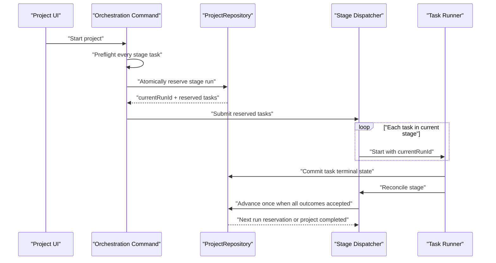
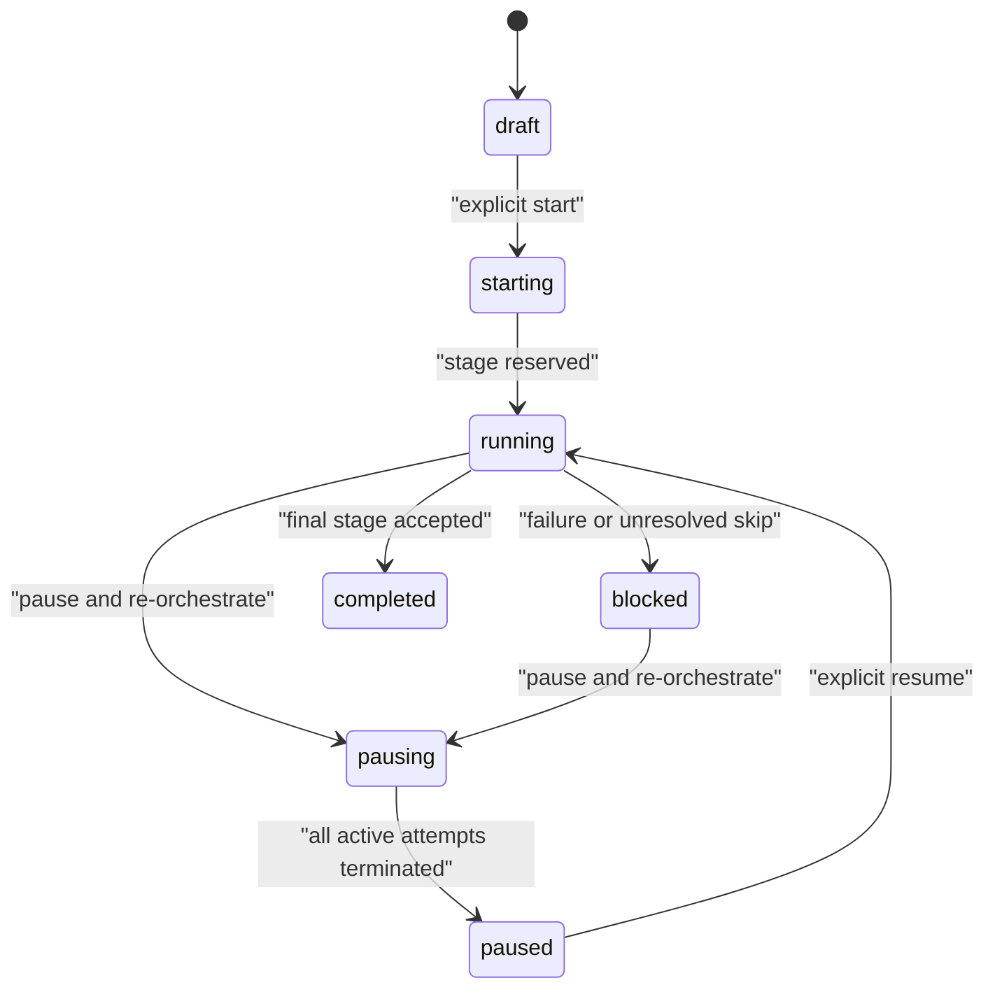

## Context

Project Execution currently models one active task per project. `projectExecutionStartMode` selects `single` or `continuous`, `executionPolicy.maxActiveTasks` defaults to `1`, and the project persists singular authorities such as `activeTaskId` and `activeAgent`. `executionOrder` is unique and project-wide; `project_execution_ordering.py` fills gaps and `project_commands.update_task` rejects duplicates. Completion and acceptance callbacks reactivate `projectExecutionFlowActive` and ask the project-start path to select the next single task.

The approved product contract instead requires one mandatory stage pipeline for every new project, parallel tasks within a stage, no single-task/manual progression mode, auto-advancement, controlled pauses and skips, and immutable completed history. This changes creation, persistence, execution, recovery, scheduling, realtime projection, workflow-chat scope, and the project UI.

The canonical project store is not JSONL. `MarkdownProjectStore` persists each project in `projects-md/<project>/project.md` and each task in a Markdown file with structured frontmatter. `projects.json` is a legacy import source. The new-project marker must therefore be written to the canonical Markdown frontmatter; introducing a separate JSONL authority would violate the repository's single-source design.

Relevant overlapping OpenSpec work includes `unify-project-materialization`, `add-agent-managed-vo-projects`, and `add-project-workflow-chat-realtime-stream`. Their project-creation and workflow-chat changes must be reconciled before implementation tasks touching the same modules are committed.

## Goals / Non-Goals

**Goals:**

- Make stage orchestration the only task-eligibility authority for marked new projects.
- Preserve task-level attempts, review, acceptance, workspace safety, provider cancellation, and audit history while enabling multiple active tasks in one stage.
- Remove stored and runtime authorities that exist only for single/free/manual progression.
- Keep project mutation atomic and stage dispatch idempotent under concurrent completions, retries, restarts, and duplicate requests.
- Render the orchestration modal to the approved Figma geometry and typography, with the confirmed removal of the save action.
- Keep legacy entry points thin by placing validation, state transitions, dispatch coordination, and persistence decisions in focused modules.

**Non-Goals:**

- Migrating or continuing to execute unmarked legacy projects.
- Supporting arbitrary dependency graphs, optional orchestration, free execution, or per-task manual start for marked projects.
- Reusing `executionOrder` as both display order and stage membership.
- Reworking provider protocols, task review semantics, or workspace safety beyond changes required for stage concurrency.
- Adding a new JSONL project store or a second orchestration state authority.

## Decisions

### 1. Persist an explicit execution model and one nested orchestration state

Every creation path will persist:

```text
executionModel: stage_pipeline_v1
orchestration:
  schemaVersion: 1
  revision: <integer>
  state: draft | starting | running | pausing | paused | blocked | completed
  currentStage: <integer|null>
  currentRunId: <string|null>
  pauseReason: <string|null>
  startedAt: <timestamp|null>
  completedAt: <timestamp|null>
```

Each task will persist:

```text
executionStage: <positive integer>
stageRunId: <string|null>
orchestrationSkip:
  status: none | requested | approved | rejected
  requestedBy: <actor|null>
  requestedAt: <timestamp|null>
  reason: <string|null>
  decidedBy: <actor|null>
  decidedAt: <timestamp|null>
```

Task `executionState`, `activeAttemptId`, `attempts`, review results, acceptance history, and evidence remain task-level truths. Active tasks are derived from task states and attempts; the project does not persist a second list or singular active-task pointer.

`executionModel` is the internal marker requested by the product. It is stored in project frontmatter because that is the canonical store. `orchestration` and `orchestrationSkip` use the store's existing complex-JSON frontmatter mechanism.

Alternative considered: add a Boolean flag beside the old fields. Rejected because it would leave two competing state machines and allow hidden fallback to old execution behavior.

### 2. Remove obsolete single-task authorities instead of translating them

For marked new projects, remove these persisted or client-facing authorities:

| Remove | Replacement |
|---|---|
| `projectExecutionStartMode` | `executionModel` plus explicit project start |
| `projectExecutionFlowActive` | `orchestration.state == running` |
| `projectExecutionFlowStopReason` | `orchestration.pauseReason` |
| `workflowActive` | derived from orchestration and task attempt states |
| `workflowPhase` | `orchestration.state` plus task `executionState` |
| `activeTaskId` | derived `activeTaskIds` projection |
| `activeAgent` | derived task/attempt actor projections |
| `autoMode` | no replacement |
| `executionPolicy.maxActiveTasks` | stage membership plus global bounded dispatch capacity |
| task `executionOrder` | task `executionStage` |

`projectExecutionEnabled` remains because it describes whether automated Project Execution and workspace/provider prerequisites are enabled; it is not a progression-mode selector. Board-column `order` remains presentation ordering and is not used for pipeline eligibility.

All materializers, template snapshots, direct/browser/recurring creation, serializers, repair functions, commands, HTTP payloads, realtime projections, workflow chat, frontend state, localization, and tests must be migrated in the same change. There will be no compatibility adapter that recreates single-task behavior.

Alternative considered: continue writing old fields as computed mirrors. Rejected because mirrors become writable authorities through legacy callers and make removal unverifiable.

### 3. Put orchestration behavior in new focused domain modules

Create focused modules rather than expanding `app/server.py` or `app/projects.js`:

- `app/services/project_orchestration.py`: pure model validation, contiguous-stage normalization, eligibility, terminal-outcome evaluation, state transitions, and projection helpers.
- `app/services/project_orchestration_commands.py`: repository-backed auto-save, start preparation, pause, resume, skip request/decision, and permission decisions.
- `app/services/project_stage_dispatch.py`: stage-run reservation, bounded submission, completion reconciliation, idempotent advancement, and startup recovery.
- `app/project-orchestration.js`: modal lifecycle, drag/drop, optimistic revision handling, fit-canvas behavior, and API adapter.
- `app/project-orchestration.css`: Figma-derived visual rules scoped to the modal.

`app/server.py` will only register routes, construct dependencies, and delegate. `app/projects.js` will expose the entry button and refresh hooks but will not own orchestration state transitions or modal rendering.

Alternative considered: extend `execution_lifecycle.start_project` and the existing order editor in place. Rejected because those paths assume one active task, unique order numbers, and selectable start modes throughout.

### 4. Auto-save one complete stage assignment with optimistic concurrency

Use a dedicated command:

```text
PUT /api/projects/{projectId}/orchestration
{
  revision,
  assignments: [{ taskId, executionStage }]
}
```

The client sends once after a completed drag/drop or task mutation, not during pointer movement. The command atomically validates project editability, task coverage, positive stages, completed-task locks, and contiguous numbering, then persists the normalized full assignment and increments `orchestration.revision`.

A stale revision returns HTTP 409 with the current revision and current normalized assignment. The UI reloads the authoritative pipeline and visibly reports that the edit was not saved. Project start is rejected while the UI has an unresolved save failure.

Task creation inside the modal uses the existing create-task domain command extended to default `executionStage` to `max(existing executionStage) + 1`. Deleting or moving the last task in a stage atomically compacts later unfinished stages.

Alternative considered: patch one task at a time. Rejected because multi-card drag operations and stage compaction would expose invalid intermediate states and multiply full-store writes.

### 5. Reuse the project-start route but replace its mode semantics

Retain `POST /api/projects/{projectId}/project-execution/start` as the explicit project-start action, but remove `mode`, `startMode`, `restartPipeline`, and other mode-selection behavior. Marked projects cannot start through the per-task start route.

Start performs a read-only preflight for every stage-1 task before mutation:

- marker and orchestration revision;
- complete, contiguous task-stage assignment;
- workspace readiness and dirty-workspace confirmation;
- executor and reviewer eligibility;
- absence of active or unresolved attempts;
- authorization.

If any task requires confirmation or fails validation, no stage task is reserved or launched. The response aggregates blockers by task. On success, one atomic update changes the orchestration from `draft` to `starting`, creates a `currentRunId`, and reserves all stage-1 tasks.

Alternative considered: call the existing single-task start endpoint repeatedly. Rejected because it rejects a second active task and would create a partially started stage if a later call fails.

### 6. Reserve a stage atomically, dispatch through a bounded executor, reconcile idempotently

Stage execution follows this sequence:



The reservation writes the same `currentRunId` to the orchestration and every task in the stage. A task start is idempotent on `(projectId, taskId, currentRunId)`; an existing matching active attempt is returned rather than duplicated.

All current-stage tasks are admitted together, satisfying logical parallelism. Physical provider startup uses a shared bounded executor rather than creating one unbounded thread per task. Initial capacity is 8 workers with a queue bounded by the existing maximum of 100 authored tasks; these are process-level safety controls, not user-selectable project progression attributes. A queue rejection marks the affected task blocked with `dispatch_queue_full` and pauses the stage; already submitted tasks remain truthful and later stages remain locked.

Every accepted terminal transition—completion, approved skip, or terminal acceptance task—calls `reconcile_stage(projectId, currentRunId)`. Concurrent callbacks serialize through `ProjectRepository.update`; only the callback that still owns the current run may reserve the next stage. External provider and notification work remains outside the project lock.

Alternative considered: unbounded daemon threads matching current behavior. Rejected because a valid authored project may contain up to 100 initial tasks, making a single stage capable of creating an unsafe burst.

### 7. Separate review completion from stage advancement

Task execution, review, and acceptance continue to own the task's terminal outcome. They no longer toggle project-level flow flags or call "start next task." Instead, terminal callbacks notify the stage dispatcher to reconcile the current run.

`reviewResult.status == skipped` continues to mean independent review was skipped; it MUST NOT be reused as an orchestration task skip. Orchestration skip state lives in `orchestrationSkip` and requires:

1. the task's responsible actor to request it;
2. a management-token-authenticated project owner/manager to approve or reject it;
3. an audit record containing actor, timestamp, task, reason, and decision.

The current application has no general multi-user project-manager RBAC. For this change, browser owner/manager authority maps to the existing management-token-authenticated management surface; Agent requests retain the existing project/actor authorization checks. This does not introduce a new tenant or role system.

### 8. Pause and re-orchestration use a two-phase cancellation barrier

Pause is explicit and confirmed:



Phase 1 atomically sets `state=pausing`, increments the revision, blocks new dispatch/advancement, and snapshots active attempt IDs. Provider cancellations occur outside the project lock. Phase 2 records those attempts as cancelled, returns unfinished tasks to pending, preserves attempt/workspace history, clears their run IDs, and sets `state=paused`.

Completed tasks and completed stage numbers cannot be edited. The paused auto-save command may alter only unfinished tasks and normalizes them into contiguous stages after the last completed stage. Resume repeats full preflight and creates a new run ID; editing alone never resumes execution.

If cancellation partially fails or the process restarts during `pausing`, recovery repeats cancellation/reconciliation idempotently and keeps the project non-dispatchable until every captured attempt is terminal.

### 9. Recovery, schedules, projections, and chat consume the new authority

- Startup recovery scans marked projects in `starting`, `running`, or `pausing`. Reserved tasks without attempts are resubmitted with the same run ID; live attempts are not duplicated; non-resumable attempts block the stage.
- Recurrence and project cron may start a marked project, but task-targeted cron cannot bypass stage eligibility. Later-stage task cron triggers are recorded as skipped.
- Dashboard and project responses derive `activeTaskIds`, `activeTaskCount`, `currentStage`, `orchestrationState`, and `pauseReason`. Singular `activeTaskId`/`activeAgent` fields are removed for this contract.
- Project workflow chat must accept an explicit task scope when multiple tasks are active. The project-level default may select the most recently updated active task only for display, never as execution authority.
- Notifications include project, stage, task, and run IDs so parallel completion and failures are diagnosable.

### 10. Figma is the visual source of truth, with one approved delta

The implementation uses Figma frame `147:2` for the full overlay composition and node `148:3` for modal geometry. Reference dimensions include the 1512×742 viewport, 1220×560 modal, and 1184×350 pipeline canvas. Existing `Press Start 2P` loading is reused; generated code or Tailwind is not copied into the application.

Visual tokens and layout are expressed as scoped CSS variables and semantic classes in `project-orchestration.css`. Cards and parallel groups are data-driven DOM, but their computed dimensions, typography, colors, borders, and spacing must match the reference. The bottom save action is removed, and the remaining footer spacing is adjusted without introducing a replacement start action.

Acceptance uses deterministic fixture data matching the 9-task/5-stage reference plus screenshots at the reference viewport. Interaction tests cover drag/drop, auto-save success/conflict/failure, add-task default stage, fit-canvas, close/reopen persistence, and locked/paused states.

## Risks / Trade-offs

- **[Data-format mismatch] The requested JSONL marker does not match the canonical store.** → Persist `executionModel` in project Markdown frontmatter and document the correction; do not add a parallel JSONL store.
- **[Breaking storage change] Old code cannot safely consume the new orchestration-only shape.** → Require a maintenance-window backup and legacy-data cleanup; rollback restores both prior code and the pre-release project-store backup.
- **[Partial parallel dispatch] One task can fail preflight or queue submission after others are ready.** → Preflight all tasks before reservation; reserve atomically; treat post-reservation submission failure as a blocked stage with truthful per-task state.
- **[Duplicate advancement] Parallel terminal callbacks may race.** → Reconcile under the project lock and require current-run ownership for the one transition that reserves the next stage.
- **[Unbounded resource usage] A stage may contain up to 100 tasks.** → Use a shared 8-worker bounded executor, bounded queue, queue-depth diagnostics, and stage pause on rejection.
- **[Cancellation is not rollback] Terminating a task may leave workspace changes.** → Preserve attempt/workspace history, warn before pause, restart from the existing workspace under current dirty-workspace confirmation rules, and never claim filesystem rollback.
- **[Auto-save conflicts] Multiple clients can overwrite stage assignments.** → Full-assignment writes with optimistic `revision`; stale clients receive 409 and reload.
- **[Authorization ambiguity] The product says owner/manager but the app has no general project RBAC.** → Map browser management to the existing management token and retain Agent project-authorization checks; do not invent a parallel role store.
- **[Overlapping OpenSpec changes] Active project-authoring and workflow-chat work touches the same modules.** → Re-read those changes before each implementation task, preserve their confirmed behavior, and stop for a spec update if contracts conflict.
- **[Visual drift] The reference Figma may change after implementation begins.** → Record the referenced node IDs and acceptance screenshots in evidence; any later design change is a specification change requiring renewed confirmation.

## Migration Plan

1. Produce a read-only preflight report of all canonical project records, marking those without `executionModel: stage_pipeline_v1`; back up the complete status directory.
2. Obtain explicit destructive-action confirmation for the exact legacy project records, then remove them before enabling the new code. No implementation script deletes records implicitly.
3. Land canonical materialization and storage support for `executionModel`, `orchestration`, `executionStage`, run IDs, and skip decisions together with tests for every creation source.
4. Land the orchestration state machine, command boundary, stage dispatcher, task terminal reconciliation, recovery, schedule, projection, and chat updates.
5. Remove old stored fields, request/response fields, frontend mode selectors, task-start controls, compatibility fallbacks, and obsolete tests only after all callers use the new authority.
6. Land the Figma-aligned modal and visual/interaction tests.
7. Deploy backend and frontend together during a maintenance window; run store-invariant validation before accepting project mutations.
8. Smoke-test create → auto-save → explicit start → parallel stage → next stage → final completion, plus failure, skip approval, pause/re-orchestrate, restart recovery, and concurrency scenarios.

Rollback requires stopping the service, restoring the previous code revision, and restoring the pre-release project-store backup. Code-only rollback is not supported after new-shape projects have been written.

## Observability and Verification

- Counters: stage reservations, task submissions, queue rejections, duplicate run suppressions, stage advances, pauses by reason, skip requests/decisions, recovery resubmissions, and auto-save conflicts.
- Timings: stage preflight, reservation commit, queue wait, task attempt duration, stage duration, and project duration.
- Structured audit fields: project ID, task ID, execution stage, run ID, attempt ID, orchestration revision, actor, transition, and reason.
- Alert conditions: queue rejection, project stuck in `starting`/`pausing`, current-stage tasks with mismatched run IDs, later-stage active task, duplicate attempt suppression spikes, and recovery loops.
- Required tests: pure state-machine tables, repository concurrency, duplicate start/terminal callback idempotency, bounded-queue failure, restart recovery, authorization, stale revision, storage round-trip, every materialization source, route contracts, realtime projections, workflow-chat multi-active selection, full regressions, and Figma screenshot/interaction acceptance.

## Open Questions

No product-blocking questions remain. Before implementation begins, the three overlapping active OpenSpec changes must be re-read at task boundaries; any contract conflict discovered there requires updating this change and returning to the affected confirmation gate.
