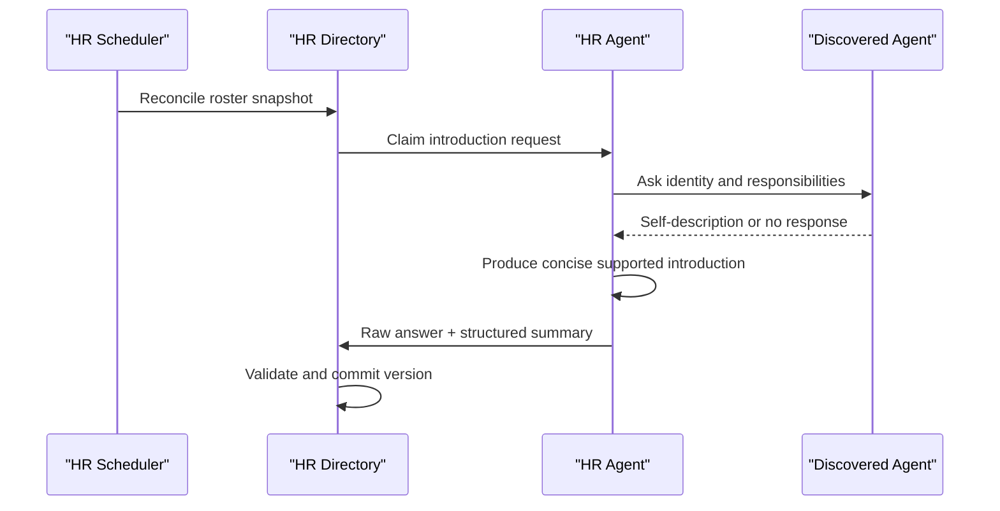
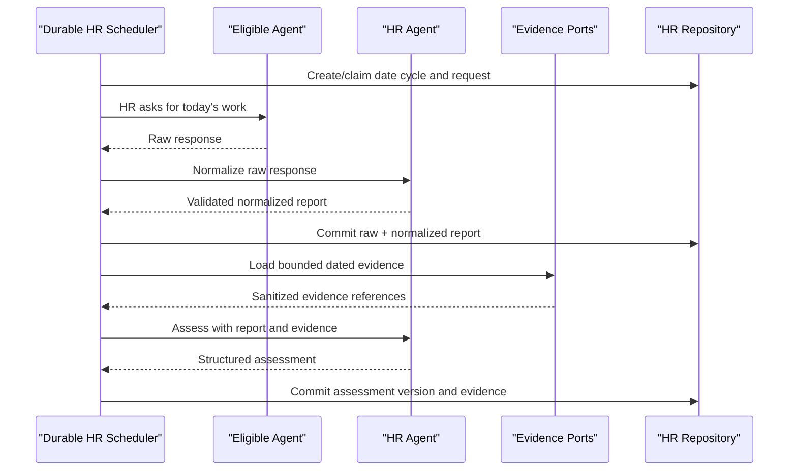

## Context

Virtual Office currently discovers OpenClaw, Hermes, Codex, Claude Code, and synthetic gateway Agents through the roster assembled in `app/server.py`. Archive Room also owns a global OpenClaw archive manager, but its discovery, creation, profile rendering, direct workspace writes, communication-skill synchronization, state persistence, pause/resume, and public projection are implemented as archive-specific functions in the large server entry point.

The repository has already established a better pattern under `app/services/`: domain modules do not import `server.py` or HTTP classes, state transitions are exercised through injected ports, authoritative repositories own persistence, and `OfficeHandler` remains transport wiring. `AGENTS.md` requires every substantial new capability to follow this modular direction.

Human Resources is cross-cutting. It introduces a second global OpenClaw system Agent, a durable Agent directory, one provider-neutral VO built-in skill, scheduled Agent conversations, HR-authored normalization and assessment, evidence reads from project/meeting/artifact/execution domains, sensitive human views, restricted Agent views, access auditing, and a Human Resources tab inside the shared Agent Management UI. The local development environment does not provide the real OpenClaw integration required for final acceptance, so provider boundaries must be deterministic under unit tests and separately verified end to end on a development machine.

Current constraints and reusable foundations include:

- `VO_STATUS_DIR` is the local durable-data root.
- `_gateway_rpc_call`, roster discovery, `_wf_call_agent`, AgentPlatform communication, and managed skill synchronization are existing integration points but remain legacy entry-point functions.
- Archive manager state is already persisted at `archive-room/manager.json`; compatibility requires preserving that path and public behavior during extraction.
- Existing management-token support (`X-VO-Management-Token` and `window.i18n.managementFetch`) can protect full human views and mutations.
- Human Resources Agent reads use the trusted VO-internal interaction boundary: loopback, no browser `Origin`, an HR action header, and a self-declared AI ID that must resolve to an active directory Agent. Access logging is operational and best-effort; it does not claim cryptographic Agent identity attestation.
- The existing browser Agent editor is implemented inside the large `app/game.js`, persists a whole office document, keeps a manual Save button, and exposes legacy mutation routes that are not sufficient for field-level audience authorization, revision checks, or bounded undo.
- The existing originless Agent HR API intentionally rejects browser requests. Therefore a browser must never obtain Agent authority from a query parameter, local storage, a roster selection, or a client-supplied Agent ID.
- Meeting services already preserve archive-manager exclusion and occupancy restoration; eligibility needs to become policy-based so HR is allowed without weakening archive-manager protection.
- Existing recurrence code demonstrates bounded reconcilers and injected clocks/workers, but Human Resources daily-cycle authority must remain inside VO even when OpenClaw cron is unavailable.
- The worktree contains unrelated user edits in `skills/vo-project-authoring/SKILL.md` and `tests/check_vo_project_authoring_skill.mjs`; implementation must not modify or overwrite them unless a later confirmed task explicitly requires it.

## Goals / Non-Goals

**Goals:**

- Create exactly one global HR Agent before any HR-owned workflow executes.
- Extract a reusable, role-configured VO system-Agent lifecycle without moving Archive Room business logic into a shared module.
- Preserve all existing archive-manager identity, state, profile, maintenance, protection, and degraded-read behavior.
- Maintain a durable HR-owned directory keyed by stable AI ID and expose one safe directory skill through the VO built-in catalog.
- Run one idempotent daily collection cycle with bounded Agent calls, neutral non-submission, late submission, and restart recovery.
- Generate HR-only, evidence-backed, non-ranking assessments with explicit information sufficiency.
- Enforce human, HR, self, and cross-Agent disclosure policies on the server, with trusted VO-internal Agent identity declarations and durable access audit.
- Merge Agent configuration and Human Resources into one modular Agent Management shell while keeping `app/server.py` limited to construction and route delegation.
- Provide a provider-neutral, short-lived Agent browser session without distributing the management token or weakening the existing originless Agent API boundary.
- Replace whole-document/manual-save Agent edits with field-scoped automatic persistence, revision-aware feedback, and bounded undo.
- Make provider calls, clocks, IDs, storage, evidence, and worker launching injectable for strict unit tests.
- Require real-OpenClaw development-machine acceptance before test-result confirmation.

**Non-Goals:**

- Replacing Archive Room, project acceptance, task review, or the existing project score feature.
- Numeric performance scores, leaderboards, automatic punishment, automatic Agent deletion, or automatic task reassignment.
- Treating all chat history as HR evidence or recording private prompt content in operational logs.
- Generalizing every existing Agent operation in one migration; only Agent Management configuration, audience authorization, and alternate mutation paths needed to enforce this specification are in scope.
- Migrating Archive Room archive data into the Human Resources store.
- Making HR an ordinary project executor or reviewer.
- Adding a new external scheduler, database server, message broker, or third-party dependency.
- Backfilling historical daily reports for dates before the feature is enabled.

## Decisions

### 1. Extract one role-configured system-Agent lifecycle service

Add focused modules:

- `app/services/system_agent_lifecycle.py`: lifecycle state machine and public result types.
- `app/services/system_agent_profiles.py`: generic versioned template parsing, safe workspace resolution, and atomic profile-file synchronization.
- `app/services/system_agent_roles.py`: immutable role definitions and role-policy lookup.

The central types will be equivalent to:

```text
SystemAgentRole
  stable_id, display_name, emoji, provider_kind
  profile_template, version_marker, required_files
  assignable, meeting_eligible, deletable
  automatic_work_categories

SystemAgentPorts
  discover(role), create(role), resolve_workspace(agent)
  sync_managed_skills(agent), load_state(role), save_state(role)
  set_presence(agent, state), clock(), new_id()
```

`SystemAgentLifecycleService.reconcile(role)`, `pause(role)`, `resume(role)`, `public_state(role)`, and `metadata(role, candidate)` own common transitions. Domain adapters provide state labels and files; the shared service never imports Archive Room or Human Resources modules.

Archive Room keeps thin compatibility delegates with its existing function names and continues using `archive-room/manager.json`. HR uses the same service with `human-resources/hr.json`, its own profile template, role policy, and activity vocabulary. This avoids a data migration for the existing archive manager while eliminating duplicated lifecycle decisions.

Alternatives considered:

- Copy archive-manager functions for HR: rejected because the next VO system Agent would duplicate the same fragile logic again.
- Move all Archive Room manager work into the shared service: rejected because archive maintenance and governance are domain behavior, not lifecycle behavior.
- Create a generic `SystemAgent` base class with inheritance: rejected in favor of immutable role data plus injected ports, which is easier to fake and does not couple domains through subclass hooks.

### 2. Preserve archive behavior with characterization-first migration

Before changing lifecycle ownership, record and run the current archive-manager Phase 4 and Archive Room Phase 1–8 tests. Extract one behavior slice at a time: state repository, profile rendering/writing, provider reconciliation, then controls and metadata. Existing wrappers remain until all callers use the new service; obsolete duplicate implementations are removed only after regression passes.

The archive role remains:

- stable ID `archive-manager`;
- non-assignable, non-deletable, meeting-ineligible;
- backed by the existing profile template and existing state file;
- capable of all existing Archive Room maintenance behavior through Archive Room-owned functions.

HR is configured as:

- stable ID `hr`, display name `HR`;
- provider creation uses the display name `HR`, while lifecycle and directory projections normalize legacy `Hr`/`hr` display values back to `HR` without changing the stable ID;
- non-assignable and non-deletable;
- meeting-eligible;
- backed by a new `app/hr-profile.md` and repository-owned VO built-in directory skill;
- excluded from its own ordinary report/assessment population.

### 3. Use a transactional SQLite repository for the new HR domain

Create `app/services/hr_repository.py` backed by Python's standard-library `sqlite3` at `VO_STATUS_DIR/human-resources/hr.sqlite3`. This is a new domain with daily history, versioned assessments, per-Agent queries, and access auditing; a single growing JSON file would require O(N) rewrites and segmented JSON would require a custom cross-file transaction protocol.

The repository owns schema versioning and transactions. No handler or other service writes the database directly. Connections are short-lived per operation, foreign keys are enabled, busy timeout is bounded, and write transactions use `BEGIN IMMEDIATE`. The initial tables are:

| Table | Purpose and key |
|---|---|
| `metadata` | schema version and repository initialization facts |
| `agents` | one current directory row keyed by stable `ai_id` |
| `agent_identity_history` | prior names, status, sources, and change timestamps |
| `introductions` | raw self-description, HR summary, state, provenance, and version |
| `daily_cycles` | one cycle per VO-local date, schedule snapshot, window, and aggregate state |
| `report_requests` | one request state per `(cycle_id, ai_id)` |
| `daily_reports` | one current dated report plus raw and normalized JSON and submission metadata |
| `assessments` | versioned HR assessment rows with one current version per Agent/date |
| `assessment_evidence` | sanitized typed references used by an assessment version |
| `access_log` | successful cross-Agent disclosure audit keyed by viewer, target, time, and scope |
| `hr_activity` | bounded operational and lifecycle-relevant HR workflow events |

Raw report and normalized/assessment structures are stored as validated JSON text inside typed rows. Secrets, bearer grants, raw provider envelopes, and unbounded transcripts are never stored as report evidence.

Repository migrations are monotonic and transactional. If migration fails, the service does not partially open the new schema. A management-only diagnostic/export endpoint provides JSON inspection without making JSON files a second authority.

Alternatives considered:

- One atomic JSON root: rejected because daily history and access logs cause growing whole-file rewrites and lock duration.
- Per-Agent/per-day JSON files: rejected because cycles, reports, assessment versions, and audit would require multi-file recovery logic.
- External database: rejected because VO is local-first and must not gain an operational dependency.

### 4. Separate HR domain responsibilities into focused services

Add these modules, none of which imports `server.py` or HTTP transport:

- `hr_directory.py`: roster reconciliation, status transitions, self-exclusion, introduction workflow, and public directory projection.
- `hr_information_completion.py`: available/missing-Agent selection, bounded introduction collection and HR summarization, single-flight asynchronous command handling, and activity recording.
- `hr_reporting.py`: daily cycles, per-Agent request claims, raw response preservation, normalization, late submissions, and status projection.
- `hr_assessments.py`: evidence validation, HR invocation, structured result parsing, workload classification, versioning, and failure isolation.
- `hr_governance.py`: actor authorization, field-level projections, access logging, and self-audit views.
- `hr_scheduler.py`: due-date calculation, startup reconciliation, bounded claims, retry policy, and worker orchestration.
- `hr_evidence.py`: read-only adapters and sanitization for projects, tasks, meetings, artifacts, execution results, and blockers.
- `hr_observability.py`: bounded counters, durations, queue age, failure codes, and rate-limited safe logs.
- `hr_api.py`: application commands/queries that compose the above services and return transport-neutral results.

`app/server.py` constructs ports and delegates routes. It does not contain HR validation, persistence decisions, state transitions, prompt parsing, or access projection.

### 5. Keep the daily schedule authoritative in VO and editable in Human Resources

The scheduler uses the shared VO `PeriodicTimer` interface also used by project recurrence, while cycle identity and claims remain stored in the HR repository. It does not depend on OpenClaw cron to decide whether a date has run. The timer only triggers reconciliation; the repository remains the idempotency and recovery authority.

Configuration is explicit and bounded:

- `VO_HR_ENABLED`: master feature switch, enabled by default so the global HR Agent is reconciled on normal startup; explicit `false` remains the rollback/opt-out control.
- automatic collection enablement and VO-local `HH:MM` are persisted through the Human Resources page, defaulting to enabled at `18:00`; the running loop reloads them on every reconciliation tick.
- `VO_HR_SUBMISSION_WINDOW_MINUTES`: default `120`, bounded.
- `VO_HR_MAX_WORKERS`: default `2`, bounded to prevent provider overload.
- `VO_HR_AGENT_TIMEOUT_SECONDS`: bounded per call.
- `VO_HR_RETRY_LIMIT`: bounded transient retry count.

At the due time the scheduler transactionally refreshes the Agent directory, creates one cycle for the VO-local date, and snapshots eligible Agent IDs. Workers claim one request row at a time, commit the claim before provider work, renew or expire claims, and persist a terminal request state. Every accepted raw response is passed through HR normalization during the same reconciliation path. Window closure and restart recovery retry raw reports that still lack normalization; assessment skips those raw reports until normalization succeeds. Window closure marks outstanding responses `not_submitted` without negative interpretation, then assessment jobs are created for eligible Agents.

Startup reconciliation behaves as follows:

- before today's due time: wait for today's occurrence;
- after due time with no cycle: create only today's missed cycle;
- with an open cycle: reclaim expired work and continue;
- never automatically backfill dates before today;
- duplicate loops or restarts converge on the same date/cycle/request keys.

The HTTP server thread never waits for all Agents. Manual management actions enqueue or claim the same durable workflow rather than running a second implementation.

### 6. Use visible HR-to-Agent communication and HR-owned reasoning

The public Agent communication route and HR workflows SHALL share one
transport-neutral `VOAgentCommunicationService`. The service owns validation,
visible request/reply events, sender readiness policy, provider routing, and
stable terminal error classification through injected ports. `app/server.py`
only builds those ports and delegates; HR calls the same service directly
rather than calling a private HTTP-handler implementation or making a loopback
HTTP request. This keeps manual VO communication and automated HR communication
behaviorally identical without adding a self-network dependency.

`HRConversationPort` has two distinct operations:

1. `ask_agent_as_hr(target, message, conversation_key, timeout)` uses the existing office-mediated Agent communication path with HR as the sender, preserving visible sender/target context and a deterministic idempotency key.
2. `ask_hr(prompt, conversation_key, timeout)` invokes the HR Agent for normalization, introduction summarization, or assessment and validates a versioned structured JSON response.

Every introduction and daily-report question includes a JSON request-context envelope with `schemaVersion`, request type, and stable Agent identity (plus the VO-local date for reports), followed by an exact preferred JSON response template. Agents are asked to return only that object without Markdown when supported. Natural-language responses remain an explicit compatibility fallback for Providers that cannot reliably produce JSON; they are preserved as raw claims and passed through the same strict HR normalization. HR normalization and assessment outputs remain mandatory, exact-key JSON contracts, and the versioned HR Profile examples must match the runtime parsers.

Introduction flow:



Daily flow:



If HR reasoning fails, the raw Agent response remains stored and retryable. If an Agent does not reply, HR does not produce a synthetic self-report. Assessment parsers reject numeric scores, ranks, unsupported workload values, missing evidence rationale, and malformed output.

### 7. Read evidence through bounded, domain-owned ports

`HREvidencePort` returns typed references, short summaries, dates, and result metadata; it does not grant HR write access to projects, meetings, artifacts, or provider history. Default evidence sources are:

- tasks assigned to or executed by the Agent and their dated transitions/results;
- relevant completed meeting contributions and summaries, not attendance alone;
- artifact metadata and delivery/test evidence attributed to the Agent;
- execution attempts, terminal results, known blockers, and waiting states.

Evidence is capped per source and per Agent/date. Raw chat history, credentials, raw provider envelopes, unrelated project content, and unrestricted workspace reads are excluded. Each assessment records exactly which sanitized evidence references were used.

### 8. Expose one canonical VO built-in Agent HR skill

Add `skills/vo-agent-hr/SKILL.md` as the repository-owned canonical skill. The broader name reflects that it covers the HR Agent roster, public Agent work views, and self access history rather than only directory lookup. The skill explains how to:

- read the safe roster;
- query one Agent's allowed public work view;
- read the caller's own access history;
- identify the caller using its stable AI ID inside the trusted VO interaction boundary;
- avoid direct storage or human-management endpoints.

`skills/catalog.md` advertises the skill and `app/agent-guide.js` renders it under a dedicated Human Resources category. Agents read the same file from the current VO instance at `/skills/vo-agent-hr/SKILL.md`, following the routing entry in `vo-operating-guidelines`. The skill is never copied, installed, versioned, or repaired inside an individual Agent workspace, so discovery and invocation are Provider-neutral.

No credential is embedded in or distributed beside the Skill. An Agent first resolves its stable identity from the current VO Agent list, then sends `X-VO-Agent-Action: human-resources` and `X-VO-Agent-Id` on the originless loopback request. The server verifies only that the declared ID is a registered active Agent. The repository schema contains no access-grant table or per-Agent Skill/grant readiness columns; schema migration permanently deletes those obsolete rows and columns from repositories created by earlier development builds.

### 9. Authenticate and project every Human Resources API server-side

Human management APIs reuse `X-VO-Management-Token` and `window.i18n.managementFetch`:

- `GET /api/human-resources/overview`
- `GET /api/human-resources/agents/{ai_id}`
- `GET /api/human-resources/access-log`
- `POST /api/human-resources/hr/{pause|resume}`
- `POST /api/human-resources/directory/sync`
- `POST /api/human-resources/directory/complete-information`
- `POST /api/human-resources/daily-sync`
- `POST /api/human-resources/schedule`
- `POST /api/human-resources/cycles/{run|close|retry}`
- `GET /api/human-resources/health`

Agent APIs require loopback, reject browser Origin, require `X-VO-Agent-Action: human-resources`, and require a self-declared `X-VO-Agent-Id` that belongs to a registered active Agent:

- `GET /api/agent-human-resources/directory`: safe roster, no cross-Agent view log.
- `GET /api/agent-human-resources/agents/{ai_id}`: public projection and one successful-view log.
- `GET /api/agent-human-resources/access-log/self`: only records where the caller is target.

A successful cross-Agent response is returned only after its audit transaction commits. If the audit commit fails, disclosure fails closed. HR and human management reads use separate routes and therefore do not create cross-Agent logs. Provider kind does not affect access.

The shared browser UI adds a separate, short-lived session boundary in
`app/services/agent_management_sessions.py`:

1. A registered Agent makes an originless loopback `POST /api/agent-management/sessions` with `X-VO-Agent-Action: agent-management` and its stable AI ID.
2. The server returns a random, single-use, short-expiry launch code. It stores only a digest plus Agent ID, expiry, and unused/used state in a bounded in-memory repository; codes are lost on restart by design.
3. The browser opens the returned same-origin launch URL and exchanges the code once. The response sets an opaque `HttpOnly`, `SameSite=Strict`, path-scoped Agent Management cookie and redirects to a URL without the code.
4. Browser Agent routes resolve the audience exclusively from that server session, re-check that the directory Agent is active, enforce idle/absolute expiry, and reject management commands and cross-Agent mutations.

The launch code and cookie are not persistent HR grants and are never placed in
local storage, logs, Skill files, or Agent workspaces. The existing originless
Skill/API routes remain unchanged. Management-token requests never inherit an
Agent session, and Agent-session requests never inherit human authority. Session
creation, exchange, expiry, replay, CSRF/origin, inactive-Agent, and restart
behavior receive negative tests.

The threat model protects against remote callers, arbitrary browser identity
claims, launch-code replay, unknown IDs, inactive Agents, and cross-audience
confusion. By product decision, the originless VO-internal request that mints a
session remains trusted and self-declared; the browser cannot change the
resulting identity.

### 10. Make system-role policy explicit across projects, meetings, and deletion

Replace archive-specific exclusion checks at shared boundaries with a role-policy lookup:

- ordinary project assignment rejects any role with `assignable=False`, including archive manager and HR;
- ordinary deletion rejects any role with `deletable=False`;
- meeting validation checks `meeting_eligible`, preserving archive-manager rejection and allowing HR;
- existing archive-specific error codes remain compatible where existing callers depend on them;
- new HR rejections use stable HR/system-role codes.

Both legacy meetings and executable meetings must call the same eligibility policy before persistence. Occupancy and restoration logic remains in the meeting domain. HR attendance is not emitted as an HR performance event; completed meeting records may later be read as bounded evidence only when relevant.

### 11. Build one modular Agent Management shell with audience-scoped adapters

Add:

- `app/agent-management.js` and `app/agent-management.css`: modal shell, close control, peer tabs, one roster/selection store, tab scroll restoration, audience bootstrap, feedback, and confirmation orchestration.
- `app/agent-configuration.js` and `app/agent-configuration.css`: configuration projection, compact visual selectors, preview, automatic-save state, and undo interaction.
- an embeddable Human Resources panel contract in `app/human-resources.js`; its data projection remains independent of the shell and receives the selected stable AI ID through an explicit adapter.
- one Agent Management toolbar entry and one modal shell in `app/index.html`; the independent Human Resources entry/modal is removed after callers migrate.
- localized strings in `app/locales/en.json` and `app/locales/zh.json`

`app/game.js` retains only thin compatibility entry points while the old `_acp*`
implementation is migrated and then removed; new state, authorization, save, or
rendering logic is not added there. The shell exposes one explicit interface:
`setRoster`, `selectAgent`, `setAudience`, `mountTab`, and `reportMutation`.
Configuration and HR panels do not read each other's globals. Stable AI ID is the
selection key across both tabs; each tab owns its loading/error/scroll state.
The top-right `×` is the only modal-close control, and the tab switch is placed
in the header area without a duplicate return button or global Save button.

The human adapter uses `managementFetch` for full-data requests. The Agent
adapter uses only the scoped Agent Management session routes and receives public
or self DTOs already projected by the server. An Agent keeps the same two-tab
navigation, but the Human Resources tab contains only governed public/self
information and no human HR commands, assessment evidence, or unrelated access
history. The shell does not fetch a human DTO and then hide fields.

Create `app/services/agent_profile_configuration.py` as the field-level
application service and `app/services/agent_profile_store.py` as the atomic,
revisioned owner of editable Agent profile/appearance configuration. Each
mutation contains one stable AI ID, one allowlisted field, a normalized value,
and `expectedRevision`. Human and Agent actors pass through the same policy:

- an Agent may change only its own `name`, `introduction`,
  `responsibilities`, `specialties`, and allowlisted appearance fields;
- a human may change those fields and confirmed high-risk Provider, branch,
  workspace, assignment, binding, create, and delete operations;
- every high-risk command requires a short-lived server-issued confirmation
  challenge bound to actor, Agent, action, normalized before/after digest, and
  expiry; a boolean `confirmed` field is insufficient;
- legacy whole-office, workspace-settings, create/delete, and Provider-binding
  mutation routes must either require management authorization and delegate to
  the same service or become read-only/removed, so they cannot bypass policy.

Profile fields are persisted independently; a partial batch cannot create a
cross-store half-save. The store writes atomically and returns the new revision.
The HR directory consumes committed name/introduction/responsibility changes
through an explicit reconciliation port rather than becoming a second writable
authority. Legacy free-form `role` is read as a compatibility fallback and
migrated to bounded responsibility/specialty values; it remains descriptive
metadata for display, filtering, and recommendations, never an assignment
permission gate.

Committed categorical controls save immediately; text fields use a short
debounce followed by a field commit. The UI shows saving/saved/failed per field.
Each successful low-risk response includes an opaque, single-use inverse token
with a documented 30-second expiry. Undo is a server operation with revision
comparison; it fails visibly rather than overwriting a newer edit. The browser
does not construct an unrestricted inverse payload.

Appearance categories render as compact buttons showing the current value.
Opening one mounts a keyboard-accessible visual grid with focus management;
selection updates the preview, commits the field, and closes the popover. Color
controls retain swatches/palettes. This replaces the permanently expanded grids
without turning colors into opaque text selects.

The HR overview shows one authoritative HR state indicator, daily-cycle counts, and a server-calculated `reportSchedule` containing the next configured collection instant, VO-local wall time/timezone, scheduler enablement, and scheduled/due/disabled state; detail separates Agent claims, HR normalization, evidence-backed HR judgment, and access history. An active-sync control invokes a focused `hr_team_sync.py` service that force-refreshes the shared roster and reconciles directory state for every Provider before the UI reloads. A separate `补充信息` control invokes `hr_information_completion.py`, which selects only available non-HR Agents lacking introduction text, reuses already received raw responses, performs bounded HR-to-Agent requests and HR summarization in the background, and prevents concurrent duplicate runs. Because `vo-agent-hr` is a VO built-in and invocation needs no per-Agent credential, detail shows neither Skill readiness nor HR API authorization readiness. Failed or partial states remain scoped to the affected Agent/workflow.

A separate `日报` control opens an accessible selector containing only available, non-HR Agents, with select-all and individual checkboxes. `hr_manual_daily_sync.py` runs the selected correction asynchronously and single-flight: it explicitly re-asks each selected Agent, replaces the same authoritative Agent/date report only after a non-empty response, clears stale normalization, increments the report revision, normalizes again, and immediately invokes HR reassessment with revision reason `manual_daily_sync`. It may reassess a selected Agent while the global cycle is still open without closing or advancing other Agents. No-response and provider failure preserve the prior report and assessment; normalization or assessment failure is isolated and visible through bounded HR activity.

All asynchronous management controls use `hr_command_status.py` to persist one command activity from `accepted` through `processing` to `complete` or `failed`. The overview queries active commands independently of the bounded recent-activity page. The UI restores this state after refresh, disables conflicting controls, presents the active action and semantic state, and polls the overview until the command reaches a terminal state. Agent-team synchronization uses the same asynchronous boundary as information completion, daily correction, and manual cycle commands, so HTTP acceptance is never presented as completed work.

Frontend logic is split into pure formatting/projection helpers where practical so Node-based tests can validate disclosure rendering, workflow states, and localization without a browser. A live browser acceptance script verifies navigation, pause/resume, roster/detail, report/assessment states, and degraded errors.

### 12. Add explicit observability, capacity, and privacy limits

`hr_observability.py` records bounded, credential-safe metrics:

- lifecycle reconciliation success/failure and duration by role;
- directory discovered/created/updated/inactive/error counts;
- cycle due/open/closed/skipped and oldest open-cycle age;
- report requests waiting/running/submitted/not-submitted/failed;
- assessment pending/succeeded/insufficient-information/failed;
- worker queue depth, claim expiry, retry, and timeout counts;
- public query allowed/denied and audit commit failures.

Operational logs contain IDs, state, code, and duration but no raw reports, full assessments, bearer tokens, credentials, or raw provider responses. Repeated failures are rate-limited. Repository and API limits bound request size, raw report length, normalized fields, evidence count, assessment length, activity history, and page sizes.

## Risks / Trade-offs

- **[Archive manager regression during extraction]** → Establish characterization tests first, preserve wrappers/state path/error codes, migrate in slices, and run Phase 1–8 regression after every lifecycle slice.
- **[Shared service becomes a second legacy monolith]** → Limit it to lifecycle/profile/policy primitives; keep HR and Archive Room orchestration in separate modules enforced by static import tests.
- **[Duplicate HR or duplicate daily work after restart]** → Use stable role IDs, provider rediscovery, unique database keys, durable claims, expiry fencing, and idempotent occurrence keys.
- **[Provider calls block the HTTP server or overload OpenClaw]** → Persist claims before work, execute in a bounded pool, cap timeout/retry/concurrency, and expose queue age and failure metrics.
- **[One Agent failure stalls the global cycle]** → Terminal per-Agent request states and failure isolation; cycle closure does not wait indefinitely.
- **[HR hallucinates a report or assessment]** → Preserve raw claims, validate structured output, require evidence references/rationale, use `insufficient_information`, and never synthesize a missing self-report.
- **[Sensitive assessment data leaks to ordinary Agents]** → Separate management and Agent routes, server-side projections, active-directory identity checks, negative disclosure tests, and no client-side-only hiding.
- **[Access log identity is self-declared]** → Treat VO-internal interaction as trusted by product decision, label the log as best-effort operational evidence, and continue rejecting remote, browser-originated, unknown, and inactive callers.
- **[Browser Agent identity is forged or replayed]** → Mint a single-use launch code only through the existing originless trusted boundary, exchange it for a short-lived HttpOnly path-scoped session, re-check active identity, and test replay, expiry, origin, CSRF, audience confusion, and restart invalidation.
- **[Legacy mutation routes bypass the merged UI policy]** → Inventory every Agent/office/workspace/create/delete mutation route; protect and delegate it to the field-level policy or remove its mutation behavior before exposing the merged UI.
- **[Automatic save overwrites a concurrent edit]** → Require expected revisions, persist one field per commit, return conflicts explicitly, and make undo a single-use revision-checked server operation.
- **[UI merge increases `game.js` coupling]** → Add focused Agent Management/configuration modules, retain only temporary thin delegates, and enforce import/global/size boundaries with static tests.
- **[SQLite introduces a new repository pattern]** → Use only Python stdlib, one owning module, transactional migrations, backup/export diagnostics, busy timeout, repository tests, and no cross-domain direct access.
- **[Assessment evidence becomes expensive or invasive]** → Use bounded typed read ports, summaries instead of raw histories, strict date/Agent filters, and source-specific limits.
- **[Daily times shift with timezone or daylight saving]** → Store configured timezone/date occurrence separately from UTC timestamps and test DST/restart boundaries.
- **[Built-in Skill drifts or is accidentally redistributed]** → Keep one repository-owned `/skills/vo-agent-hr` source, advertise it through the catalog, and add static no-workspace-publication checks.
- **[Feature rollback leaves data or background work]** → Master and scheduler switches stop new work; workers use durable claims and bounded timeouts; rollback retains the database and archive-manager state for later recovery.
- **[Development-machine behavior differs from fakes]** → Treat real OpenClaw creation/profile/restart/communication/meeting checks as a mandatory test-result gate rather than an optional smoke test.

## Migration Plan

1. Capture archive-manager and meeting eligibility characterization baselines without changing behavior.
2. Add shared system-Agent role/profile/lifecycle modules and unit tests with injected fake provider, filesystem, clock, and state ports.
3. Move archive-manager lifecycle slices behind existing compatibility delegates; run focused and full Archive Room regressions after each slice.
4. Add HR role/profile/state and verify HR creation remains disabled behind `VO_HR_ENABLED` until storage and UI are ready.
5. Add the transactional HR repository and schema migration tests, followed by directory and introduction services.
6. Add the canonical `vo-agent-hr` skill to the VO built-in catalog with trusted VO-internal identity headers and no workspace copies or Provider-specific credentials.
7. Add reporting, evidence, assessment, scheduler, and observability services with deterministic clocks and fake conversations.
8. Add management and Agent APIs with authorization, disclosure, audit, body-size, and pagination tests.
9. Update project/deletion/meeting policy wiring and run project, meeting, Archive Room, communication, and provider regressions.
10. Add field-level profile storage/service, revisioned low-risk auto-save/undo, server-bound high-risk confirmation, and secure or retire every alternate Agent mutation route.
11. Add short-lived Agent UI session mint/exchange/expiry and separate human/Agent DTO adapters with negative authorization coverage.
12. Build the modular Agent Management shell, migrate Agent configuration out of `game.js`, embed Human Resources, remove the independent HR modal/save button/duplicate return controls, and add localization plus browser-component tests.
13. Deploy to the approved development machine with code present but `VO_HR_ENABLED=0`; capture the pre-enable browser baseline for Agent Management, Archive Room, meetings, projects, and existing Agent operations.
14. Enable HR lifecycle and directory; verify real OpenClaw creation, rediscovery, profile repair, Skill exposure, human management authentication, Agent launch-code/session entry, self/public disclosure, auto-save/undo, high-risk denial/confirmation, restart, meeting eligibility, and archive-manager isolation from the browser-visible flow.
15. Enable the scheduler for a short controlled window; drive sync, information completion, daily correction/collection, normalization, assessment, failure isolation, restart recovery, and refreshed UI projection end to end.
16. Rehearse rollback in the approved order, confirm persisted state and existing VO workflows remain available, capture evidence, and only then restore the intended daily schedule.

Rollback:

- Disable `VO_HR_SCHEDULER_ENABLED` to stop new cycles while preserving reads.
- Disable `VO_HR_ENABLED` to stop HR reconciliation and Human Resources mutation paths.
- Allow claimed work to expire or complete under bounded timeouts; no unbounded background thread is waited on.
- Roll back application code if required; `hr.sqlite3` and `human-resources/hr.json` remain inert and recoverable.
- Archive manager continues to use its original state path; if shared lifecycle code itself must be rolled back, restore the prior compatibility implementation without a state migration.
- Do not automatically delete the real HR Agent during rollback; pause it and retain identity/profile for safe recovery.

## Verification Strategy

Verification is split into four required layers:

1. **Pure unit tests:** role policy, lifecycle transitions, profile parsing/path safety, repository transactions/migrations, directory reconciliation, scheduler due logic and DST, claim fencing, report normalization validation, assessment validation, projection and audit policy.
2. **Service/HTTP integration tests with fakes:** fake roster/provider/conversation/evidence ports, management token, built-in Skill catalog exposure, absence of Agent workspace copies and credentials, trusted Agent identity headers across Providers, idempotent retries, partial failures, pagination, body limits, CORS/origin rejection, and concurrent requests.
3. **Compatibility and UI regression:** Archive Room Phase 1–8, archive manager Phase 4, meetings, project assignment/deletion, communication skills, Provider boundaries, every legacy Agent mutation route, profile revision/conflict/undo, launch-code/session negatives, two-tab selection/scroll state, compact selector keyboard behavior, localization, JS syntax, and live merged-UI paths.
4. **Development-machine real OpenClaw E2E acceptance:** browser-visible human and Agent entry; management-token or launch-code/session authorization; merged-tab navigation; real HTTP/service/background/provider boundaries; auto-save/undo and high-risk denial/confirmation; HR/archive-manager creation and isolation; profile and Skill writes; Agent conversations; daily report and assessment; disclosure audit; durable persistence; VO/OpenClaw restart recovery; rollback; refreshed final UI; and regression of Archive Room plus existing VO workflows.

Every implementation task must add or update its focused tests. Unit, static,
API-only, fake-provider, and smoke success cannot waive layer 4. OpenSpec
test-result confirmation remains blocked until the approved machine, VO and
OpenClaw versions, feature-switch sequence, browser actions, correlated command
or log IDs, persisted outcomes, screenshots/recordings, failures/fixes/retries,
restart/rollback results, and uncovered items are recorded.

## Open Questions

- The exact approved development-machine target and deployment command will be resolved before the first real-OpenClaw E2E task; without them the test-result gate remains blocked, while the acceptance matrix is fixed by the specs.
- The production daily time may override the proposed `18:00` default through configuration without changing the one-cycle-per-local-date contract.
- Access logs intentionally record the Agent ID declared inside the trusted VO interaction boundary; if the product threat model later requires cryptographic identity attestation, that will be a separate protocol change rather than Provider-specific Skill distribution.
