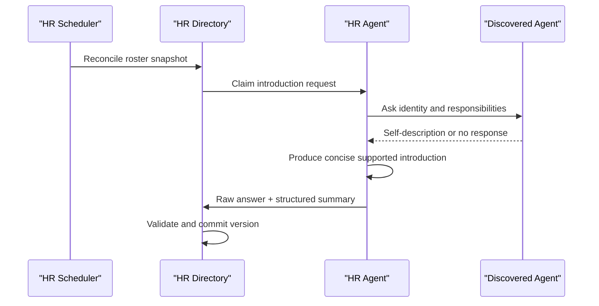
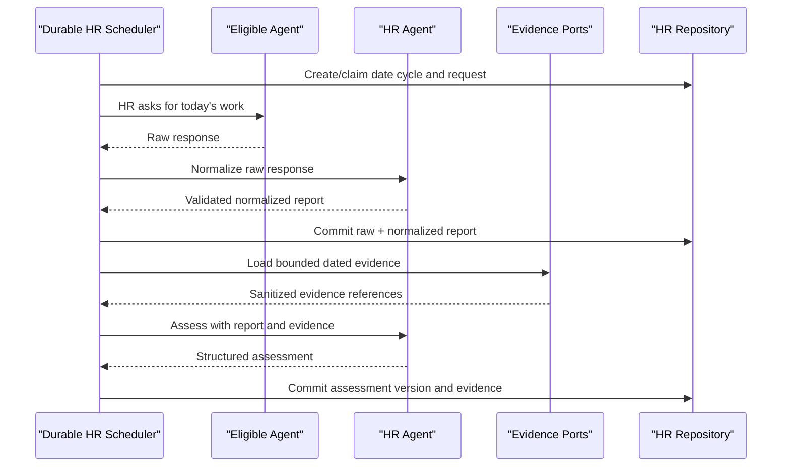

## Context

Virtual Office currently discovers OpenClaw, Hermes, Codex, Claude Code, and synthetic gateway Agents through the roster assembled in `app/server.py`. Archive Room also owns a global OpenClaw archive manager, but its discovery, creation, profile rendering, direct workspace writes, communication-skill synchronization, state persistence, pause/resume, and public projection are implemented as archive-specific functions in the large server entry point.

The repository has already established a better pattern under `app/services/`: domain modules do not import `server.py` or HTTP classes, state transitions are exercised through injected ports, authoritative repositories own persistence, and `OfficeHandler` remains transport wiring. `AGENTS.md` requires every substantial new capability to follow this modular direction.

Human Resources is cross-cutting. It introduces a second global OpenClaw system Agent, a durable Agent directory, one provider-neutral VO built-in skill, scheduled Agent conversations, HR-authored normalization and assessment, evidence reads from project/meeting/artifact/execution domains, sensitive human views, restricted Agent views, access auditing, and a first-level UI. The local development environment does not provide the real OpenClaw integration required for final acceptance, so provider boundaries must be deterministic under unit tests and separately verified on a development machine.

Current constraints and reusable foundations include:

- `VO_STATUS_DIR` is the local durable-data root.
- `_gateway_rpc_call`, roster discovery, `_wf_call_agent`, AgentPlatform communication, and managed skill synchronization are existing integration points but remain legacy entry-point functions.
- Archive manager state is already persisted at `archive-room/manager.json`; compatibility requires preserving that path and public behavior during extraction.
- Existing management-token support (`X-VO-Management-Token` and `window.i18n.managementFetch`) can protect full human views and mutations.
- Existing Agent-safe HTTP surfaces use loopback, no browser `Origin`, action headers, known roster identity, and scoped grants. Human Resources needs a comparable but narrower authenticated Agent-read boundary because access-log viewer identity must not be freely spoofable.
- Meeting services already preserve archive-manager exclusion and occupancy restoration; eligibility needs to become policy-based so HR is allowed without weakening archive-manager protection.
- Existing recurrence code demonstrates bounded reconcilers and injected clocks/workers, but Human Resources daily-cycle authority must remain inside VO even when OpenClaw cron is unavailable.
- The worktree contains unrelated user edits in `skills/vo-project-authoring/SKILL.md` and `tests/check_vo_project_authoring_skill.mjs`; implementation must not modify or overwrite them unless a later confirmed task explicitly requires it.

## Goals / Non-Goals

**Goals:**

- Create exactly one global HR Agent before any HR-owned workflow executes.
- Extract a reusable, role-configured VO system-Agent lifecycle without moving Archive Room business logic into a shared module.
- Preserve all existing archive-manager identity, state, profile, maintenance, protection, and degraded-read behavior.
- Maintain a durable HR-owned directory keyed by stable AI ID and expose one safe directory skill through the VO built-in catalog.
- Run one idempotent daily collection cycle with bounded Agent calls, neutral non-submission, late submission, and restart recovery.
- Generate HR-only, evidence-backed, non-ranking assessments with explicit information sufficiency.
- Enforce human, HR, self, and cross-Agent disclosure policies on the server, with authenticated Agent identity and durable access audit.
- Add an independent Human Resources UI while keeping `app/server.py` limited to construction and route delegation.
- Make provider calls, clocks, IDs, storage, evidence, and worker launching injectable for strict unit tests.
- Require real-OpenClaw development-machine acceptance before test-result confirmation.

**Non-Goals:**

- Replacing Archive Room, project acceptance, task review, or the existing project score feature.
- Numeric performance scores, leaderboards, automatic punishment, automatic Agent deletion, or automatic task reassignment.
- Treating all chat history as HR evidence or recording private prompt content in operational logs.
- Generalizing every existing Agent operation in one migration; the shared lifecycle covers VO system-Agent lifecycle only.
- Migrating Archive Room archive data into the Human Resources store.
- Making HR an ordinary project executor or reviewer.
- Adding a new external scheduler, database server, message broker, or third-party dependency.
- Backfilling historical daily reports for dates before the feature is enabled.

## Decisions

### 1. Extract one role-configured system-Agent lifecycle service

Add focused modules:

- `app/services/system_agent_lifecycle.py`: lifecycle state machine and public result types.
- `app/services/system_agent_profiles.py`: generic versioned template parsing, safe workspace resolution, and atomic profile-file synchronization.
- `app/services/system_agent_roles.py`: immutable role definitions and role-policy lookup.

The central types will be equivalent to:

```text
SystemAgentRole
  stable_id, display_name, emoji, provider_kind
  profile_template, version_marker, required_files
  assignable, meeting_eligible, deletable
  automatic_work_categories

SystemAgentPorts
  discover(role), create(role), resolve_workspace(agent)
  sync_managed_skills(agent), load_state(role), save_state(role)
  set_presence(agent, state), clock(), new_id()
```

`SystemAgentLifecycleService.reconcile(role)`, `pause(role)`, `resume(role)`, `public_state(role)`, and `metadata(role, candidate)` own common transitions. Domain adapters provide state labels and files; the shared service never imports Archive Room or Human Resources modules.

Archive Room keeps thin compatibility delegates with its existing function names and continues using `archive-room/manager.json`. HR uses the same service with `human-resources/hr.json`, its own profile template, role policy, and activity vocabulary. This avoids a data migration for the existing archive manager while eliminating duplicated lifecycle decisions.

Alternatives considered:

- Copy archive-manager functions for HR: rejected because the next VO system Agent would duplicate the same fragile logic again.
- Move all Archive Room manager work into the shared service: rejected because archive maintenance and governance are domain behavior, not lifecycle behavior.
- Create a generic `SystemAgent` base class with inheritance: rejected in favor of immutable role data plus injected ports, which is easier to fake and does not couple domains through subclass hooks.

### 2. Preserve archive behavior with characterization-first migration

Before changing lifecycle ownership, record and run the current archive-manager Phase 4 and Archive Room Phase 1–8 tests. Extract one behavior slice at a time: state repository, profile rendering/writing, provider reconciliation, then controls and metadata. Existing wrappers remain until all callers use the new service; obsolete duplicate implementations are removed only after regression passes.

The archive role remains:

- stable ID `archive-manager`;
- non-assignable, non-deletable, meeting-ineligible;
- backed by the existing profile template and existing state file;
- capable of all existing Archive Room maintenance behavior through Archive Room-owned functions.

HR is configured as:

- stable ID `hr`, display name `HR`;
- provider creation uses the display name `HR`, while lifecycle and directory projections normalize legacy `Hr`/`hr` display values back to `HR` without changing the stable ID;
- non-assignable and non-deletable;
- meeting-eligible;
- backed by a new `app/hr-profile.md` and repository-owned VO built-in directory skill;
- excluded from its own ordinary report/assessment population.

### 3. Use a transactional SQLite repository for the new HR domain

Create `app/services/hr_repository.py` backed by Python's standard-library `sqlite3` at `VO_STATUS_DIR/human-resources/hr.sqlite3`. This is a new domain with daily history, versioned assessments, per-Agent queries, and access auditing; a single growing JSON file would require O(N) rewrites and segmented JSON would require a custom cross-file transaction protocol.

The repository owns schema versioning and transactions. No handler or other service writes the database directly. Connections are short-lived per operation, foreign keys are enabled, busy timeout is bounded, and write transactions use `BEGIN IMMEDIATE`. The initial tables are:

| Table | Purpose and key |
|---|---|
| `metadata` | schema version and repository initialization facts |
| `agents` | one current directory row keyed by stable `ai_id` |
| `agent_identity_history` | prior names, status, sources, and change timestamps |
| `introductions` | raw self-description, HR summary, state, provenance, and version |
| `daily_cycles` | one cycle per VO-local date, schedule snapshot, window, and aggregate state |
| `report_requests` | one request state per `(cycle_id, ai_id)` |
| `daily_reports` | one current dated report plus raw and normalized JSON and submission metadata |
| `assessments` | versioned HR assessment rows with one current version per Agent/date |
| `assessment_evidence` | sanitized typed references used by an assessment version |
| `access_grants` | hashed Agent grant, status, rotation, and revocation metadata |
| `access_log` | successful cross-Agent disclosure audit keyed by viewer, target, time, and scope |
| `hr_activity` | bounded operational and lifecycle-relevant HR workflow events |

Raw report and normalized/assessment structures are stored as validated JSON text inside typed rows. Secrets, bearer grants, raw provider envelopes, and unbounded transcripts are never stored as report evidence.

Repository migrations are monotonic and transactional. If migration fails, the service does not partially open the new schema. A management-only diagnostic/export endpoint provides JSON inspection without making JSON files a second authority.

Alternatives considered:

- One atomic JSON root: rejected because daily history and access logs cause growing whole-file rewrites and lock duration.
- Per-Agent/per-day JSON files: rejected because cycles, reports, assessment versions, and audit would require multi-file recovery logic.
- External database: rejected because VO is local-first and must not gain an operational dependency.

### 4. Separate HR domain responsibilities into focused services

Add these modules, none of which imports `server.py` or HTTP transport:

- `hr_directory.py`: roster reconciliation, status transitions, self-exclusion, introduction workflow, and public directory projection.
- `hr_agent_grants.py`: identity-bound Agent API grant lifecycle and secure credential delivery, independent of Skill files.
- `hr_directory_enablement.py`: directory persistence and isolated Agent API grant-readiness reconciliation.
- `hr_reporting.py`: daily cycles, per-Agent request claims, raw response preservation, normalization, late submissions, and status projection.
- `hr_assessments.py`: evidence validation, HR invocation, structured result parsing, workload classification, versioning, and failure isolation.
- `hr_governance.py`: actor authorization, field-level projections, access-grant validation, access logging, and self-audit views.
- `hr_scheduler.py`: due-date calculation, startup reconciliation, bounded claims, retry policy, and worker orchestration.
- `hr_evidence.py`: read-only adapters and sanitization for projects, tasks, meetings, artifacts, execution results, and blockers.
- `hr_observability.py`: bounded counters, durations, queue age, failure codes, and rate-limited safe logs.
- `hr_api.py`: application commands/queries that compose the above services and return transport-neutral results.

`app/server.py` constructs ports and delegates routes. It does not contain HR validation, persistence decisions, state transitions, prompt parsing, or access projection.

### 5. Keep the daily schedule authoritative in VO

The scheduler uses a small daemon reconciliation loop similar to existing recurrence reconciliation, but cycle identity and claims are stored in the HR repository. It does not depend on OpenClaw cron to decide whether a date has run.

Configuration is explicit and bounded:

- `VO_HR_ENABLED`: master feature switch, enabled by default so the global HR Agent is reconciled on normal startup; explicit `false` remains the rollback/opt-out control.
- `VO_HR_SCHEDULER_ENABLED`: automatic collection/assessment switch, disabled by default so enabling the HR lifecycle does not immediately contact Agents.
- `VO_HR_DAILY_TIME`: VO-local `HH:MM`, default `18:00`.
- `VO_HR_SUBMISSION_WINDOW_MINUTES`: default `120`, bounded.
- `VO_HR_MAX_WORKERS`: default `2`, bounded to prevent provider overload.
- `VO_HR_AGENT_TIMEOUT_SECONDS`: bounded per call.
- `VO_HR_RETRY_LIMIT`: bounded transient retry count.

At the due time the scheduler transactionally creates one cycle for the VO-local date and snapshots eligible Agent IDs. Workers claim one request row at a time, commit the claim before provider work, renew or expire claims, and persist a terminal request state. Window closure marks outstanding responses `not_submitted` without negative interpretation, then assessment jobs are created for eligible Agents.

Startup reconciliation behaves as follows:

- before today's due time: wait for today's occurrence;
- after due time with no cycle: create only today's missed cycle;
- with an open cycle: reclaim expired work and continue;
- never automatically backfill dates before today;
- duplicate loops or restarts converge on the same date/cycle/request keys.

The HTTP server thread never waits for all Agents. Manual management actions enqueue or claim the same durable workflow rather than running a second implementation.

### 6. Use visible HR-to-Agent communication and HR-owned reasoning

`HRConversationPort` has two distinct operations:

1. `ask_agent_as_hr(target, message, conversation_key, timeout)` uses the existing office-mediated Agent communication path with HR as the sender, preserving visible sender/target context and a deterministic idempotency key.
2. `ask_hr(prompt, conversation_key, timeout)` invokes the HR Agent for normalization, introduction summarization, or assessment and validates a versioned structured JSON response.

Introduction flow:



Daily flow:



If HR reasoning fails, the raw Agent response remains stored and retryable. If an Agent does not reply, HR does not produce a synthetic self-report. Assessment parsers reject numeric scores, ranks, unsupported workload values, missing evidence rationale, and malformed output.

### 7. Read evidence through bounded, domain-owned ports

`HREvidencePort` returns typed references, short summaries, dates, and result metadata; it does not grant HR write access to projects, meetings, artifacts, or provider history. Default evidence sources are:

- tasks assigned to or executed by the Agent and their dated transitions/results;
- relevant completed meeting contributions and summaries, not attendance alone;
- artifact metadata and delivery/test evidence attributed to the Agent;
- execution attempts, terminal results, known blockers, and waiting states.

Evidence is capped per source and per Agent/date. Raw chat history, credentials, raw provider envelopes, unrelated project content, and unrestricted workspace reads are excluded. Each assessment records exactly which sanitized evidence references were used.

### 8. Expose one canonical VO built-in Agent-directory skill

Add `skills/vo-agent-directory/SKILL.md` as the repository-owned canonical skill. The skill explains how to:

- read the safe roster;
- query one Agent's allowed public work view;
- read the caller's own access history;
- authenticate using the provisioned Agent grant;
- avoid direct storage or human-management endpoints.

`skills/catalog.md` advertises the skill and `app/agent-guide.js` renders it under a dedicated Human Resources category. Agents read the same file from the current VO instance at `/skills/vo-agent-directory/SKILL.md`, following the routing entry in `vo-operating-guidelines`. The skill is never copied, installed, versioned, or repaired inside an individual Agent workspace, so discovery is Provider-neutral and there is no per-Agent Skill readiness state.

The built-in Skill and the security credential have separate lifecycles. `hr_agent_grants.py` may deliver an identity-bound grant through a supported secure workspace credential path, but its reference lives under `.vo/credentials/human-resources/` and never under `skills/`. During upgrade it removes only legacy directory-skill copies carrying the exact Virtual Office ownership marker and preserves unowned same-name content. An Agent without a supported secure grant delivery path can still discover and read the built-in Skill, remains visible in the directory, and can submit through office-mediated HR conversation, but cannot perform authenticated cross-Agent HTTP reads until grant delivery is available. This is safer than silently treating a caller-supplied ID as authenticated while avoiding a false Provider restriction on Skill availability.

### 9. Authenticate and project every Human Resources API server-side

Human management APIs reuse `X-VO-Management-Token` and `window.i18n.managementFetch`:

- `GET /api/human-resources/overview`
- `GET /api/human-resources/agents/{ai_id}`
- `GET /api/human-resources/access-log`
- `POST /api/human-resources/hr/{pause|resume}`
- `POST /api/human-resources/directory/sync`
- `POST /api/human-resources/cycles/{run|close|retry}`
- `GET /api/human-resources/health`

Agent APIs require loopback, reject browser Origin, require `X-VO-Agent-Action: human-resources`, require `X-VO-Agent-Id`, and validate a bearer grant whose stored digest belongs to the same active AI ID:

- `GET /api/agent-human-resources/directory`: safe roster, no cross-Agent view log.
- `GET /api/agent-human-resources/agents/{ai_id}`: public projection and one successful-view log.
- `GET /api/agent-human-resources/access-log/self`: only records where the caller is target.

Bearer tokens are random, returned only through the managed delivery path, stored only as digests in the HR repository, compared in constant time, and revoked when the Agent is deleted or the grant is rotated. A successful cross-Agent response is returned only after its audit transaction commits. If the audit commit fails, disclosure fails closed. HR and human management reads use separate routes and therefore do not create cross-Agent logs.

The threat model protects against untrusted HTTP callers and one Agent presenting another Agent's ID. It does not claim isolation from a hostile local process with unrestricted access to every Agent workspace; that broader sandbox boundary is outside this change.

### 10. Make system-role policy explicit across projects, meetings, and deletion

Replace archive-specific exclusion checks at shared boundaries with a role-policy lookup:

- ordinary project assignment rejects any role with `assignable=False`, including archive manager and HR;
- ordinary deletion rejects any role with `deletable=False`;
- meeting validation checks `meeting_eligible`, preserving archive-manager rejection and allowing HR;
- existing archive-specific error codes remain compatible where existing callers depend on them;
- new HR rejections use stable HR/system-role codes.

Both legacy meetings and executable meetings must call the same eligibility policy before persistence. Occupancy and restoration logic remains in the meeting domain. HR attendance is not emitted as an HR performance event; completed meeting records may later be read as bounded evidence only when relevant.

### 11. Add an independent UI module with management-token data access

Add:

- `app/human-resources.js`
- `app/human-resources.css`
- a Human Resources toolbar entry and modal shell in `app/index.html`
- localized strings in `app/locales/en.json` and `app/locales/zh.json`

The UI follows Archive Room's independent modal/list/detail pattern but does not import or duplicate Archive Room state. It uses `managementFetch` for every full-data request. The overview shows one authoritative HR state indicator, daily-cycle counts, and a server-calculated `reportSchedule` containing the next configured collection instant, VO-local wall time/timezone, scheduler enablement, and scheduled/due/disabled state; detail separates Agent claims, HR normalization, evidence-backed HR judgment, and access history. An active-sync control invokes a focused `hr_team_sync.py` service that force-refreshes the shared roster, reconciles directory state, and refreshes Agent API grant readiness before the UI reloads. Because the directory Skill is a VO built-in, the detail does not show a per-Agent Skill readiness field. Failed or partial states remain scoped to the affected Agent/workflow. The Agent-facing API is not called by the human UI.

Frontend logic is split into pure formatting/projection helpers where practical so Node-based tests can validate disclosure rendering, workflow states, and localization without a browser. A live browser acceptance script verifies navigation, pause/resume, roster/detail, report/assessment states, and degraded errors.

### 12. Add explicit observability, capacity, and privacy limits

`hr_observability.py` records bounded, credential-safe metrics:

- lifecycle reconciliation success/failure and duration by role;
- directory discovered/created/updated/inactive/error counts;
- cycle due/open/closed/skipped and oldest open-cycle age;
- report requests waiting/running/submitted/not-submitted/failed;
- assessment pending/succeeded/insufficient-information/failed;
- worker queue depth, claim expiry, retry, and timeout counts;
- public query allowed/denied, audit commit failures, and grant failures;
- Agent API grant ready/unsupported/delivery-failure counts.

Operational logs contain IDs, state, code, and duration but no raw reports, full assessments, bearer tokens, credentials, or raw provider responses. Repeated failures are rate-limited. Repository and API limits bound request size, raw report length, normalized fields, evidence count, assessment length, activity history, and page sizes.

## Risks / Trade-offs

- **[Archive manager regression during extraction]** → Establish characterization tests first, preserve wrappers/state path/error codes, migrate in slices, and run Phase 1–8 regression after every lifecycle slice.
- **[Shared service becomes a second legacy monolith]** → Limit it to lifecycle/profile/policy primitives; keep HR and Archive Room orchestration in separate modules enforced by static import tests.
- **[Duplicate HR or duplicate daily work after restart]** → Use stable role IDs, provider rediscovery, unique database keys, durable claims, expiry fencing, and idempotent occurrence keys.
- **[Provider calls block the HTTP server or overload OpenClaw]** → Persist claims before work, execute in a bounded pool, cap timeout/retry/concurrency, and expose queue age and failure metrics.
- **[One Agent failure stalls the global cycle]** → Terminal per-Agent request states and failure isolation; cycle closure does not wait indefinitely.
- **[HR hallucinates a report or assessment]** → Preserve raw claims, validate structured output, require evidence references/rationale, use `insufficient_information`, and never synthesize a missing self-report.
- **[Sensitive assessment data leaks to ordinary Agents]** → Separate management and Agent routes, server-side projections, scoped grants, negative authorization tests, and no client-side-only hiding.
- **[Access log identity is spoofed]** → Bind a hashed bearer grant to known AI ID in addition to loopback/action headers; fail disclosure when authentication or audit persistence fails.
- **[Grant delivery is unsupported for a provider]** → Keep the built-in Skill visible, report only Agent API authorization readiness, and disable cross-Agent HTTP reads for that Agent while retaining HR conversation/report participation.
- **[SQLite introduces a new repository pattern]** → Use only Python stdlib, one owning module, transactional migrations, backup/export diagnostics, busy timeout, repository tests, and no cross-domain direct access.
- **[Assessment evidence becomes expensive or invasive]** → Use bounded typed read ports, summaries instead of raw histories, strict date/Agent filters, and source-specific limits.
- **[Daily times shift with timezone or daylight saving]** → Store configured timezone/date occurrence separately from UTC timestamps and test DST/restart boundaries.
- **[Built-in Skill drifts or is accidentally redistributed]** → Keep one repository-owned `/skills` source, advertise it through the catalog, add static no-workspace-publication checks, and keep grant files under a separate credential path.
- **[Feature rollback leaves data or background work]** → Master and scheduler switches stop new work; workers use durable claims and bounded timeouts; rollback retains the database and archive-manager state for later recovery.
- **[Development-machine behavior differs from fakes]** → Treat real OpenClaw creation/profile/restart/communication/meeting checks as a mandatory test-result gate rather than an optional smoke test.

## Migration Plan

1. Capture archive-manager and meeting eligibility characterization baselines without changing behavior.
2. Add shared system-Agent role/profile/lifecycle modules and unit tests with injected fake provider, filesystem, clock, and state ports.
3. Move archive-manager lifecycle slices behind existing compatibility delegates; run focused and full Archive Room regressions after each slice.
4. Add HR role/profile/state and verify HR creation remains disabled behind `VO_HR_ENABLED` until storage and UI are ready.
5. Add the transactional HR repository and schema migration tests, followed by directory and introduction services.
6. Add the canonical directory skill to the VO built-in catalog, then add separate per-Agent grants and authorization-readiness projection without workspace Skill copies.
7. Add reporting, evidence, assessment, scheduler, and observability services with deterministic clocks and fake conversations.
8. Add management and Agent APIs with authorization, disclosure, audit, body-size, and pagination tests.
9. Update project/deletion/meeting policy wiring and run project, meeting, Archive Room, communication, and provider regressions.
10. Add the Human Resources UI, localization, Node checks, and live browser acceptance coverage.
11. Deploy to the development machine with code present but `VO_HR_ENABLED=0`; run archive-manager and existing VO smoke tests.
12. Enable HR lifecycle only, verify real OpenClaw auto-create, rediscovery, profile repair, restart, pause/resume, meeting eligibility, assignment/deletion protection, and archive-manager isolation.
13. Enable the directory; verify built-in Skill exposure for every Provider, real Agent discovery, introduction, grant delivery, and controlled public queries.
14. Enable scheduler for a short controlled acceptance window; verify collection, non-response, normalization, assessment, restart idempotency, logs, and failure isolation.
15. Restore the intended daily schedule only after evidence is captured and no regression is observed.

Rollback:

- Disable `VO_HR_SCHEDULER_ENABLED` to stop new cycles while preserving reads.
- Disable `VO_HR_ENABLED` to stop HR reconciliation and Human Resources mutation paths.
- Allow claimed work to expire or complete under bounded timeouts; no unbounded background thread is waited on.
- Roll back application code if required; `hr.sqlite3` and `human-resources/hr.json` remain inert and recoverable.
- Archive manager continues to use its original state path; if shared lifecycle code itself must be rolled back, restore the prior compatibility implementation without a state migration.
- Do not automatically delete the real HR Agent during rollback; pause it and retain identity/profile for safe recovery.

## Verification Strategy

Verification is split into four required layers:

1. **Pure unit tests:** role policy, lifecycle transitions, profile parsing/path safety, repository transactions/migrations, directory reconciliation, scheduler due logic and DST, claim fencing, report normalization validation, assessment validation, projection and audit policy.
2. **Service/HTTP integration tests with fakes:** fake roster/provider/conversation/evidence ports, management token, built-in Skill catalog exposure, absence of Agent workspace copies, Agent grants, idempotent retries, partial failures, pagination, body limits, CORS/origin rejection, and concurrent requests.
3. **Compatibility and UI regression:** Archive Room Phase 1–8, archive manager Phase 4, meetings, project assignment/deletion, communication skills, provider boundaries, static service boundaries, localization, JS syntax, and live Human Resources UI paths.
4. **Development-machine real OpenClaw acceptance:** HR/archive-manager creation and isolation, profile and skill writes, restart repair, pause/resume, HR meeting participation, archive-manager meeting rejection, Agent conversations, daily report and assessment, access grant/query/audit, provider failure degradation, and restart idempotency.

Every implementation task must add or update its focused tests. Local test success cannot waive layer 4. OpenSpec test-result confirmation remains blocked until commands, environment/version, outputs, failures/fixes, and uncovered items are recorded.

## Open Questions

- The exact development-machine target and deployment command will be resolved before the first real-OpenClaw acceptance task; the acceptance matrix is already fixed by the specs.
- The production daily time may override the proposed `18:00` default through configuration without changing the one-cycle-per-local-date contract.
- Provider-specific secure grant delivery beyond existing OpenClaw workspace support will be enabled only when its adapter can prove an isolated delivery boundary; the built-in Skill remains Provider-neutral, while providers without a grant path remain visible but cannot make cross-Agent HTTP reads.
