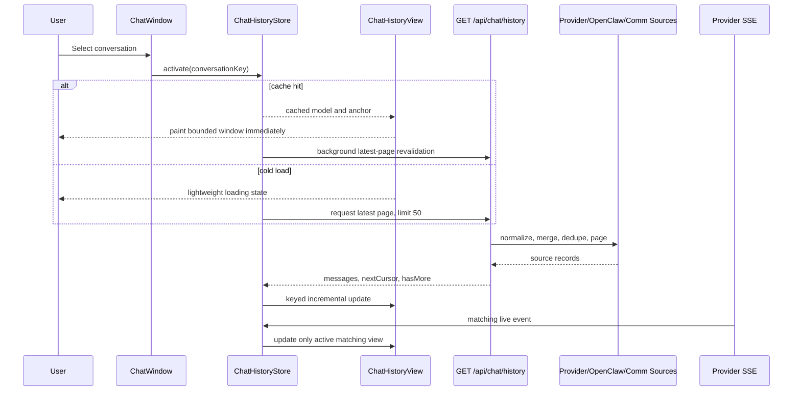
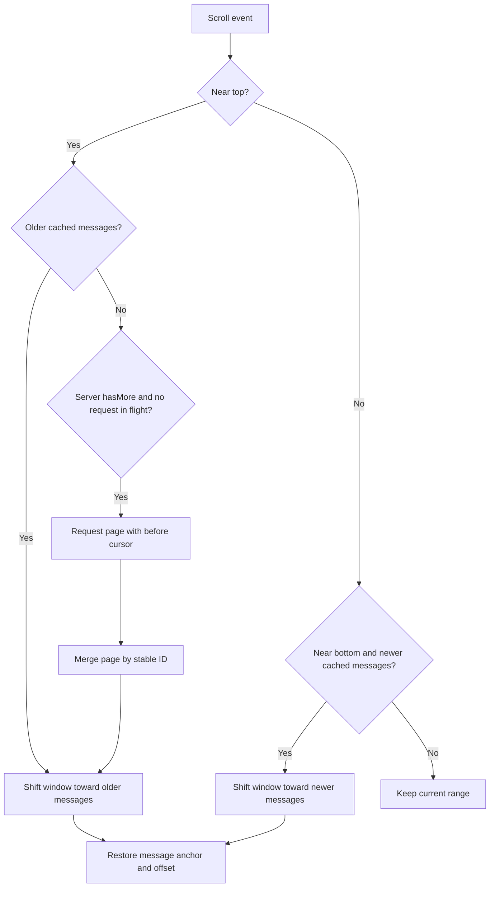
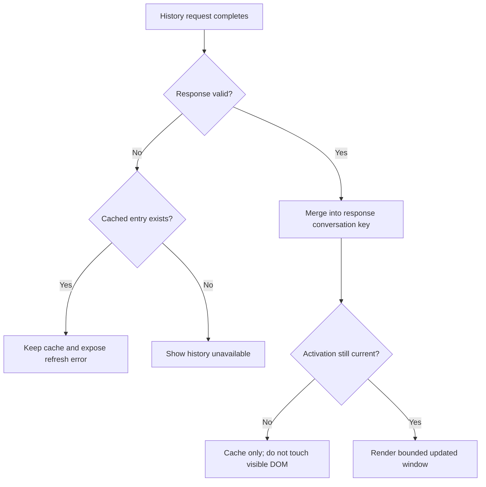
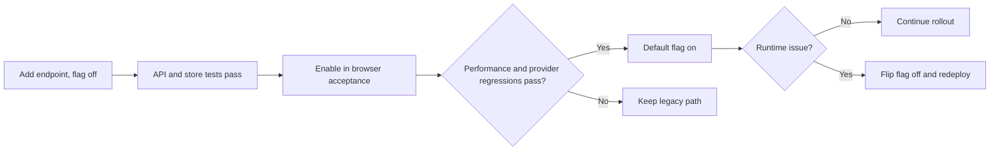

## Context

The chat UI is a vanilla JavaScript application served by `app/server.py`. A `ChatWindow` owns selection, provider streams, history loading, message rendering, and scrolling in `app/chat.js`. Today `ChatWindow.applySelection()` resets the conversation, clears `.chat-messages`, displays a loading bubble, and invokes `loadHistory()`. `loadHistory()` then follows provider-specific branches, requests up to 500 records, performs client-side merging and sorting, runs Markdown parsing and rich-card construction for every visible record, appends the full result, and finally reads `scrollHeight` to move to the bottom.

The recent cancellable batch renderer in `renderHistoryQueue()` prevents one uninterrupted synchronous mount, but it does not reduce total parsing, card construction, DOM size, or repeated work when a user returns to a conversation. Hermes and Claude Code also request `/agent-chat` after their provider history response, and Codex or provider branches may request communication history separately. `app/server.py::_load_comm_history()` scans its JSONL file from the beginning, while provider histories are stored in bounded JSON files. Gateway history is currently obtained with the `chat.history` WebSocket RPC.

The provider SSE convergence already scopes live events by provider, agent, and conversation. The history redesign must consume that same identity without reopening per-run streams or reintroducing resident polling. Existing user changes in `app/chat.js` and `app/server.py` are part of the baseline and must be preserved.

Stakeholders are VO users who switch among primary and secondary chat panels, and maintainers of the Codex, Hermes, Claude Code, Gateway, agent-platform communication, and Feishu display paths.

## Goals / Non-Goals

**Goals:**

- Render a previously visited conversation from runtime cache before a network refresh completes.
- Return and mount no more than the newest 50 messages on a cold load.
- Load older history through an opaque cursor while preserving the visible anchor.
- Keep historical message roots at or below 160 for a one-thousand-message conversation.
- Reuse stable sanitized Markdown output while reconstructing interactive cards safely.
- Reconcile provider SSE events and history responses into one conversation-keyed model.
- Preserve sender attribution, attachments, tools, thinking, approvals, Feishu-visible messages, and recovered final responses across Codex, Hermes, Claude Code, and Gateway.
- Provide deterministic counters and performance marks for automated and browser acceptance.
- Keep rollback additive and data-migration-free.

**Non-Goals:**

- Persist chat history cache across browser reloads.
- Add history search, a database, a durable indexing service, or a new authentication model.
- Replace provider run SSE, Gateway transport, or the underlying provider history file formats.
- Render more than the existing bounded source history. Provider files currently retain at most 500 messages; the unified model will expose at most 1,000 merged display records per conversation.
- Remove legacy provider history endpoints in this change.

## Decisions

### 1. Use a unified page contract plus a shared runtime store

The selected approach combines an additive provider-neutral HTTP page endpoint, a page-level `ChatHistoryStore`, and a bounded `ChatHistoryView`. This addresses network waterfalls, repeated normalization, repeated Markdown parsing, and unbounded DOM together.

Alternatives considered:

- Frontend-only caching and DOM trimming was rejected because cold loads would still fetch and merge complete histories and would not satisfy the confirmed page contract.
- A durable SQLite or search index was rejected because current histories are local bounded files and the migration, recovery, and write-consistency cost is not justified for this iteration.
- Caching detached DOM subtrees was rejected because approval buttons and live tool cards capture `ChatWindow` state, detached media can continue consuming resources, and memory becomes difficult to bound.

The target flow is:



### 2. Introduce one normalized history page API

#### Implementation point: HTTP route and validation

- Target file: `app/server.py`
- Target function: `OfficeHandler.do_GET()` alongside the existing `/api/{provider}/history` routes near the current history branches.
- Insertion: add `GET /api/chat/history` before the provider-specific history routes so no existing route semantics change.
- Logic: parse and validate the provider kind, agent, conversation/session identifiers, limit, and cursor; call `_handle_chat_history_page()`; return the existing JSON response style with HTTP 200 for success and HTTP 400 for malformed input.
- Security and compatibility: allow only `codex`, `hermes`, `claude-code`, and `gateway`; cap `limit` at 50; reject malformed cursors; do not accept filesystem paths; resolve agents and session files through existing roster/session helpers. The endpoint exposes no data that is not already available through the existing local history routes.
- Code evidence: `OfficeHandler.do_GET()` currently implements `/api/hermes/history`, `/api/codex/history`, and `/api/claude-code/history`; those routes parse `agentId` and `conversationId` with `urllib.parse` and return JSON. The new aggregate route follows their response structure but intentionally omits wildcard CORS.

```python
# app/server.py: OfficeHandler.do_GET
elif request_path == "/api/chat/history":
    result = _handle_chat_history_page(query_params)
    status = result.pop("_status", 200)
    self.send_response(status)
    self.send_header("Content-Type", "application/json")
    self.end_headers()
    self.wfile.write(json.dumps(result).encode())
```

Request query:

| Field | Type | Required | Validation |
| --- | --- | --- | --- |
| `providerKind` | string | yes | `codex`, `hermes`, `claude-code`, or `gateway` |
| `agentId` | string | yes | 1-160 characters; must resolve through the current roster/session maps |
| `conversationId` | string | provider-dependent | Maximum 256 characters; required for provider conversations; empty only for legacy Gateway sessions |
| `sessionKey` | string | Gateway | Maximum 512 characters; resolved with `_openclaw_session_paths()`; never interpreted as a path |
| `limit` | integer | no | Default 50; range 1-50 |
| `before` | opaque string | no | Base64url JSON cursor with version and sort tuple |

Successful response:

```json
{
  "ok": true,
  "conversationKey": "codex\u001fagent-id\u001fconversation-id",
  "messages": [],
  "nextCursor": "opaque-or-empty",
  "hasMore": false,
  "session": {
    "sessionId": "",
    "contextUsed": 0,
    "contextWindow": 0,
    "tokenUsage": {}
  }
}
```

Error response:

```json
{
  "ok": false,
  "code": "invalid_chat_history_cursor",
  "error": "Invalid chat history cursor"
}
```

#### Implementation point: normalization, stable identity, and paging

- Target file: `app/server.py`
- New helpers: `_handle_chat_history_page()`, `_normalize_chat_history_message()`, `_chat_history_message_id()`, `_encode_chat_history_cursor()`, `_decode_chat_history_cursor()`, and `_page_chat_history_messages()`.
- Insertion: place helpers near `_load_comm_history()` and provider history adapters because this is the current history-merging layer.
- Data model: each response message contains `id`, `version`, `providerKind`, `conversationId`, `role`, `text`, `epochMs`, sender metadata, attachments/media, tools, thinking, reasoning tokens, approval, status, and source.
- Identity: use an existing event/message/tool ID when present. Otherwise derive a fallback ID with a specified synchronous FNV-1a 32-bit implementation over UTF-8 bytes of provider, conversation, role, normalized timestamp, sender IDs, source, and text signature. The exact field order, delimiter, UTF-8 encoding, and unsigned hexadecimal output are shared by Python and JavaScript fixture tests. `version` uses the same algorithm over every render-affecting field so a stable identity invalidates cached HTML when content changes. Source IDs remain preferred; fallback hash collisions are resolved by comparing the canonical identity fields and adding a deterministic ordinal within the sorted source snapshot.
- Ordering: sort by `(epochMs, id)` ascending. The initial page selects the last `limit` records. A cursor stores `{v: 1, ts, id}` for the first returned record; the previous page selects records strictly before that tuple and returns them ascending.
- Dedupe: prefer communication-layer records when they carry the same communication ID; otherwise dedupe by stable ID. Ephemeral progress records remain owned by SSE recovery and are excluded from historical bubbles unless the existing recoverable-progress filters mark them displayable.
- Code evidence: `_dedupe_visible_comm_history()` already prefers event IDs and content signatures; `_comm_event_to_chat_message()` preserves sender context; provider branches already expose token usage and session metrics.

```python
def _handle_chat_history_page(query):
    request = _parse_chat_history_request(query)
    source_pages, session = _load_chat_history_source_pages(request)
    page, next_cursor, has_more = _merge_chat_history_source_pages(
        source_pages, request.before, request.limit
    )
    return {
        "ok": True,
        "conversationKey": request.key,
        "messages": page,
        "nextCursor": next_cursor,
        "hasMore": has_more,
        "session": session,
    }
```

#### Implementation point: source adapters and bounded source cache

- Target file: `app/server.py`
- Target helpers: existing `_load_hermes_history()`, `_load_codex_history()`, `_load_claude_code_history()`, `_load_comm_history()`, `_openclaw_session_paths()`, and the parsing body currently inside `get_agent_messages()`.
- Logic: create `_load_chat_history_source_pages(request)` with provider-specific adapters implementing `page_before(before, limit_plus_one)`. Codex combines local provider candidates and conversation communication candidates. Hermes and Claude Code combine their conversation-scoped JSON candidates with communication candidates. Gateway resolves the exact session transcript from `sessionKey`, reads candidates backward, and combines communication candidates. The merger requests at most `limit + 1` candidates per source, normalizes/dedupes them, then selects the newest page before the global cursor. This avoids materializing 1,000 records before the first 50-message response.
- Gateway refactor: reuse `_openclaw_session_paths()` for exact session resolution, but extract a new raw JSONL content-block normalizer rather than reusing the floor-bubble output of `get_agent_messages()`. The normalizer preserves full text, image/file/media blocks, `toolCall`/`tool_call`, and matching `toolResult`/`tool_result` data in the same shapes currently consumed by `extractText()`, `extractMedia()`, and `extractToolItems()` in `app/chat.js`. A lazy reverse reader keeps its previous byte offset and extends the normalized snapshot only when an older page is requested, stopping at 1,000 displayable messages or file start. It does not apply the 500-character floor-bubble truncation.
- Cache: import `OrderedDict` beside the existing `deque` import and use a process-local LRU protected by a dedicated `threading.RLock`, because the server runs `ThreadingHTTPServer`. Key entries by source path plus source-specific filter. Validate entries with file inode, size, and nanosecond mtime. Provider JSON snapshots are bounded by their existing 500-record files. Gateway and communication JSONL snapshots begin with enough tail records for one page and extend lazily for older cursors. Cap the cache at 32 source snapshots and 64 MiB of estimated serialized payload; active reads can rebuild after eviction. Communication-log append changes size/mtime and invalidates or extends its snapshot automatically.
- Consistency: history files remain the source of truth. The cache is read-through only, performs no writes, and may return only a snapshot that existed at request start. SSE or the next revalidation supplies later records.
- Code evidence: provider history files are already bounded at 500 messages; `_read_tail_text()` provides tail-reading behavior; `_load_comm_history()` currently scans JSONL; `get_agent_messages()` already resolves OpenClaw session paths and converts transcript records.

```python
def _load_chat_history_source_pages(request):
    if request.provider_kind == "gateway":
        provider_page = _page_openclaw_session_history(request, request.limit + 1)
    elif request.provider_kind == "codex":
        provider_page = _page_codex_history(request, request.limit + 1)
    elif request.provider_kind == "hermes":
        provider_page = _page_hermes_history(request, request.limit + 1)
    else:
        provider_page = _page_claude_code_history(request, request.limit + 1)

    comm_page = _page_cached_comm_history(request, request.limit + 1)
    return [provider_page, comm_page], _history_session_metrics(request)
```

### 3. Add a page-level conversation store

#### Implementation point: store module and lifecycle

- Target files: new `app/chat-history.js`, `app/index.html`, and `app/chat.js`.
- Target symbols: `ChatHistoryStore`, `createConversationKey()`, and a shared `chatHistoryStore` loaded before `chat.js`.
- Insertion: add the new script immediately before the existing `chat.js` script in `app/index.html`. `ChatWindow` receives the shared store rather than owning a separate cache.
- Entry state: ordered message IDs, message map, `nextCursor`, `hasMore`, session metrics, last validation time, one in-flight latest request, one in-flight older request per cursor, active-view references, anchor state, render window, estimated byte size, and monotonically increasing revision.
- Bounds: at most eight inactive conversation entries, at most 1,000 normalized messages per entry, and a 12 MiB estimated payload budget for inactive entries. LRU eviction never removes an entry with an active view; if all entries are active, inactive insertion is skipped rather than evicting active state.
- Request isolation: store requests are keyed and deduplicated. A `ChatWindow` activation token decides whether a completed request may trigger that view; the response can still update its own cache entry after the user switches away. Eviction or explicit session reset aborts the associated request.
- Code evidence: the page already creates one `ChatWindow` per primary/secondary panel and shares page globals such as provider connections and selection persistence. `ChatWindow` currently uses `historyLoadToken` to reject stale rendering, which becomes the activation-token pattern.

```javascript
// app/chat-history.js
class ChatHistoryStore {
  activate(context, view) {
    const key = createConversationKey(context);
    const entry = this.getOrCreate(key);
    entry.activeViews.add(view);
    entry.lastAccessAt = performance.now();
    return { key, entry, activation: ++view.activation };
  }

  async revalidate(context, activation) {
    const entry = this.getOrCreate(createConversationKey(context));
    const page = await this.fetchLatestPageOnce(entry, context);
    this.mergePage(entry, page, "latest");
    this.notifyMatchingViews(entry, activation);
  }
}
```

### 4. Render a measured, bounded message window

#### Implementation point: virtual history view

- Target files: `app/chat-history.js`, `app/chat.js`, and `app/style.css`.
- Target symbols: `ChatHistoryView`, `ChatWindow.renderHistoryModel()`, and `.chat-history-spacer`.
- Insertion: `ChatWindow` constructs `.chat-history-layer` and `.chat-live-layer` inside `.chat-messages` after resolving the container, then constructs a `ChatHistoryView` over the history layer. Existing delegated image clicks remain on the outer container. Historical root elements receive `data-history-message-id`; typing, streaming, status, and live-activity nodes append to the live layer and are never removed by a history-window redraw. `appendMessage()` continues to support an explicit parent so history rendering can target the history layer while live calls default to the live layer.
- Initial range: newest 50 messages. Window shifts in 40-message increments with 20-message overscan and never exceeds 160 historical roots.
- Geometry: maintain measured height per message ID. Render top and bottom spacer elements using measured totals and a conservative estimate for unseen items. One `ResizeObserver` instance observes every mounted historical message root, not the fixed-height scroll container; its callback updates only changed heights. Media load events request a remeasure. Spacers use `flex: 0 0 auto` so flex layout cannot collapse their reserved height.
- Anchor: before prepend or range shift, record the first visible message ID and its top offset relative to the scroll container. After rendering, set `scrollTop` by the difference between the new and old anchor position. Store `{messageId, offset, stickToBottom}` per conversation instead of raw `scrollTop` alone.
- Navigation: nearing the top loads an older server page if available, otherwise shifts toward older cached messages. Nearing the bottom shifts toward newer cached messages. At the newest range, the existing bottom-stick behavior remains.
- Rich content: historical nodes are reconstructed from normalized models. Interactive tool and approval cards are recreated against the active `ChatWindow`; detached interactive DOM is never cached. Each entry stores presentation state for expanded `details` elements keyed by message ID and detail kind. A capture-phase `toggle` listener records that state before a node leaves the window and reapplies it when the node returns. Approval status itself remains message-model state, not presentation state.
- Update granularity: a page prepend or range shift may replace the bounded history layer. A live mutation whose message is already mounted patches or replaces only that keyed message root; an appended newest message inserts one root and trims the opposite edge if necessary. SSE activity therefore does not rebuild all 160 roots.
- Code evidence: `appendMessage()` is the current rich-message factory; `isNearBottom()`, `scrollBottom()`, and `scrollBottomAfterLayout()` own current scroll behavior; `.chat-messages` is the flex scroll container.

```javascript
class ChatHistoryView {
  render(entry, requestedRange) {
    const anchor = this.captureAnchor();
    const range = clampWindow(requestedRange, entry.order.length, 160);
    const fragment = document.createDocumentFragment();
    fragment.append(this.createSpacer("top", this.heightBefore(range.start)));
    for (const id of entry.order.slice(range.start, range.end)) {
      fragment.append(this.renderMessage(entry.messages.get(id)));
    }
    fragment.append(this.createSpacer("bottom", this.heightAfter(range.end)));
    this.historyLayer.replaceChildren(fragment);
    this.measureMountedMessages();
    this.restoreAnchor(anchor);
  }

  applyMutation(entry, messageId) {
    const current = this.historyLayer.querySelector(
      `[data-history-message-id="${CSS.escape(messageId)}"]`
    );
    if (current) current.replaceWith(this.renderMessage(entry.messages.get(messageId)));
    else if (this.includesNewestRange()) this.appendNewestAndTrim(entry, messageId);
  }
}
```



### 5. Reuse sanitized Markdown without caching interactive DOM

#### Implementation point: render signature cache

- Target files: `app/chat-history.js` and `app/chat.js`.
- Target symbols: `ChatHistoryStore.getRenderedHtml()`, `ChatHistoryStore.setRenderedHtml()`, `formatContent()`, and `appendMessage()`.
- Insertion: allow `appendMessage()` to accept a normalized message and optional cached sanitized HTML. If absent, call the existing `formatContent()` and cache the result only when the message is stable.
- Signature: server `version` plus frontend formatting version. Any text, tool, thinking, approval, attachment, sender, or status change produces a new version. Streaming deltas and running tool/activity messages bypass the HTML cache until finalized.
- Bounds: rendered HTML cache is an LRU of 1,000 entries or 8 MiB, whichever is reached first.
- Security: only the output of the existing `formatContent()` sanitization is cached; raw provider HTML is never trusted or persisted.
- Code evidence: `formatContent()` currently escapes input, parses Markdown with `marked`, and applies `_sanitizeHtml()`; `appendMessage()` calls it for every historical message.

```javascript
function renderNormalizedMessage(message, windowInstance) {
  let html = chatHistoryStore.getRenderedHtml(message.id, message.version);
  if (html == null) {
    html = formatContent(message.text || "");
    if (message.status !== "running") {
      chatHistoryStore.setRenderedHtml(message.id, message.version, html);
    }
  }
  return windowInstance.appendNormalizedMessage(message, { sanitizedHtml: html });
}
```

### 6. Integrate selection, panel reopen, and live events

#### Implementation point: selection and history activation

- Target file: `app/chat.js`.
- Target functions: `ChatWindow.applySelection()`, `resetConversation()`, `newSession()`, `sendMessage()`, `loadHistory()`, `setPrimaryPanelOpen()`, and `setSecondaryPanelOpen()`.
- Logic: split live-run cleanup from history-view reset. Before switching, persist the current anchor in the store. Activate the new key, synchronously render a cache hit, then reconnect SSE and start a background latest-page revalidation. A cold miss displays one lightweight loading state until the first page arrives. Reselecting the same key reuses the active entry and deduplicates refresh. Reopening a secondary panel renders its retained entry before scheduling refresh.
- New session and optimistic messages: after a provider history clear succeeds and the conversation ID rotates, explicitly invalidate the old key and activate a new empty key. `sendMessage()` inserts the optimistic user message into the active store entry before rendering; upload failure removes that same stable ID from both model and view, preserving the existing rollback behavior.
- Legacy: retain the current provider-specific body as `loadLegacyHistory()` behind `CHAT_HISTORY_V2_ENABLED`. The default path uses the store; setting the constant false is the emergency code rollback.
- Code evidence: `applySelection()` currently clears state and calls `loadHistory()`; `setSecondaryPanelOpen()` currently calls `loadHistory()` on every reopen.

```javascript
applySelection(option, options = {}) {
  const nextContext = this.historyContextFor(option);
  this.historyView.saveAnchor();
  this.resetLiveConversationState();
  const activation = chatHistoryStore.activate(nextContext, this.historyView);
  if (activation.entry.order.length) {
    this.historyView.renderCached(activation.entry);
  } else {
    this.historyView.renderLoading();
  }
  this.updateProviderEventSource();
  chatHistoryStore.revalidate(nextContext, activation).catch(error => {
    this.historyView.showRefreshErrorWithoutClearingCache(error);
  });
}
```

#### Implementation point: SSE and final-message reconciliation

- Target file: `app/chat.js`.
- Target functions: `handleProviderEvent()`, provider-native handlers, Gateway `handleChatEvent()`/`handleSessionMessageEvent()`, `scheduleFeishuHistoryRefresh()`, `finalizeStreamingMessage()`, approval handlers, and history recovery handling.
- Logic: convert history-affecting provider SSE and Gateway WebSocket events into normalized mutations before or alongside existing transient UI handling. Streaming deltas stay transient; optimistic/final assistant messages, tool terminal states, approvals, and recovered history merge by message ID/version. Each mutation carries provider/agent/conversation context from its transport, so a matching inactive cache may update while the current view remains unchanged. Feishu SSE currently provides only `message`/`delivery` refresh signals, not a reliable normalized message payload; `scheduleFeishuHistoryRefresh()` therefore schedules a deduplicated latest-page revalidation for the active conversation key instead of inventing a direct mutation.
- Race rule: a latest-page response merges with current entry state rather than replacing it. Records with a newer version or terminal status win; otherwise existing live records remain. This prevents a response snapshot from erasing an event received during the request.
- Code evidence: `updateProviderEventSource()` already builds the exact provider/agent/conversation key; `handleProviderEvent()` dispatches named events; `historyLoadToken` and EventSource key checks already reject stale view work.

```javascript
handleProviderEvent(eventName, data) {
  const context = this.providerEventContext();
  chatHistoryStore.applyLiveEvent(context, eventName, data);
  this.handleExistingProviderUiEvent(eventName, data);
}
```

### 7. Error handling and recovery

- Invalid request or cursor: server returns a bounded JSON error with a stable code. The client clears only that entry's cursor and retries the newest page once; it does not loop.
- Latest-page refresh failure with cache: retain cached messages and mark status disconnected/unavailable using existing status UI. SSE may continue updating the entry.
- Cold-load failure: show the existing history-unavailable system message.
- Older-page failure: keep the current window and cursor, clear the in-flight marker, and allow a later user-triggered retry.
- Out-of-order response: merge only into the response key; render only if the view activation still matches.
- Source file mutation during read: treat each read as a snapshot; stat mismatch invalidates the cache on the next request.
- Oversized source/cache: apply the declared record and byte bounds and evict inactive LRU entries. Do not evict active entries or truncate a currently displayed message.
- Image height changes: remeasure and restore the current anchor without reparsing the message.



### 8. Capacity, observability, security, and compatibility

Capacity controls are explicit: 50 records per HTTP page, 1,000 normalized records per conversation, 160 mounted historical roots, eight inactive conversation entries, 12 MiB inactive client model budget, 1,000/8 MiB rendered HTML cache, and 32/64 MiB server source snapshots. These are code constants and require a deployment to change; malformed or out-of-range input is rejected or clamped.

Client observability uses `performance.mark()` and `performance.measure()` for `vo-chat-history-switch`, `vo-chat-history-cache-paint`, `vo-chat-history-page-paint`, and `vo-chat-history-render-batch`. A read-only `window.__voChatHistoryDebug` exposes hashed key labels, counts, mounted-node count, cache hit/miss counters, stale-response count, and last duration, but never raw agent/conversation identifiers, text, attachments, commands, or message payloads. Server logging records only provider kind, page size, source cache hit/miss, and duration for slow requests; it excludes agent IDs, conversation IDs, content, and cursor payloads.

No new external network call, durable write, permission, encryption boundary, or cross-tenant surface is introduced. Chat content remains in the same browser process and local VO server where it is already available. Query identifiers are resolved against current roster and session helpers, and the server never joins a user-supplied path. Unlike legacy history routes, the new aggregate endpoint intentionally sends no wildcard CORS header and is consumed same-origin by the VO page. Existing approval actions retain their current authorization and handlers because cached DOM is not reused.

The new endpoint is additive. Existing provider history routes, Gateway RPC, provider SSE, and legacy `loadHistory()` remain during rollout. Rich message compatibility is verified from normalized fixtures for all providers and source-overlap cases.

### 9. Test design

- Pure store tests in `tests/check_chat_history_store.mjs`: LRU/byte eviction, active-entry protection, stable merge, version invalidation, in-flight dedupe, rapid-switch isolation, cursor state, and live-event/history races.
- API tests in `tests/check_chat_history_api.py`: validation and identifier length caps, Python/JavaScript identity fixture parity, cursor encoding, initial/older paging, chronological order, dedupe preference, lazy JSONL extension, source bounds, session metrics, malformed cursor, same-origin response headers, and all four provider adapters using temporary fixture files.
- Static integration checks in `tests/check_chat_history_navigation.mjs`: script order, feature flag, API route, bounded constants, store activation from `applySelection()`, panel reopen behavior, SSE store mutation, and no regression to resident polling.
- Browser acceptance in `tests/chat_history_performance.mjs`: intercept the history endpoint with 1,000 normalized messages, delay refresh, verify cached content is painted first, resolve three responses out of order, navigate older/newer ranges, verify anchor stability after image/detail resizing, assert at most 160 historical roots, verify live-layer nodes survive history redraws, exercise rich cards and restored detail state, and collect isolated long tasks.
- Existing regression suite: provider SSE bridge, Codex/Claude run events, approval UI, chat bug regressions, and frontend performance static checks.

The controlled browser acceptance runs with unrelated canvas animation paused. It fails when an instrumented history render batch takes at least 50 ms; a `PerformanceObserver` over the same isolated interval provides corroborating main-thread long-task evidence. This avoids claiming that the browser Long Tasks API can attribute an arbitrary task to a performance mark.

## Risks / Trade-offs

- [Dynamic-height virtualization can cause scroll drift after images or expanded cards resize] -> Store message anchors, observe mounted sizes, remeasure media loads, and restore by message ID plus offset rather than raw `scrollTop`.
- [A stable-ID fallback can collide or change when legacy records lack IDs] -> Include provider, conversation, timestamp, sender, source, role, and render signature; prefer source IDs whenever present; test duplicate and edited-record cases.
- [History refresh can overwrite a newer SSE mutation] -> Merge by ID/version and terminal-state precedence instead of replacing the entry; render only matching activations.
- [Process-local source snapshots can be stale] -> Validate inode/size/mtime on every request and rely on SSE/latest revalidation; snapshots are read-through and disposable.
- [Gateway transcript parsing can still be expensive on the first deep page] -> Read backward in chunks, stop at 1,000 displayable records, cache the normalized snapshot, and keep the first response to 50 records.
- [Maintaining a temporary legacy path increases code size] -> Isolate it as `loadLegacyHistory()` behind one constant and remove it in a later change after browser acceptance is stable.
- [The 12 MiB client budget may evict a conversation sooner than the count limit] -> Evict only inactive LRU entries; a subsequent switch cold-loads the latest page correctly.
- [Server endpoint broadens the number of records available in one normalized shape] -> Preserve current local-server trust boundary, validate roster/session identifiers, cap page size, and avoid logging content.
- [Performance assertions can be noisy on shared machines] -> Use delayed deterministic fixtures, history-specific marks, DOM/count invariants, and repeat the long-task scenario; report environmental variance separately from functional failures.

## Migration Plan

1. Add normalization, cursor helpers, source adapters, cache bounds, and `/api/chat/history` while leaving all existing clients unchanged.
2. Add API fixture tests and strict validation for all providers.
3. Add `app/chat-history.js`, load it before `chat.js`, and test the store independently.
4. Integrate the bounded view behind `CHAT_HISTORY_V2_ENABLED = false`; run legacy and new-path regression tests.
5. Enable the flag by default, run the browser acceptance on primary and secondary panels, and verify provider SSE/recovery behavior.
6. Ship with old history endpoints and `loadLegacyHistory()` intact. Observe history measures, error counts, and source-cache behavior during the first release.

Rollback requires no data repair: set `CHAT_HISTORY_V2_ENABLED` to false and redeploy the frontend. The additive endpoint and read-through caches may remain unused. If the server endpoint itself is implicated, revert the route/helper change; no durable schema or history file changed.



## Open Questions

None. The user selected the unified API, shared runtime cache, and bounded dynamic-window approach. Capacity constants, temporary legacy fallback, and non-persistent cache behavior are implementation-level decisions within the confirmed scope.
