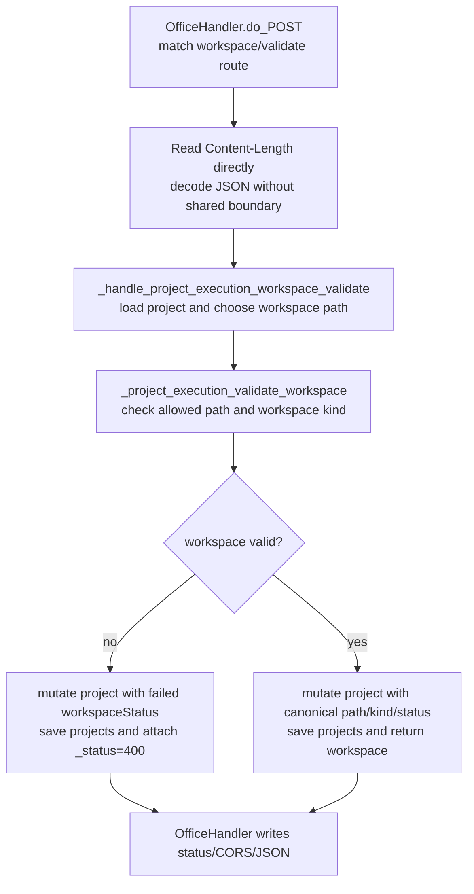
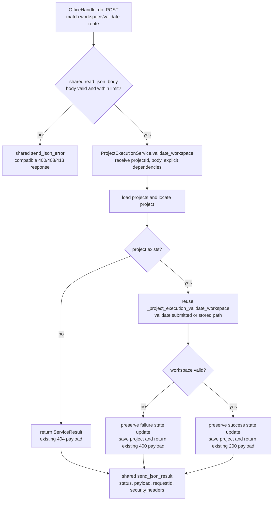

## Context

`app/server.py` contains the `OfficeHandler` HTTP adapter, project persistence helpers, workspace validation, project execution orchestration, provider integration, and many unrelated domains. POST handlers repeatedly read `Content-Length`, decode JSON, call a `_handle_*` function, pop `_status`, and write JSON plus CORS headers. A bounded reader already exists as `OfficeHandler._read_limited_json_body`, but it is currently limited to management endpoints rather than used as the shared contract for migrated routes.

The pilot operation will be `POST /api/projects/{projectId}/project-execution/workspace/validate`, currently routed in `OfficeHandler.do_POST` to `_handle_project_execution_workspace_validate`. It is a suitable first slice because it exercises HTTP parsing, project lookup, filesystem validation, persistence on both success and failure, and status mapping, but it does not start a provider, spawn a thread, acquire a long-lived execution lock, or emit SSE events.

Current flow:

Constraints:

- Preserve the route, request fields, response fields, status codes, project mutation, and persistence format.
- Preserve existing workspace allowlist and filesystem checks.
- Avoid a new web framework, dependency injection framework, repository rewrite, or global route migration.
- Keep later project, meeting, and provider extraction changes independently reviewable.

## Goals / Non-Goals

**Goals:**

- Establish shared HTTP helpers for bounded JSON input, JSON output, structured failures, request identifiers, and common security headers on migrated routes.
- Establish a service boundary that can be invoked without `OfficeHandler` or a live server.
- Move the workspace-validation business orchestration into a first project execution service while reusing existing lower-level behavior.
- Prove compatibility through direct service tests and HTTP contract tests.
- Make the pilot reversible without data migration.

**Non-Goals:**

- Migrating every JSON endpoint in this change.
- Changing the process bind address, global CORS policy, authentication model, or external callback policy.
- Moving the full project execution state machine, provider launch, cancellation, review, scheduling, SSE, or WebSocket behavior.
- Introducing a base service class, service registry, container, ORM, or new runtime dependency.
- Changing project JSON structure or rewriting existing project storage.

## Decisions

### 1. Use workspace validation as the only pilot business operation

The change will extract `POST /api/projects/{projectId}/project-execution/workspace/validate`. The service owns project lookup, selection of the submitted or stored workspace path, application of validation results to the project, timestamp update, and persistence. The HTTP adapter owns route matching, path extraction, bounded JSON decoding, service invocation, and response emission.

Starting a task was considered because it is more representative of the final domain, but it also owns role resolution, dirty-worktree confirmation, state transitions, thread creation, provider execution, and cancellation coordination. Using it in the foundation change would make regressions difficult to attribute and would pre-empt the second change.

### 2. Add a small functional service module with explicit dependencies

Create `app/services/project_execution.py` and `app/services/__init__.py`. The pilot function will accept `project_id`, a normalized request mapping, and explicit callables for loading projects, saving projects, validating a workspace, and obtaining the current timestamp.

The service will not import `server.py`, inspect `OfficeHandler`, or write network responses. Its `ServiceResult.status` remains an HTTP-oriented compatibility value for this incremental pilot; "transport-independent" here means it does not read or write HTTP transport objects, not that its result vocabulary is protocol-neutral. Explicit callables are chosen over a dependency-injection framework because the existing code is function-oriented and tests already replace module functions directly. A class hierarchy was considered and rejected for this pilot because it adds lifecycle and inheritance decisions without an existing project convention.

Expected service flow:

### 3. Represent service outcomes without HTTP coupling

The new module will define a small immutable `ServiceResult` value containing `status` and `payload`. Expected business failures such as project-not-found and invalid-workspace remain ordinary results because they are part of the existing endpoint contract. Unexpected exceptions are not converted inside the service; the HTTP boundary logs them and returns a sanitized 500 response with a request identifier.

Reusing the existing convention of embedding `_status` inside business dictionaries was considered. It was rejected at the new boundary because `_status` is an HTTP concern and would reproduce the coupling this change is intended to remove. Existing non-migrated functions keep `_status` unchanged.

### 4. Extend the existing bounded body reader instead of creating a second parser

Rename/generalize `_read_limited_json_body` only as needed so the migrated route can use it with an explicit limit. Preserve its current 400, 408, and 413 outcomes. The migrated route will require a JSON object; arrays and scalar JSON values will return a 400 response before service invocation.

This change will not migrate all POST routes. Broad conversion is deferred because malformed-request behavior varies across existing handlers and must be audited route by route.

### 5. Centralize output only for migrated and management paths initially

Add `OfficeHandler` helpers that serialize JSON once, set `Content-Type` and `Content-Length`, attach a request identifier, and apply a small set of response-hardening headers. The helpers will not globally inject CORS or change existing CORS values in this change; CORS and bind-address hardening require a separate compatibility review for browser, Docker, and external callback use cases.

The initial common headers will be non-breaking response protections such as `X-Content-Type-Options: nosniff` and a request identifier header. CSP and frame policy are deferred because they can affect the embedded browser/viewer surfaces.

### 6. Keep persistence and concurrency ownership unchanged

The pilot service calls the existing load/save functions exactly once per completed validation path. It does not introduce a cache, background thread, lock, retry, or asynchronous operation. The existing persistence implementation remains responsible for its current serialization behavior.

This pilot does not claim to solve concurrent lost updates in project storage. Changing concurrency semantics belongs in the second change and requires broader state-machine analysis.

### 7. Use characterization tests as the compatibility gate

Before switching the route, tests will capture current success, missing-project, invalid-workspace, malformed-JSON, and oversized-body behavior. Direct service tests will assert mutation and persistence calls without an HTTP server. HTTP-level tests will assert route, status, JSON shape, request identifier, and security headers.

Existing project execution regression tests remain mandatory. No snapshot will be updated merely to accept a changed response unless the confirmed specification is revised first.

## Risks / Trade-offs

- **[Risk: service still depends on broad project dictionaries]** → Keep the pilot narrow and pass existing dictionaries unchanged; introduce domain models only if a later confirmed change requires them.
- **[Risk: shared response helpers accidentally change headers or serialization]** → Limit adoption to the pilot and existing management response path, and add byte/JSON-level contract assertions before wider migration.
- **[Risk: invalid requests currently have inconsistent behavior]** → Characterize the pilot route first and explicitly approve only the bounded-reader changes required by the confirmed spec.
- **[Risk: circular import from service to server]** → The service module must not import `server.py`; all legacy functions are injected from the route composition point.
- **[Risk: project save after validation races with another writer]** → Preserve current behavior in this change and record concurrency ownership as a required design topic for phase two.
- **[Risk: security work is perceived as complete]** → Document that global CORS, bind address, authentication, CSP, and frame policy are intentionally deferred and remain separate risks.
- **[Trade-off: explicit callable dependencies are verbose]** → The verbosity makes ownership and tests visible and avoids premature framework or repository abstractions.

## Migration Plan

1. Add characterization tests for the current workspace-validation route and helper behavior.
2. Add shared HTTP input/output helpers without migrating unrelated routes.
3. Add the project execution service and direct unit tests using explicit dependencies.
4. Switch only the workspace-validation route to the service and shared HTTP helpers.
5. Run focused HTTP, project execution, static contract, and merged-change regression checks.
6. Keep the old handler function until the migrated path passes review; then remove only that obsolete wrapper in a separate reviewable task.

Rollback requires reverting the route delegation and service/helper commits. No data repair, migration, feature flag, or coordinated frontend rollback is required because persisted fields and route contracts remain unchanged.

## Technical Review

### 评审结论

**带条件通过。** The design is suitable for task planning if the compatibility assertions are written before route migration and global security-policy changes remain out of scope.

### 阻塞问题

None after selecting workspace validation as the pilot and explicitly deferring global CORS/bind-policy changes.

### 主要风险

- **稳定性:** shared helpers could change error/serialization behavior; controlled by pilot-only adoption and characterization tests.
- **数据一致性:** existing whole-project persistence can race; behavior is preserved, not solved, and must be reviewed in phase two.
- **安全:** request bounds and response hardening improve the migrated path, but global exposure remains unchanged.
- **性能:** the pilot adds only constant-cost result wrapping and header generation; filesystem and persistence work are unchanged.
- **兼容性:** status, payload, mutation, and stored data are asserted by contract tests.
- **可回滚性:** no schema migration or parallel write path is introduced.
- **可观测性:** request identifiers improve error correlation; structured metrics are deferred.

### 关键追问

- **Why not extract task start first?** It combines too many concurrency and provider responsibilities for a foundation change.
- **Why not migrate every POST endpoint to the bounded reader?** Existing malformed-body semantics are inconsistent, so bulk migration would create hidden behavior changes.
- **Why inject functions instead of a repository class?** It matches the existing functional style and avoids designing the full project repository before phase two.
- **What happens if persistence fails?** The exception propagates to the HTTP boundary, is logged with the request identifier, and produces a sanitized 500; no partial alternate store is introduced.
- **Does disabling or reverting the change leave background work?** No; the pilot launches no thread or provider run.

### 测试与上线建议

- Capture pre-migration route behavior before changing delegation.
- Test success, missing project, invalid/missing path, disallowed root, malformed JSON, scalar JSON, oversized body, persistence failure, and unexpected validator failure.
- Run the existing project execution suite and HTTP contract checks.
- Deploy as a normal code change because no data migration or feature flag is required; rollback by reverting the isolated commits if contract checks or runtime smoke tests fail.

## Open Questions

None required to proceed to task planning. Phase two must independently decide project-store concurrency ownership and final service grouping rather than treating this pilot as a binding full-domain architecture.

## Management Token Dialog Follow-up

`i18n.managementFetch` currently invokes `window.prompt` after a protected request returns 403. Replace that native browser surface with a small Promise-based modal implemented in `app/i18n.js`, using the existing global `modal`, `modal-content`, `modal-header`, and `modal-controls` classes plus narrowly scoped token-dialog styles in `app/style.css`.

The dialog will render text through DOM `textContent` rather than interpolating translated strings into HTML. Its input uses `type="password"`, `autocomplete="current-password"`, and an accessible label. Confirm resolves the entered trimmed value; cancel, close, backdrop, and Escape resolve an empty value. Enter submits only when the token is non-empty. The implementation removes prior dialog instances, restores focus on close, and does not persist the value beyond the existing `sessionStorage` behavior.

This follow-up changes only the token-entry UI. It does not change the default token, management header, retry count, 403 handling, server authorization, or storage lifetime.

Concurrent protected requests share one in-flight token-dialog Promise. A later
403 therefore reuses the visible dialog rather than removing it, so every
waiting `managementFetch` resumes from the same user decision and no orphaned
keydown listener remains.
