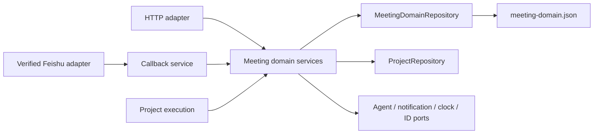
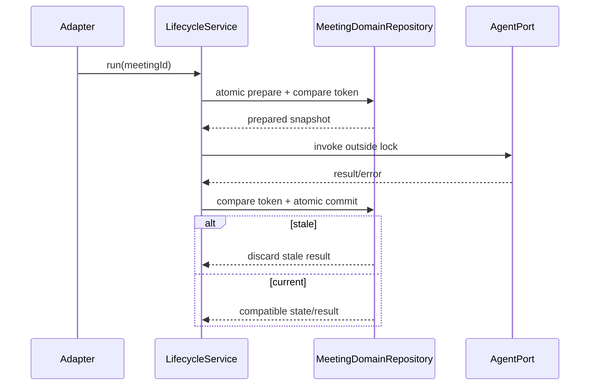

## Context

Virtual Office currently stores executable Meetings in `executable-meetings.json` and AI meeting requests in `meeting-requests.json`. Lifecycle, request conversion, Agent occupancy, action items, project blockers, notifications, and Feishu callbacks are primarily orchestrated in `app/server.py`. Although each file uses atomic replacement, commands spanning both files require two locks and two commits, increasing maintenance cost and leaving partial-commit recovery paths.

The confirmed requirement replaces both legacy stores with one authoritative Meeting-domain JSON store and provides an explicit migration script. Public APIs, state names, confirmation rules, Agent behavior, projections, events, notifications, and project-execution interfaces remain compatible; only the internal persistence layout intentionally changes.

Constraints:

- Standard-library HTTP server and local JSON/Markdown storage remain.
- One server process is the supported deployment model.
- Migration must be offline with Meeting mutations stopped.
- Invalid or conflicting legacy data fails closed; runtime never silently migrates.
- Slow Agent, notification, Feishu, and project work cannot hold the Meeting store lock.
- No database, queue, durable outbox, frontend redesign, or `_wf_*` migration.

## Goals / Non-Goals

**Goals:**

- Use one unified JSON schema and one atomic repository boundary for all Meeting-domain state.
- Remove coordinated writes between executable Meeting and request stores.
- Provide an idempotent, auditable migration with backups, validation, dry-run, and safe rollback.
- Extract lifecycle, requests, action items, notifications, and callbacks into directly testable services.
- Prevent stale Agent results, duplicate conversion/tasks/callbacks, and incorrect occupancy release.

**Non-Goals:**

- No Meeting UI or product-workflow changes.
- No change to request auto-confirm or human-confirmation policy.
- No multi-process/distributed transaction guarantee.
- No automatic online migration or reverse-migration tool.
- No exactly-once external notification guarantee.

## Decisions

### 1. One versioned unified Meeting-domain schema

The authoritative file is `meeting-domain.json` under the existing status directory:

```json
{
  "schemaVersion": 1,
  "meetings": {},
  "events": {},
  "occupancy": {},
  "requests": {},
  "idempotency": {
    "meetings": {},
    "requests": {},
    "callbacks": {},
    "actionItems": {}
  },
  "migration": {
    "sourceDigest": "",
    "migratedAt": "",
    "reportFile": ""
  },
  "updatedAt": ""
}
```

Existing Meeting, event, occupancy, request, conversion, and timestamp records retain their field shapes. Namespacing idempotency avoids collisions between legacy stores while allowing one bounded cleanup policy. `schemaVersion` is mandatory and unknown future versions fail closed.

Alternative considered: embed requests under Meetings. Rejected because pending/rejected requests may not have a Meeting, and changing request identity/projection would increase compatibility risk.

### 2. A single `MeetingDomainRepository` owns all persistence

`app/services/meeting_repository.py` owns load validation/repair, deep-copy returns, atomic mutation, event sequencing, occupancy, requests, and namespaced idempotency. It uses one ref-counted process-local reentrant lock and writes a temp file followed by `os.replace`, flush, and best-effort directory fsync where supported.

Every Meeting-domain command commits through `repository.update(mutator)`. No service writes the JSON file directly. Successful writes update one in-memory coherent snapshot; external file replacement invalidates it through bounded metadata checks consistent with the Phase 2 repository approach.

One Store removes Meeting↔Request partial commits. Project Markdown remains a separate authority, so Meeting↔Project commands still use compare tokens and idempotent forward recovery.



### 3. Offline migration script with explicit modes

Add `scripts/migrate_meeting_store.py` with:

- `--dry-run` as the default safety mode: load, normalize, merge, validate, and print/write a report without mutation.
- `--apply`: require both source paths and destination path to be inside the configured status directory; refuse if a running-server lock/PID indicates active mutation.
- `--force-rebuild` is intentionally absent. Conflicts require manual correction rather than destructive preference rules.
- Machine-readable JSON report plus concise terminal summary.

The script uses the same schema/validation helpers as `MeetingDomainRepository` but does not import `server.py`.

### 4. Deterministic migration and conflict rules

Migration executes in this order:

1. Open both legacy files without following symlinks; capture bytes, size, digest, and metadata.
2. Parse JSON and validate top-level/object types.
3. Normalize missing optional maps using the current compatible defaults.
4. Map executable fields (`meetings`, `events`, `occupancy`, executable idempotency) and request fields (`requests`, request idempotency) into separate unified namespaces.
5. Validate unique IDs, event ownership, request source/project/task fields, request conversion Meeting IDs, occupancy owners/participants/non-terminal state, supported phases/statuses, and bounded histories.
6. Re-read and re-digest both sources immediately before apply; abort if either changed.
7. Write timestamped byte-for-byte backups of both sources and fsync them.
8. Write the unified temp file, reload it through repository validation, compare counts/relationships/digest, then atomically replace the destination.
9. Write the final report and success marker. Legacy files remain as rollback inputs and are not deleted automatically.

Identity collisions with different content, dangling converted Meeting links, multiple active occupancy owners, malformed JSON, or unsupported schema fail the entire migration. There is no last-writer-wins merge.

### 5. Migration is idempotent by source digest and semantic comparison

The unified migration metadata stores a digest over both exact legacy inputs plus the migration schema version. Re-running with the same source digest:

- validates the existing unified file;
- confirms counts and semantic content match;
- emits `already_migrated` without replacing the file or duplicating entries.

If the source digest changes after a successful migration, `--apply` fails with `migration_source_changed`; operators must decide whether to restore legacy mode, correct data, or perform a separately reviewed migration. This avoids merging post-cutover writes from two authorities.

### 6. Runtime startup has a strict authority gate

Startup determines Meeting persistence state:

- Valid unified store: Meeting reads/writes use it exclusively.
- Unified store absent and both legacy stores empty/absent: initialize a new empty unified store atomically.
- Unified store absent and either legacy store contains domain data: Meeting mutations return stable `meeting_store_migration_required`; read-only diagnostics expose migration status but do not merge data.
- Unified store invalid/unknown version: Meeting operations fail with `meeting_store_invalid`; no empty replacement is created.

Legacy files are never read as parallel runtime authorities after a valid unified store exists. Startup logs only sanitized paths/digests/counts.

### 7. Service boundaries use the unified transaction

Incrementally extract:

- `meeting_lifecycle.py`: create, transition, conflict/intervention, agenda/arbitration/moderator operations, turns, terminalization, and reconcile.
- `meeting_requests.py`: create/list/detail, context selection, confirm/reject, conversion, and blocker linkage.
- `meeting_action_items.py`: result normalization, project projection, and task conversion.
- `meeting_notifications.py`: bounded sanitized DTOs, stable intents, and best-effort delivery coordination.
- `meeting_callbacks.py`: trusted callback commands, action allowlists, linkage, and persistent replay handling.

HTTP parsing/authentication, Feishu signature verification and card formatting, SSE/WebSocket transport, and Provider clients remain adapters. Temporary `_handle_*` delegates may translate results but cannot retain business orchestration.

### 8. Slow Agent work uses prepare and compare-and-commit

Lifecycle prepare atomically records phase, turn/event sequence, call ID, participant, and pending-call metadata. Agent work runs outside the repository lock. Result commit verifies Meeting ID, phase, sequence, participant, and call ID; stale results are recorded/discarded without overwriting intervention, cancellation, takeover, or terminal state.



### 9. Occupancy is atomically consistent with Meeting state

Claims and Meeting participant/phase changes occur in one unified mutation. Claim fails if a non-terminal Meeting owns the Agent. Release only removes `occupancy[agent]` when it equals the terminating Meeting ID. Recovery rebuilds occupancy deterministically from non-terminal Meetings, reports ambiguous claims, and never silently chooses between conflicting owners.

### 10. Request conversion is atomic inside the domain Store

Confirmation/rejection, request conversion claim, Meeting creation, request conversion metadata, and Meeting idempotency commit together in one unified mutation. Repeated decisions return the existing request/Meeting. This removes the previous successful-Meeting/failed-request partial state.

Project blocker mutation remains separate. It uses request/Meeting/task/attempt compare tokens through `ProjectRepository`. If Project commit fails, the unified Store retains a bounded reconciliation diagnostic; retry reapplies the idempotent project mutation without creating another Meeting.

### 11. Action items, callbacks, and notifications remain idempotent

Action-item IDs are stable from Meeting/result identity. Project task creation dedupes by `(meetingId, actionItemId)` through ProjectRepository and records the linked task idempotently in the unified Store.

Feishu verification stays in the adapter, which creates a trusted context containing verified event/message ID and actor. Callback outcome/dedupe commits in the unified Store. Card values cannot override actor identity or linkage.

Business state commits before external notification delivery. Sanitized DTOs and stable intent keys are persisted; delivery failure does not roll back state and does not claim exactly-once behavior.

### 12. Capacity, observability, and compatibility

Dictionary lookup remains O(1) by ID. Event/history/idempotency collections retain bounded limits. Baselines record loads, saves, bytes, Agent/notification calls, lock wait, and p95 for 1/20/100 Meetings plus request/callback/occupancy contention. Migrated paths must not increase external calls or durable writes; request conversion should reduce two Meeting-domain writes to one.

Low-cardinality diagnostics cover migration state, schema version, operation, ID digest, phase/status, stale commit, lock wait, recovery repair, callback replay, Project reconciliation, notification failure, load/save bytes, and duration. Credentials, raw callback bodies, unrestricted transcripts, absolute paths, and raw Agent errors are prohibited.

## Risks / Trade-offs

- [Larger single file] One Store increases bytes per commit → retain bounds, measure write p95/size, and keep slow work outside the lock.
- [Migration data loss] Incorrect mapping could omit records → byte backups, dry-run, source re-digest, count/link validation, atomic destination, no source deletion.
- [Authority ambiguity] Legacy writes after cutover could diverge → unified Store is exclusive; changed source digest blocks re-apply.
- [Invalid occupancy] Legacy data may contain competing owners → migration fails closed for manual resolution.
- [Meeting↔Project partial commit] Project Markdown remains separate → compare tokens, idempotent retry, and reconciliation diagnostics.
- [Stale Agent result] Interventions race slow calls → durable phase/sequence/call compare token.
- [Callback forgery/replay] Card values are untrusted → verified adapter context, allowlist, linkage validation, and persistent dedupe.
- [Rollback external effects] Agent/Feishu effects cannot be undone → restore data only while stopped and reconcile external effects from audit/intents.
- [Single-process scope] Process lock is not distributed → enforce one server writer; multi-process requires a future transactional store.

## Migration Plan

1. Characterize both legacy stores, all writers/callers, schema variants, corrupted/conflicting fixtures, API contracts, and performance.
2. Implement unified schema validator, repository, migration dry-run/apply/report, and exhaustive migration tests before changing runtime authority.
3. Run migration rehearsal on copied small/medium/large fixtures; prove backups, counts, links, idempotency, conflict failure, and restore.
4. Add startup authority gate and migrate existing store helpers to the unified repository while retaining Handler behavior.
5. Extract lifecycle/occupancy, then requests/conversion, action items, notifications, and callbacks in reversible slices.
6. Run complete Python/JavaScript/static/persistence/Project/Feishu/SSE/WebSocket/OpenSpec regression and performance comparison.
7. Before release, stop Meeting mutations and the server, back up all status/project files, run migration dry-run then apply, validate report, start exactly one process via `start.sh`, and execute Meeting/request/action/callback smoke tests.
8. Roll back on migration mismatch, unreadable unified data, duplicate Meeting/task, incorrect occupancy, unauthorized callback effect, project-linkage overwrite, or sustained p95 regression. Stop the process, preserve failed evidence, restore both timestamped legacy backups and the prior code, then restart via `start.sh`.

## Technical Review

### 评审结论

**带条件通过。** The single-Store design removes one consistency boundary and is suitable for task planning after explicit technical-design confirmation.

### 阻塞问题

No unresolved design blocker remains. The human technical-design confirmation is pending.

### 主要风险

- Migration correctness and authority cutover.
- Larger whole-file atomic writes and lock duration.
- Meeting↔Project partial commits after the internal stores are unified.
- Stale Agent results, occupancy conflicts, callback replay, and sensitive content.

### 关键追问

- Q: Why one top-level Store rather than nesting requests in Meetings? A: Requests may exist without Meetings; a shared root preserves both models while removing the second file/lock.
- Q: Why offline migration? A: It provides a stable source snapshot and prevents dual-authority writes.
- Q: Why keep legacy files after success? A: They are byte-for-byte rollback inputs; runtime ignores them after cutover.
- Q: How is repeated migration safe? A: Exact source digest, semantic validation, and `already_migrated` no-op behavior.
- Q: What still needs reconciliation? A: Only Project Markdown and external Agent/Feishu effects, which cannot share the local JSON transaction.

### 测试与上线建议

- Cover missing/empty/corrupt/symlinked/changing inputs, identity collisions, dangling links, occupancy conflicts, unknown schema, disk-full/replace/fsync failures, and repeat migration.
- Verify old/new API payloads, phase/status transitions, request confirmation, action items, callback replay, notification failure, and restart recovery.
- Measure migration duration/peak memory/output size and runtime load/save/lock p95 on fixed fixtures.
- Rehearse stop → backup → dry-run → apply → validate → `start.sh` → smoke → rollback/restore before release.

## Open Questions

None. File name, schema version, migration modes, authority gate, and conflict policy are fixed by this design; implementation constants must preserve existing configured limits.
