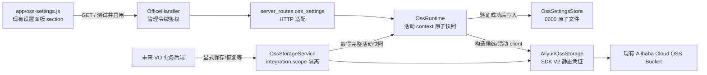
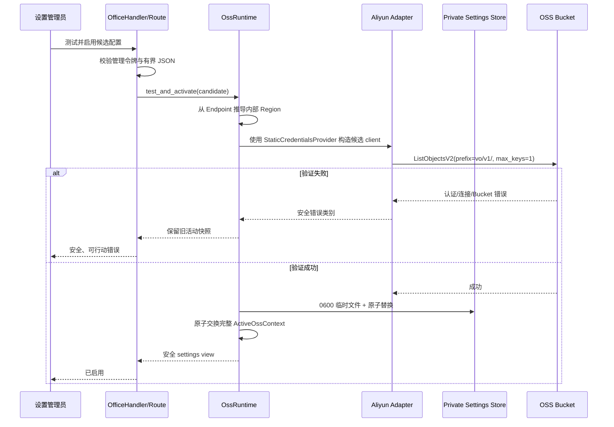

## Context

VO 当前没有通用远端对象存储能力。设置页实际由 `app/index.html` 中的 `#main-menu-panel` 承载，运行时设置逻辑集中在大型 `app/game.js`；后端实际入口是大型 `app/server.py::OfficeHandler`。通用配置通过 `_load_vo_config()` 和 `_persist_setup_payload()` 管理，路径和内容允许环境变量参与，且普通 JSON 写入方式不适合承载本需求的 OSS 凭证与“验证后才激活”语义。

本设计只建立一个供未来 VO 业务模块调用的后端 OSS 能力，并在现有设置体验中增加阿里云 OSS 配置。它不迁移任何现有资料、不增加浏览器对象 API，也不实现自动恢复。

已确认的源码依据位于 `analysis/modification-points.md`：

- MP-OSS-01：`app/index.html:49/54/1255`、`app/game.js::_mmLoadCurrentSettings/mmSaveSettings`、`app/i18n.js::managementFetch`。
- MP-OSS-02：`app/server.py::_resolve_config_path/_load_vo_config/_persist_setup_payload` 与 `app/project_store.py::_atomic_write_private` 的安全写入模式。
- MP-OSS-03：`app/server.py::OfficeHandler.do_GET/do_POST`、管理令牌鉴权和 `server_routes.skill_library_organization` 的显式运行时注入模式。
- MP-OSS-04：`start.sh::python_bin` 依赖检查约定，以及当前仓库不存在 OSS SDK 和对象存储抽象的事实。

约束与利益相关方：

- 设置管理员需要在现有设置页配置 endpoint、bucket 与 AccessKey，并得到安全、可行动的验证结果；SDK 所需 Region 由后端从 Endpoint 推导，不作为设置项暴露。
- 未来 VO 业务模块需要稳定的保存、主动恢复、覆盖、删除、存在性、元数据和列表接口。
- OSS 配置值不得来自环境变量；密钥不得通过浏览器、API、错误或日志回显。
- 大对象传输必须保持有界内存，不增加小于 OSS 限制的 VO 固定总大小限制。
- 当前工作树包含大量用户修改；实现必须以新聚焦文件为主，既有文件只做必要注册与装配。

## Goals / Non-Goals

**Goals:**

- 提供后端 `OssStorageService`，以调用方 integration scope 隔离对象，并提供流式保存和主动恢复。
- 提供阿里云 OSS Python SDK V2 适配器，显式使用设置中的静态凭证，不触发环境变量凭证链。
- 使用独立应用私有设置文件保存活动配置，通过显式连接测试后原子激活，重启后可恢复。
- 在现有设置面板中追加小型 OSS section，复用现有管理令牌边界。
- 建立稳定、密钥安全的领域错误和必要观测，并用 fake provider/SDK 完成可重复自动化验证。

**Non-Goals:**

- 不提供公开 URL、签名 URL、浏览器上传/下载、资料浏览器或搜索。
- 不自动、后台、定时恢复，也不恢复完整 VO 状态。
- 不实现最终用户授权；通用模块只隔离 integration scope。
- 不创建、删除或配置 Bucket，不验证或代管 RAM 权限策略。
- 不迁移现有资料，不接入 personal-assets 或其他现有业务。
- 不提供版本历史、回收站、本地后备存储、多云抽象或跨云迁移。
- 不引入 KMS、系统钥匙串或主密码加密；本期密钥保护边界是独立 `0600` 文件、原子写入和全链路脱敏。

## Decisions

### 1. OSS 设置使用独立私有存储，不进入通用 VO 配置

**对应修改点：MP-OSS-02。**

新建 `app/services/oss_settings.py`，定义不可变的 `OssConnectionConfig`、安全投影 `OssSettingsView` 和 `OssSettingsStore`。composition root 将 VO 已确定的应用数据目录作为显式构造参数传入，store 固定使用目录内的 `oss-settings.json`；store 自身不读取 `OSS_*`、`ALIBABA_CLOUD_*` 或任何其他环境变量。

持久化结构包含 schema version、endpoint、bucket、access key ID、access key secret 和激活时间，不单独持久化 Region。写入采用同目录临时文件、临时文件及目标文件 `0600`、flush/fsync、`os.replace` 的原子替换模式。读取或接收候选时，`_derive_region_from_endpoint()` 从规范化 hostname 推导 SDK 内部 Region：支持 `oss-<region>.aliyuncs.com`、`oss-<region>-internal.aliyuncs.com` 与 `<region>.oss.aliyuncs.com`；加速域名、自定义 CNAME 或其他无明确 Region 的 Endpoint 在 provider 构造前返回 `oss_region_unresolved`。内部不可变 `OssConnectionConfig` 保留一次派生出的 `region`，避免后续层重复解析，但 `OssSettingsView` 和持久化投影均不含该字段。

开发阶段已经写入的同 schema 文件可能带有旧 `region` 键；读取时忽略该键并始终从 endpoint 重新推导，下一次成功激活会以无 region 的投影原子覆写。这样不会把旧独立字段继续作为事实源，也不需要破坏性迁移。

更新时，未提交新 secret 表示保留当前活动 secret；尚无活动 secret 时 secret 必填。提交非空新 secret 表示替换。候选配置只存在于当前请求内存中，验证失败不持久化。

**变量行为变化：** 不扩展 `app/server.py::_SETUP_SECRET_KEYS`，不让 OSS 值进入 `_persist_setup_payload(body)` 的 `existing: dict`；新增 store 成为 OSS 设置唯一事实源。

**替代方案：**

- 扩展 `vo-config.json`：拒绝，因为其路径和字段存在环境变量覆盖，且普通写入与验证前保存语义不满足规格。
- 仅使用环境变量或 SDK 默认凭证链：拒绝，因为用户明确要求只在设置页管理。
- 引入 KMS/钥匙串：本期不采用，避免增加平台绑定和新的根密钥生命周期；若需要超出本机账户权限边界的静态加密，另立需求。

### 2. 连接测试与激活是一次显式、失败安全的原子操作

**对应修改点：MP-OSS-02、MP-OSS-03。**

`app/services/oss_runtime.py::OssRuntime` 管理 `_active_snapshot: ActiveOssContext | None`。设置提交按以下顺序执行：

1. 校验 endpoint/bucket/AccessKey 格式，将未提供的 secret 与当前活动 secret 合并，并从 Endpoint 推导内部 Region；无法推导时在网络访问前失败。
2. 用包含派生 Region 的完整候选值创建临时阿里云 client。
3. 对指定现有 Bucket 执行只读 `ListObjectsV2` 探测，使用 VO 对象根前缀且 `max_keys=1`；这同时验证 endpoint、派生 region、凭证、Bucket 可达性和本能力所需的列表权限，不创建或修改任何 Bucket/object。
4. 探测成功后原子写入私有设置文件。
5. 在短临界区内一次性交换完整 `ActiveOssContext`。
6. 交换完成后才向前端返回成功。

每次对象操作在开始时取得一个完整 context 引用，随后不再读取可变配置字段。激活前已经开始的操作可以继续使用旧 client；激活响应之后开始的操作统一取得新 client，不会混用新旧 endpoint、bucket 或凭证。若测试或持久化失败，旧文件和旧快照保持不变。若进程在文件替换后、内存交换前退出，重启会从已完整写入的新文件恢复；当前请求不会虚报成功。

设置页提供一个“测试并启用”动作，不持久化单独的“已测试候选”或长期 activation token，避免候选值在测试与启用之间被改动。它仍满足“当前值必须明确测试成功后才能激活”。

**替代方案：**

- 分为长期保存候选、测试、再次启用三步：拒绝，因为需要额外候选密钥存储、版本和过期管理，而用户选择的是验证成功后启用。
- 用写入临时对象测试全部 CRUD 权限：拒绝，因为测试不得修改 Bucket 内容；实际操作缺权时由稳定 provider failure 显式报告。
- 使用 `HeadBucket`：不作为首选，因为本能力本身要求 list，使用最小列表请求可同时验证所需列表权限且保持只读。

### 3. 阿里云 SDK 只在 provider 适配器中出现，并显式注入凭证

**对应修改点：MP-OSS-04。**

新建 `app/services/aliyun_oss_storage.py`，它是唯一导入 `alibabacloud_oss_v2` 的业务模块。`build_client(config)` 明确构造：

- `oss.credentials.StaticCredentialsProvider(access_key_id=..., access_key_secret=...)`；
- `oss.config.load_default()` 后显式覆盖 `credentials_provider`、从 Endpoint 派生的内部 `region` 和用户配置的 `endpoint`；
- `oss.Client(cfg)`。

禁止实例化 `EnvironmentVariableCredentialsProvider`，也不使用会自行寻找凭证的默认 provider。`start.sh` 按现有 `python_bin` 约定检查导入名 `alibabacloud_oss_v2`，缺失时在 `.venv` 安装官方包 `alibabacloud-oss-v2`。

适配器定义窄的 provider protocol，领域服务只依赖该 protocol。SDK 异常在适配器边界归一化：404/对象不存在映射 not-found；401/403 或认证类错误映射 authentication；网络、DNS、连接和超时映射 connectivity；其余映射 provider-operation。设置探测在此基础上进一步输出 configuration-invalid、authentication、connectivity、bucket-inaccessible 等安全类别。只保留错误类别、HTTP 状态和 provider request ID 等安全诊断信息。

**替代方案：**

- 使用旧 `oss2` SDK：拒绝；新能力采用官方 Python SDK V2 的类型化 API 和上传管理器。
- 在领域服务中直接调用 SDK：拒绝，因为会把 SDK 异常、流类型和凭证构造扩散到未来所有调用方，难以做稳定测试和脱敏。

### 4. 对象引用绑定 integration scope，provider key 永远由服务构造

**对应修改点：MP-OSS-04。**

新建 `app/services/oss_storage.py::OssStorageService`。公开方法均显式接收 `integration_id: str`，并使用结构化 `ObjectRef`，而不接受原始 OSS key：

- provider root 固定为 `vo/v1/`；
- integration ID 和 caller object ID 分别采用无 `/` 的 URL-safe base64 编码；
- provider key 为 `vo/v1/<encoded-integration>/<encoded-object-id>`；
- 返回的 `ObjectRef` 同时包含 object ID 与 integration scope fingerprint。

服务收到引用时先校验 fingerprint 是否与当前 `integration_id` 匹配，不匹配即返回 `scope_mismatch`；随后仍只使用当前调用方 integration ID 构造 provider prefix。即使调用方伪造 object ID，也只能访问自己的 prefix，不能形成跨 scope provider key。空值、无法规范化的引用、超出 OSS key 长度或非法分页 token 均在发 provider 请求前拒绝。

`ObjectMetadata` 只包含 `ObjectRef`、size、content type（可用时）、ETag 和 last-modified，不包含 bucket、endpoint、provider key 或 URL。列表固定带当前 scope prefix并使用 SDK continuation token；返回前解码 object ID。OSS ListObjectsV2 不提供 content type 时返回 `None`，不为每个条目额外发 HEAD，避免 N+1 请求；单对象 metadata 通过 HEAD 获取 content type。

最终用户身份、项目权限和资料归属仍由 future integration 在调用前判断；通用服务只保证 integration namespace 隔离。

**替代方案：**

- 直接把 caller object ID 当 OSS key：拒绝，因为 `/`、`..`、前缀碰撞和错误的 list prefix 容易破坏隔离。
- 只对 integration ID 做 hash、接受完整 raw key：拒绝，因为 raw key 仍会泄露 provider 命名并扩大错误输入面。
- 在模块内实现最终用户 ACL：拒绝，因为当前没有统一资料主体，且规格明确由调用方负责。

### 5. 保存与恢复均采用流接口，恢复只能被显式调用

**对应修改点：MP-OSS-04。**

`OssStorageService.save(...)` 接受 binary reader/file-like 对象与可选 content type，适配器使用 SDK V2 `Uploader.upload_from` 的 multipart 流式上传。它不执行无界 `read()`，也不设置小于 OSS 限制的 VO 总大小上限；part size 和并发使用适配器内部有界默认值。

`restore_to(...)` 只有被业务调用方显式调用时才执行 `GetObject`。适配器从 response body 以固定 buffer 循环读取并写入 caller-provided binary sink，完成后关闭 provider body。API 不提供“返回整个 bytes”的大对象便利方法，避免未来调用方误用无界内存；小对象调用方可自行使用 `io.BytesIO`。

同一 scope 下对相同 object ID 再次保存直接写同一 provider key，利用 OSS Put/complete-multipart 的覆盖语义。delete 成功后模块不建立回收索引；exists/metadata/restore 的 not-found 均使用统一结果。服务不创建定时器、worker、恢复队列或启动扫描。

**替代方案：**

- `save(bytes) -> bytes` 风格：拒绝，因为无法证明大对象有界内存。
- 先完整落地本地临时文件：不作为通用路径，避免双份磁盘需求；未来若业务天然拥有 filepath，可在不改变领域语义的前提下增加专用 adapter 方法。
- 对象恢复 URL：拒绝，因为规格要求后端主动取回且不暴露签名或公共地址。

### 6. 设置 HTTP 只做管理鉴权与领域适配，对象能力不暴露 HTTP

**对应修改点：MP-OSS-01、MP-OSS-03。**

新建 `app/server_routes/oss_settings.py`，提供：

- `GET /api/settings/oss`：返回 `OssSettingsView`；
- `POST /api/settings/oss/test-and-activate`：读取有界 JSON，调用 runtime 的测试并激活操作。

两个入口都由 `OfficeHandler.do_GET/do_POST` 在读取设置或请求体前调用 `_reject_untrusted_management_request()`。route module 使用现有 `_runtime_provider` / `configure_runtime()` 注入模式，负责 HTTP status 与安全错误 JSON，业务校验、文件 IO 和 SDK 调用均留在 services。

`app/oss-settings.js` 在页面加载后创建一次 OSS `.mm-section`，并插入 `#main-menu-panel .main-menu-body` 中页面级 `.mm-save-all` 之前；找不到该按钮时才回退为容器末尾追加。区块只复用现有 `.mm-section/.mm-label/.mm-input/.mm-btn/.mm-status`，不修改全局 CSS。Region 控件、回填、必填校验和 POST 字段全部删除。

它通过 `i18n.managementFetch` 复用令牌挑战；加载时密钥输入框始终为空，只展示 `secretConfigured` 状态；提交成功或失败后都清除 secret DOM value。`renderStatus()` 在 message 为空时隐藏并清空状态容器，只有加载、成功或失败有文本时才恢复现有 `.mm-status` 样式。无活动配置的 GET 返回 `ok=true`、`configured=false` 的安全空投影，前端保持空表单、收起状态区，不创建 provider 或显示操作失败。既有 `app/game.js::mmSaveSettings()`、`_mmSettingsConfigRequest` 和 `/setup/save` 不变。

对象保存、恢复、删除、列表等没有通用 HTTP route；未来业务模块直接依赖 `OssStorageService`，并在自己的鉴权边界内调用。

**替代方案：**

- 复用 `/setup/save`：拒绝，因为会在测试前持久化候选并进入环境变量可覆盖的通用配置。
- 把对象方法一起做成 `/api/oss/*`：拒绝，因为当前没有最终用户授权模型，会意外形成通用文件网关。

### 7. 失败语义、日志和密钥处理在边界统一

**对应修改点：MP-OSS-02、MP-OSS-03、MP-OSS-04。**

领域错误携带固定 code、面向用户的安全 message、可选 provider request ID，不携带原始 SDK exception repr、请求对象或 candidate config。route 只序列化这些安全字段。日志在以下边界记录一次：设置验证失败、活动配置切换、provider 操作失败；包含 action、integration scope fingerprint、object reference、error category、request ID，不包含 endpoint query、AccessKey、secret、请求体、对象内容或完整 integration ID。not-found 等预期分支使用低级别日志，避免重复报错与日志风暴。

配置对象的 `repr`/字符串表现需显式隐藏 secret；测试通过唯一哨兵 secret/content 捕捉响应、异常和日志泄漏。前端不将 secret 放入状态对象、localStorage、sessionStorage 或 DOM 属性。

## Architecture and Data Flow

### 激活时序

## Scenario → Modification Point → Test Mapping

| Scenario | 文件 / 符号 / 关键变量 | 验证锚点 |
|---|---|---|
| 保存并主动恢复；不会提前恢复 | MP-OSS-04 `oss_storage.py::save/restore_to`，reader/sink | `tests/test_oss_storage.py` 流式往返及 provider 调用计数 |
| 不签发浏览器直达地址 | MP-OSS-04 `ObjectRef/ObjectMetadata` | 结果 schema 不含 URL/endpoint/bucket/key |
| 本 scope 访问、跨 scope 拒绝 | MP-OSS-04 `integration_id/ObjectRef/scope prefix` | 双 integration 的 read/write/delete/list 隔离测试 |
| 覆盖同一 object ID | MP-OSS-04 同一 provider key | 二次 save 后 restore 仅得新内容 |
| 删除后不存在且无模块恢复 | MP-OSS-04 `delete/exists/metadata/restore_to` | 删除后的统一 not-found 测试 |
| 仅列出本 scope 基本元数据 | MP-OSS-04 list prefix/pagination | 多 scope、分页、size/contentType 可空测试 |
| 大于 buffer 的有界内存传输 | MP-OSS-04 reader/sink、Uploader/GetObject body | 禁止无界 read 的探针 reader/sink 测试 |
| provider 拒绝保存、restore not-found | MP-OSS-04 异常分类器 | fake SDK 分类、secret/content 泄漏测试 |
| 无活动配置不发 OSS 请求且显示正常空状态 | MP-OSS-02 `_active_snapshot/settings_view`、MP-OSS-01 `renderSafeState/renderStatus` | runtime/provider 调用数为零；授权 GET 200；空表单无错误状态块 |
| 现有设置页展示且无 Bucket 管理 | MP-OSS-01 `ensureOssSettingsSection` 的 `section/host/saveButton` | JS DOM 测试无 Region、幂等插入且位于 `.mm-save-all` 前 |
| 未授权读写设置 | MP-OSS-03 `OfficeHandler` 鉴权分支 | live-server GET/POST 403 且鉴权先于 body/runtime |
| 重启恢复且 OSS-like env 不覆盖 | MP-OSS-02 `OssSettingsStore.load_active` | 临时目录重建 runtime、污染 env 后值不变 |
| secret 写后不可读、替换生效 | MP-OSS-01/02 view 与 candidate merge | API/DOM 无 secret；新 client 仅得替换值 |
| 设置错误不泄密 | MP-OSS-02/03/04 安全异常映射 | 哨兵 secret 不出现在响应、异常、repr、日志 |
| 测试成功后启用且不修改 Bucket | MP-OSS-02 `test_and_activate`、MP-OSS-04 list probe | fake SDK 只收到 ListObjectsV2，随后新操作用新 client |
| 标准 Endpoint 推导 Region；无法推导则拒绝 | MP-OSS-02 `_normalize_endpoint/_derive_region_from_endpoint/OssConnectionConfig.create` | 公网、内网、dual-stack 推导；加速/CNAME 返回 `oss_region_unresolved` 且 provider 零调用 |
| 测试失败保留旧活动配置 | MP-OSS-02 `_active_snapshot` | 失败后 identity/revision 与 provider 仍为旧值 |
| 新操作原子看到完整替换配置 | MP-OSS-02 `ActiveOssContext` | 并发 barrier 测试只观察完整旧/新 tuple |

## Compatibility and Unchanged Behavior

- `app/game.js::_mmLoadCurrentSettings()`、`mmSaveSettings()`、`config: object` 和 `/setup/save` 的行为保持不变。
- `app/server.py::_load_vo_config()`、`_persist_setup_payload()`、`VO_CONFIG`、`STATUS_DIR` 的既有含义保持不变；composition root 只把已解析的数据目录显式传给 OSS store。
- 现有管理令牌头、挑战码和前端 token prompt 保持不变。
- 没有活动 OSS 配置时，设置 GET 返回正常空投影且 VO 其他功能正常启动；只有调用对象存储能力时返回 configuration-unavailable。
- `OssConnectionConfig.region` 仅为当前后端快照中的派生字段；设置 API、前端 DOM/POST、环境变量和 `oss-settings.json` 都不把它当独立配置。
- SDK 缺失时，`start.sh` 按现有依赖自修复约定处理；直接绕过启动脚本导入 OSS adapter 时给出明确依赖错误，但不影响不使用 OSS 的模块被导入。

## Risks / Trade-offs

- **[AccessKey 以应用可读形式保存在本机私有文件]** → 文件和目录限制为当前账户可读，写入原子化，API/日志/DOM 全链路脱敏；需要 KMS/钥匙串时另立跨平台密钥管理需求。
- **[只读连接测试不能证明 Put/Get/Delete 权限]** → 测试验证 Bucket 可达及本能力必需的 list 权限；每个实际操作仍提供稳定显式失败，不通过测试创建探针对象。
- **[加速 Endpoint 与自定义 CNAME 不包含可可靠推导的 Region]** → 本期在 provider 访问前返回明确 `oss_region_unresolved`，不回退到环境变量、默认 Region 或猜测值；需要支持时另立具备可信 Region 发现机制的需求。
- **[进程崩溃可能发生在磁盘替换与内存交换之间]** → 不在交换前返回成功；重启从完整新文件恢复，不会产生部分配置。
- **[激活期间已经开始的请求继续使用旧 client]** → 每次请求固定完整 context；规格只要求激活后开始的新请求使用新配置，该策略避免中途切换破坏长传输。
- **[ListObjectsV2 不返回 content type]** → 列表中 `contentType=None`，单对象 metadata 通过 HEAD 获取；避免列表 N+1 和大目录放大。
- **[multipart stream 上传失败需要调用方重试]** → `upload_from` 保持有界内存但不提供 checkpoint；本期不持久化恢复任务或上传 checkpoint，错误明确返回。
- **[SDK 版本变化导致异常类型或 API 细节变化]** → 所有 SDK 接触集中在单一 adapter，并以 fake SDK contract test 固化凭证、请求、分页和流式边界。
- **[对象 key 编码增加长度]** → 写入前计算最终 UTF-8 key 长度并稳定拒绝超限输入，不把 provider 的模糊错误暴露给调用方。
- **[大型 `server.py` 与 locale 文件当前已有用户改动]** → 只追加最小 route 分支、composition 注入和 locale 键；实现时逐文件检查 diff，禁止覆盖无关改动。

## Migration Plan

1. 先增加领域类型、私有 settings store、runtime 与 fake 测试，不接触现有业务。
2. 增加阿里云 adapter 和 SDK 启动依赖检查，以 fake SDK contract test 验证，不要求真实 AccessKey。
3. 增加管理 route 和 `OfficeHandler` 的薄鉴权转发，完成 live-server 测试。
4. 增加独立前端 section、locale 文案和 DOM 测试。
5. 运行 OpenSpec strict validation、Python 定点测试、前端 DOM/模块边界测试及既有管理令牌测试。

首次部署时没有 `oss-settings.json`，runtime 处于未配置状态，不影响其他 VO 功能。管理员在设置页首次“测试并启用”后才创建该文件。没有现有 OSS 数据或配置需要迁移。

回滚时可移除新 UI/route 装配和 SDK 检查；现有 VO 行为恢复原状。专用 `oss-settings.json` 可保留供重新启用，避免破坏性删除凭证；若用户明确要求移除，应由用户确认后执行可恢复或明确的清理操作。云端对象不会被回滚代码自动删除。

## Open Questions

- 无阻塞性开放问题。已确认本期采用 `0600` 私有文件而非 KMS/钥匙串；采用一次“测试并启用”操作；对象 API 仅面向后端调用方。
- 实现阶段需以安装到 `.venv` 的实际 `alibabacloud-oss-v2` 版本复核具体异常类和 response body 关闭方法；若与官方 V2 文档或本设计的 provider protocol 不一致，先更新 design 并重新确认，而不是在 adapter 外扩散兼容逻辑。
