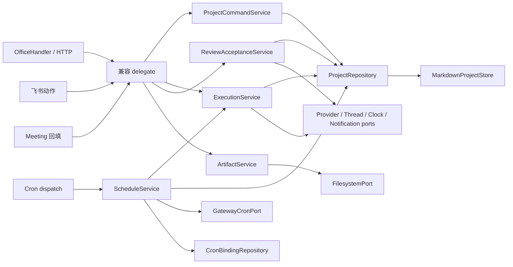
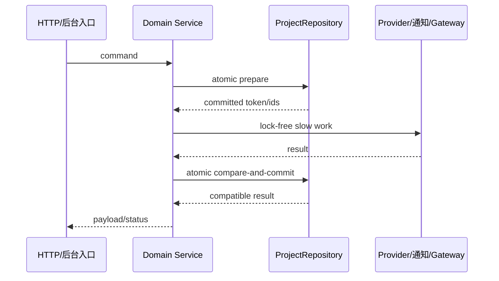

## Context

### 1. 背景和目标

#### 背景

Virtual Office 的项目、任务、执行、Review、返工、验收、Artifact 与 Cron 编排集中在 `app/server.py`。HTTP Handler、飞书回调、后台 daemon thread、Meeting 回填与 Cron dispatch 会直接调用同一批 `_handle_*` / `_project_execution_*` 函数；项目数据由 `app/project_store.py:MarkdownProjectStore` 持久化，但业务层普遍采用 load-modify-save，实例锁不覆盖完整状态事务。

当前结构造成三类问题：业务状态机难以脱离 HTTP 测试；不同入口可能覆盖同一项目的新状态；重复 load/save 与全量扫描会放大项目数据增长后的后台开销。第一期已验证 `ServiceResult`、显式 callable 依赖和薄 HTTP adapter 的可行性，本期沿用该模式并扩展到 Project Execution 主路径。

#### 目标

- 按独立切片提取 Project Execution Service，降低 `OfficeHandler` 与业务编排耦合。
- 对迁移路径引入按 `project_id` 隔离的原子更新，防止丢更新和重复 active attempt。
- 基于可复现基线减少冗余项目存储读写或重复扫描，改善后台性能。
- 保持 API、状态码、响应字段、SSE/WebSocket、通知、Provider 协议与 Markdown 存储兼容。
- 允许修复当前切片内可复现且预期行为明确的 bug，并以回归测试记录行为差异。

#### 业务目标

后台项目执行在并发操作和大项目数据下更稳定，执行、Review、验收与调度的失败更可定位；本方案不改变用户操作路径。

#### 技术目标

形成 Handler → Service → Repository/Port 的单向依赖；逐切片开发和验证，全部完成后整体上线。

### Stakeholders and constraints

- 影响调用方：项目页面、管理 API、飞书验收动作、Meeting 结果回填、Cron dispatch、Provider adapters。
- 约束：Python 标准库 HTTP server；MarkdownProjectStore 为权威存储；不新增框架、数据库或常驻 worker。
- 旧 `_wf_*` workflow 不在本期迁移，只保证其既有调用兼容。
- 前端交互和视觉不在范围内。

## Goals / Non-Goals

**Goals:**

- 独立测试项目命令、生命周期、Review/验收、Artifact 与 Schedule。
- 原子化同项目状态提交，不跨慢外部调用持锁。
- 记录关键路径的 load/save/provider 次数与稳定耗时基线。
- 逐切片保留可回滚提交边界，最终作为一个版本整体发布。

**Non-Goals:**

- 不迁移 legacy `_wf_*` workflow。
- 不切换 Web 框架、队列/worker、数据库或 Provider 协议。
- 不重命名持久化字段，不做 Markdown 数据迁移。
- 不做项目页面交互或视觉优化。
- 不宣称解决所有跨进程事务；当前部署模型仍是单 server process。

## Decisions

### 2.0 关键术语

- **ProjectRepository**：封装项目加载、兼容修复、history 合并与按项目原子更新的应用端口。
- **Atomic update**：同一 `project_id` 的读取与状态校验由 project lock 串行；最终全量 Markdown 持久化由短全局 commit lock 串行，并在锁内重读后只合并目标项目。
- **Slow work**：Provider、通知、Gateway、Git/文件扫描等不可在项目锁内执行的工作。
- **Compatibility delegate**：保留原 `_handle_*` 签名的薄函数，转调 Service 并返回既有 dict/`_status`。

### 2.1 方案选型与详细设计（架构、流程图等）

#### 总体调用方向



Handler 保留路由、management-token 鉴权、bounded JSON 与 HTTP/file response；Service 只接收应用数据和显式依赖。内部调用方不伪造 HTTP token，而是传入 actor/source。

#### 实现点 1：ProjectRepository 与项目级原子更新

- 目标文件：新增 `app/services/project_repository.py`；适配 `app/server.py:_load_projects/_save_projects` 与 `app/project_store.py:MarkdownProjectStore.load_all/save_all`。
- 插入位置：Service 依赖构造处创建单例 repository；旧 `_load_projects/_save_projects` 暂作为兼容 delegate。
- 具体逻辑：维护带引用计数的 `project_id -> LockEntry` 注册表和一个全局 store commit lock。project lock 内读取并校验目标状态、生成仅针对目标 project 的新值；commit lock 内重新 `load_all`，将目标 project 合并到最新全量数据，再执行 history merge 与 `save_all`。不同项目的慢工作可并行，但全量 store 的短提交串行。外部 I/O 在两类锁外执行，结果提交时重新校验 attempt/review id。
- 数据读写：保持完整 project dict 与未知字段；不改变 frontmatter `*_json` 映射。
- 异常与兼容：锁顺序固定为 registry guard → project lock → store commit lock；不得持 binding lock 获取 project/store lock，不得在 mutator 内嵌套 `repo.update`。兼容期内 `_save_projects` 保留为 Repository 的安全三方合并 delegate：`_load_projects` 附带不可持久化的基线快照，delegate 在 commit lock 内将 baseline、caller changes 与 latest 按 project/task/entity id 合并，禁止直接 stale 全量覆盖。`PROJECT_STORE.save_all/delete_project` 只能出现在 Repository adapter wiring。各业务切片迁移时再把对应 writer 改为显式 `repo.update/delete`；legacy `_wf_*` 可长期保留业务编排，但写协调不可绕过 Repository。store 异常继续向上层兼容映射。
- 测试点：同项目串行、不同项目 barrier 交错提交后两边更新均保留、stale attempt 不覆盖、legacy workflow 更新与 execution completion 交错、不同项目 legacy/new writer 交错、repair/history merge、锁顺序、registry refcount 回收和 load/save 次数。
- 代码证据：`app/server.py:_load_projects/_save_projects/_project_execution_repair_acceptance_state`；`app/project_store.py:MarkdownProjectStore.load_all/save_all`。

Writer inventory 必须覆盖项目/任务 CRUD、execution start/cancel/runner、Review/acceptance/Feishu action、Meeting result、Cron history/reopen、archive/maintenance、启动恢复、legacy `_wf_*` 写入以及 `PROJECT_STORE.delete_project`。每项标记为 `repo.update`、`repo.delete` 或有证据的 owned-field merge。静态测试禁止 repository adapter 之外直接调用 `PROJECT_STORE.save_all/delete_project`，并禁止把已在锁外修改的全量 data 传入 `_save_projects`。这里的 legacy 非目标仅表示不迁移其业务编排，写协调仍必须迁移。

```python
def update(project_id, mutator):
    with acquire_lock_entry(project_id) as project_lock:
        with project_lock:
            snapshot = load_with_repairs()
            changed_project, result = mutator(copy(snapshot[project_id]))
            with store_commit_lock:
                latest = load_with_repairs()
                latest[project_id] = changed_project
                save_with_cron_history_merge(latest)
            return result
```

#### 实现点 2：项目/任务命令与生命周期 Service

- 目标文件：新增 `app/services/project_commands.py`、`app/services/execution_lifecycle.py`；修改 `app/server.py` 中 `_handle_projects_*`、`_handle_project_*`、`_handle_task_*`、`_handle_project_execution_start/status/cancel` 为 delegate。
- 插入位置：保留 HTTP 路由分支和 `_status` adapter；将 task Done/checklist/column policy 与 `_project_execution_transition` 移入 lifecycle 模块。
- 具体逻辑：start 在 atomic update 内完成 eligibility、workspace confirmation、角色解析、attempt 创建与先保存；锁外启动 daemon thread。runner 调 Provider 后以 attempt id 为 compare condition 原子提交，避免旧结果覆盖新 attempt。
- 数据读写：保留 task `executionState`、attempt `status`、project `workflowPhase/activeTaskId`、列位置和有限 history。
- 异常与兼容：继续使用现有 workspace validator 与 provider normalization。修复 Git 安全门：已确认是 Git workspace 时，snapshot command 失败或超时返回 409 + 稳定 `workspace_git_snapshot_failed` code，并且不启动 Provider；非 Git workspace 不因缺少 snapshot 阻断。其余保持 400/404/409/408/503 等兼容 status/code。
- 测试点：状态转换矩阵、重复 start、并发 cancel/finish、dirty workspace、provider 失败与 transient retry、调用次数基线。
- 代码证据：`_project_execution_transition`、`_project_execution_run_attempt`、`_handle_project_execution_start/status/cancel`、`tests/test_project_execution.py`。

```python
def start(command):
    prepared = repo.update(command.project_id, prepare_attempt)
    launcher(lambda: run_attempt(prepared.ids))
    return prepared.result

def complete_attempt(ids, provider_result):
    return repo.update(ids.project_id, lambda project, data:
        commit_only_if_active_attempt_matches(project, ids, provider_result))
```

#### 实现点 3：Review、返工与验收 Service

- 目标文件：新增 `app/services/review_acceptance.py`；修改 `_project_execution_run_review`、`_handle_project_execution_review_start`、`_handle_project_execution_acceptance` 及飞书动作调用点。
- 插入位置：HTTP 与飞书入口共用同一 command；review parser 保留在现有可复用函数/模块，不在本期重写。
- 具体逻辑：atomic update 内创建 review 或确认 acceptance eligibility；锁外调用 reviewer/通知；以 review id/attempt id 条件提交 pass、rework 或 acceptance。首次状态提交同时写稳定 notification intent/idempotency key，发送结果再更新 marker。由于现有飞书接口不提供端到端 exactly-once，本期保证本地 intent 幂等，外部通知维持 best-effort/可能重复语义且不回滚业务结果。
- 数据读写：保留 reviewer、review、acceptanceHistory、checklist、attempt 和 notification marker 结构及裁剪上限。
- 异常与兼容：重复 acceptance 等价于一次；空 checklist 显式确认、rework feedback 与 Feishu action payload 保持兼容。
- 测试点：malformed review、自动返工上限、重复验收、通知失败、飞书与 HTTP 同结果。
- 代码证据：`_project_execution_run_review`、`_handle_project_execution_acceptance`、`_handle_feishu_project_execution_card_action`、`tests/test_review_parser.py`。

```python
def accept(command):
    transition = repo.update(command.project_id, commit_acceptance_and_notification_intent)
    notification = notifier.send(transition.notification)
    repo.update(command.project_id, lambda project:
        record_marker_if_state_still_matches(project, transition, notification))
    return transition.result
```

#### 实现点 4：Artifact Service

- 目标文件：新增 `app/services/artifacts.py`；修改 `_handle_project_artifacts_list/read/file/delete`。
- 插入位置：Service 返回 metadata、文本结果或安全 file descriptor；Handler 继续负责 headers 与 `wfile`。
- 具体逻辑：复用 URL decode、反斜杠规范化、`realpath` containment、扩展 allowlist、associated source、深度/数量/512 KiB 上限。操作前再次 canonicalize/stat；平台支持时使用 no-follow 打开，fallback 保持二次校验。`open_file` 返回可上下文管理的 `OpenedArtifact`，Handler 在 `with` 中流式写并在 BrokenPipe/异常时 finally close。
- 数据读写：不改变 artifact 内容。目录删除保持现有兼容语义：递归扫描 root 内目标目录，但只删除 allowlist 文件，随后仅对已经为空的目录执行 `rmdir`；禁止无条件 `rmtree` 和跟随 symlink。
- 异常与兼容：保留 400/403/404/409/415/500 与 truncation 字段；文件流错误仍由 Handler 映射。
- 测试点：新增 `tests/test_artifact_service.py`，覆盖 traversal、symlink swap、非普通文件、客户端中断关闭 fd、TOCTOU fallback、过大文件、unsupported type、associated-only、目录递归 allowlist 删除和删除鉴权。
- 代码证据：`_artifact_normalize_relpath/_artifact_safe_path/_artifact_context_*` 与项目 artifact routes。

```python
def open_artifact(context, rel_path):
    safe = resolve_inside_root(context.root, rel_path)
    verify_allowed_and_associated(context, safe)
    return OpenedArtifact(fs.open_readonly_no_follow_or_revalidate(safe))

with artifact_service.open_file(context, rel_path) as opened:
    handler.stream(opened)
```

#### 实现点 5：Schedule Service

- 目标文件：新增 `app/services/project_schedule.py`；修改 `_handle_project_scheduled_cron_*` 与 `_project_cron_*` helpers。
- 插入位置：Gateway RPC 和 binding file 通过 `GatewayCronPort`/`CronBindingRepository` 注入；到期执行通过 `ExecutionCommandPort` 调 lifecycle。
- 具体逻辑：保留 gateway job、binding、project history 三类资源及当前顺序；业务 skipped/paused 仍返回成功业务状态。dispatch 的 reopen 与 start 在 project atomic update 中准备，锁外调用 execution command。跨资源失败记录可诊断 pending reconciliation，不在本期引入常驻修复 worker。
- 数据读写：保持 history 上限 200、binding 文件和 gateway payload。
- 异常与兼容：Gateway 失败保持 502；完成任务、paused、archived、409 start failure 的 skipped 语义不变。
- 测试点：phase1-5、重复 dispatch、gateway success/local failure、reopen repeatable task、不同项目并发。
- 代码证据：`_handle_project_scheduled_cron_*`、`_project_cron_append_history`、`tests/test_project_scheduled_cron_phase*.py`。

端口最小方法：Gateway=`list/add/update/remove/run/alert`，Binding=`get/list/put/delete/update_status`，Execution=`start_task/start_project`；每个方法返回兼容 payload/status/error，不在 Service 内吞掉 502 或业务 skipped。`_handle_project_scheduled_cron_run` 的 Gateway run 后本地 dispatch 双阶段语义必须用契约测试锁定。

```python
def dispatch(project_id, cron_id):
    decision = repo.update(project_id, prepare_due_dispatch)
    if decision.skipped:
        return decision.result
    result = execution.start(decision.command)
    repo.update(project_id, lambda project, data: append_dispatch_history(project, result))
    return compatible_dispatch_result(result)
```

#### 性能测量流程

每个切片先用 spy 记录 pre-change 的 `load_all/save_all/provider` 调用次数，再对固定 fixture 重复运行并记录中位耗时；文件系统耗时只作辅助，稳定门禁以操作次数和结果一致性为主。不得为追求耗时数字跳过 repair、history merge 或安全检查。



### 备选方案一

一次性把全部函数移动到单个 `ProjectService`。优点是文件变少；缺点是形成新的巨型 Service，无法独立验证和回滚，拒绝采用。

### 备选方案二

本期切换数据库、队列 worker 并重建领域实体。可获得更强跨进程事务，但会同时改变部署、存储和异步语义，超出兼容迁移范围，拒绝采用。

### 2.2 接口定义（重要）

不新增或修改公开 HTTP 路由。内部 Service command 使用明确 `project_id/task_id/attempt_id/actor/source/body`；返回沿用不可变 `ServiceResult(status, payload)`，业务 payload 继续保留既有 `code/status/reason/confirmationRequired`。Handler 在调用前继续完成 management-token 鉴权和 JSON 校验，Artifact 文件流继续由 Handler 输出。

### 2.3 存储与缓存设计（必填）

MarkdownProjectStore 与 frontmatter 字段不变；不新增缓存。Repository 保留 load-time acceptance repair、save-time cron history merge和未知字段。LockEntry 包含 `{lock, refcount}`；在 registry guard 内先增加包含等待者在内的 refcount，再等待 project lock，finally 在 guard 内递减，只有 refcount=0 才删除，避免同项目同时出现两把锁。不存在的 project id 在创建 LockEntry 前先做格式限制，并确保失败路径释放引用。

### 2.4 MG 设计（必填）

本方案不涉及 MG，原因是项目数据仍使用本地 MarkdownProjectStore，不新增数据库表、索引或数据库迁移。

### 2.5 异常处理（必填）

参数/状态错误映射到既有 400/404/409；provider timeout/unavailable 等继续使用 `provider_http_status`；Gateway 失败保持 502；未知异常由共享 HTTP helper 脱敏返回 request id。慢工作完成后若 compare token 失效，丢弃陈旧结果并记录，不覆盖新状态。通知失败保持 best-effort，不回滚业务状态。

### 2.6 敏感数据以及敏感数据如何处理（必填）

workspace path、Provider reply/error、Review feedback、Artifact 内容和飞书目标属于敏感业务数据。继续使用 `_project_execution_redact` 与长度/数量上限；不持久化 raw provider result；日志不输出 token、完整文件内容或未脱敏异常。

| 数据 | 允许落点 | 处理 | 禁止落点 |
| --- | --- | --- | --- |
| management/provider credentials、raw provider result | 仅调用时内存 | 不复制、不持久化 | 项目 Markdown、日志、通知 |
| workspace/Artifact 绝对路径 | 必要项目字段、本机诊断 | 日志仅摘要；响应按既有权限 | 通知、聚合指标、异常正文 |
| Artifact 内容 | 授权响应流 | 大小/类型/路径校验 | 日志、通知、项目状态 |
| reply/error/review feedback | 兼容项目字段、授权通知 | 统一 redaction 与长度上限 | raw exception 日志 |
| provider metadata | allowlist 字段 | 丢弃未知敏感字段 | 通用 logger/notifier payload |

LoggerPort 与 NotifierPort 只接受 sanitized DTO；以 canary secret、绝对路径、超长正文和异常字符串做泄露回归。

### 2.7 安全设计（必填）

#### 业务鉴权

HTTP management-token 鉴权留在 `OfficeHandler._reject_untrusted_management_request`，必须先鉴权再调用 Service。飞书、Cron、Meeting 使用显式 actor/source 和现有入口校验，不伪造 HTTP 身份。

| 入口 | 可信凭据/上下文 | 原子提交内再次校验 |
| --- | --- | --- |
| HTTP | management token 由 Handler 验证 | project/task/attempt 归属与当前状态 |
| 飞书 | 既有 callback authenticity、action idempotency | action-project-task-attempt linkage 与允许动作 |
| Meeting | 既有 meeting/request 记录 | meeting-request-project-task linkage 与可回填状态 |
| Cron | 本地 binding 与 Gateway 入口 | cronId-projectId-target linkage、paused/archive/eligibility |

`actor/source` 只用于审计，不是授权凭据；Service command 必须携带可信 adapter 构造的 entry context，拒绝 body 伪造的 principal。

#### 加密等安全项

本方案不新增传输或静态加密，原因是没有新增网络协议和数据存储；现有本机文件权限与 HTTP 部署边界不变。

#### 安全讨论及结论记录

Artifact 必须保持 realpath containment、allowlist、资源上限，并增强打开前重校验/no-follow。Git workspace snapshot 失败或超时采用失败关闭，返回 409 + `workspace_git_snapshot_failed`；非 Git workspace 保持可执行。该行为作为确认的安全 bug 修复，必须有 failing-before 回归与调用方兼容测试。

Artifact filesystem port 使用上下文管理器；打开后通过 `fstat` 再验 regular file 与大小，所有成功、异常和客户端中断路径关闭 fd。支持的平台采用 `dir_fd`/`O_NOFOLLOW`，fallback 二次 canonicalize/stat 并记录降级；删除不得跟随 symlink。

### 2.8 监控项（必填）

复用结构化日志并增加低基数事件：service operation、project id 摘要、结果 code、duration、load/save count、lock wait、stale commit、provider duration、notification/gateway failure。无现成指标系统，本期以日志和测试计数为主，不新增监控依赖。

### 2.9 私有互通设计（必填）

本方案不新增私有网络互通；Provider、Gateway 与飞书仍复用现有调用模块和凭证边界。

### 2.10 容量规划

不编造线上 QPS。性能 fixture 固定为 small=`5 projects × 10 tasks`、medium=`50 × 50`、large=`200 × 100`，history 使用既有 20/50/100/200 上限；Artifact 增加 100/500 项与 8 层目录，Cron 增加 1/20/100 bindings。记录线程数、锁等待者、registry 峰值、扫描项数和耗时曲线；不得出现新增的超线性重复扫描。

### 2.11 新增调用链流量评估（必填）

不新增远程调用；Provider、通知、Gateway 次数不得高于基线。原子提交可能增加一次短本地重读以验证慢工作结果，但必须通过消除其他冗余读取使总计不高于基线，否则该切片不得宣称性能改善。

### 2.12 风险控制（必填）

- 锁顺序错误 → 所有慢工作移出锁区；禁止嵌套两个 project lock。
- 陈旧后台结果 → attempt/review id compare-and-commit。
- 兼容 delegate 漏调用方 → `rg` 静态调用清单加 HTTP、飞书、Meeting、Cron 回归。
- 性能优化误删兼容读 → 以 repair/history merge 和旧数据 fixture 锁定。
- Artifact 安全回退不一致 → 跨平台分支测试与二次 canonicalization。

### 2.13 是否存在对上游业务的不兼容变更（必填）

无计划中的不兼容变更。确认 bug 修复与并发陈旧写丢弃属于有意纠正，必须在对应 task 中记录 failing-before case；若需要改变公开 payload/status，立即回到规格确认门禁。

### 2.14 性能影响评估（必填）

预期减少关键路径项目 store 读写与相同项目并发覆盖；不同项目慢工作可并发，全量 durable commit 短暂串行。固定矩阵覆盖 start prepare、provider completion commit、review start/commit、acceptance、cron dispatch：基线记录当前 `origin/main` SHA；每项预热 3 次、执行 20 次，记录中位数和 p95，并计数 load/save/provider/notification/gateway/git scan。结果写入 change 下 `performance-baseline.md` 与 `performance-result.md`。所有路径调用次数不得增加，至少一个已确认冗余存储读写路径必须严格下降，否则第二期不得验收为性能改善。

### 3. 自动化测试 case 设计

#### 3.1 业务核心流程 case 覆盖

项目/任务 CRUD、start/status/cancel、provider complete/retry、review/rework/acceptance、Meeting blocker、Artifact list/read/file/delete、Cron phase1-5 和整体连续执行。

#### 3.2 异常 case 覆盖

同项目并发 start、cancel 与 completion 竞态、stale attempt/review、store/provider/notification/gateway 失败、dirty workspace、path traversal/symlink、重复 dispatch、旧 Markdown 数据加载。

### 4. 方案 CheckList

- [ ] 每个新 Service 不 import `server.py`/`OfficeHandler`。
- [ ] `rg` 清点全部 `_save_projects`/`PROJECT_STORE.save_all` writer；迁移期 `_save_projects` 仅为 Repository 三方合并 delegate，不存在绕过 coordinator 的 stale 全量保存。
- [ ] Writer inventory 覆盖 CRUD、execution、review/acceptance、Feishu、Meeting、Cron、archive/recovery、legacy `_wf_*` 与 delete_project，并标注迁移策略。
- [ ] 每片有 characterization、Service、adapter 与性能基线测试。
- [ ] load/save/provider 次数不高于基线，目标冗余路径下降。
- [ ] 慢工作不持 project lock，陈旧结果不可覆盖。
- [ ] API、存储、事件、通知和 Provider 契约通过回归。
- [ ] 发现 bug 时先复现、补规格/测试并记录行为差异。

### 5. 工作量评估及 Milestones

M1 Repository/原子更新与项目任务命令；M2 lifecycle；M3 Review/返工/验收；M4 Artifact；M5 Schedule；M6 全量回归、性能对比和整体上线准备。每个 Milestone 独立提交并通过定向回归后才进入下一项。

### 6. 测试注意事项

沿用 `tempfile.TemporaryDirectory`、store/provider callable 替换和一期 Service boundary 静态检查；后台线程通过 launcher 注入实现同步测试。最终使用启动脚本做人工回归，不直接用 Python 启动服务。

### 7. 上线方案（必填）

开发期逐切片修改、测试与提交，不在生产长期保留双路径开关。全部切片完成后运行 Python/JS/static/OpenSpec 全量回归及启动脚本人工验收，再整体发布第二期。

发布 runbook：发布前备份 projects 目录与 cron bindings；停止新 start/dispatch，等待或取消当前 daemon runner；记录 active attempt/review/cron 快照；替换版本并只启动一个 server process；执行 health、读取兼容、start/review/acceptance/artifact/cron smoke；观察错误 code、stale commit、lock wait、snapshot error、artifact rejection、notification/gateway failure。任一 commit failure、重复 active attempt、数据读取失败立即回滚；任一核心 operation 在连续 20 次样本中 p95 超过 `performance-result.md` 同 fixture 30%，或 lock wait p95 超过其持锁操作 p95 且持续两个观察窗口，也回滚。回滚后重启单进程，核对 active attempt、review flags、cron binding/history 与 Artifact 读取；Provider/通知/Gateway 已发生的外部副作用不自动回滚，按快照人工 reconcile。

正式发布前在 staging 使用 medium fixture 完成一次“发布 → 启动活跃 attempt/review/cron → 停止新执行并排空 → 回滚旧版本 → 状态核对”演练，将版本 SHA、命令、备份位置、前后快照和核对结果写入 change 下 `rollout-rehearsal.md`；演练未通过不得上线。

### 8. 评审记录及结论

#### 一审记录

本节在三路独立评审完成后记录客观结论；技术问题保存在问题清单，不混入正文。

#### 结论

待技术方案确认门禁完成后记录。

#### TODOlist

本方案正文不记录未决 TODO；未决项统一进入问题清单。

#### 二审记录

如一审要求修改，在复审后记录。

## Risks / Trade-offs

- [单进程原子性] project lock 不能解决多进程共享同一状态目录 → 保持当前单 server process 部署约束；多进程需另立存储事务方案。
- [同项目排队] 正确性串行化增加热点项目等待 → 锁区只含本地 load/validate/save，记录 lock wait。
- [全量存储提交] 不同项目 durable commit 仍短暂串行 → commit lock 内重读并只合并目标项目，慢工作不持锁。
- [兼容 delegate 暂存] 迁移期存在薄旧函数 → 每片完成后删除无调用 delegate，并用静态检查防止业务回流。
- [整体发布回滚粒度] 生产回滚是整期而非单 slice → 开发提交仍保持切片边界，发布前执行全量门禁。

## Migration Plan

1. 建立 characterization 与性能基线，不改行为。
2. 引入 Repository 和原子更新，迁移项目/任务命令。
3. 迁移生命周期，保持 provider/thread adapters。
4. 迁移 Review/返工/验收及飞书调用。
5. 迁移 Artifact，再迁移 Schedule。
6. 每步定向测试通过后才能进入下一步；确认 bug 单独记录和验证。
7. 全量回归、启动脚本人工验收、性能报告通过后整体上线。
8. 异常时整体回滚代码；不需要数据回滚。

## Open Questions

- 通知一致性采用现有 best-effort 两次提交，还是引入持久 outbox？
- Cron Gateway 与 binding 双写失败是否只记录诊断，还是本期增加 reconcile 状态？
