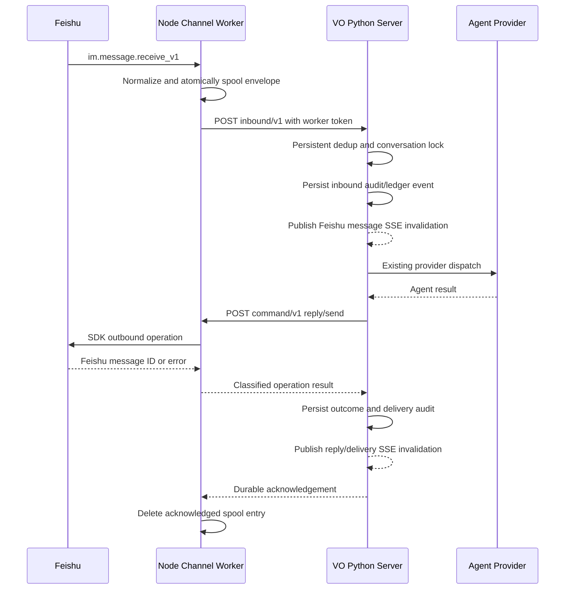

## Context

The Feishu Chat App currently runs a Python subprocess (`app/feishu_chat_worker.py`) that wraps `lark_oapi` through `FeishuLongConnectionReceiver`, converts raw SDK objects into a legacy event body, and posts that body to `/api/feishu-chat/inbound-worker`. The Python server performs representative-Agent routing, provider execution, persistent JSONL and communication-ledger recording, idempotency, ordering, outbound Feishu REST calls, and UI event publication.

The current worker exists partly to isolate Chat App WebSocket state from the notification/card-action application's Python SDK runtime. It also has known structural costs: protocol normalization is custom, callback timeout is shorter than the maximum Agent execution time, worker discovery uses a broad process-name scan, status writes are not atomic, and outbound behavior is split between the worker and Python REST helpers.

`@larksuite/channel` 0.4.0 provides a normalized message model, WebSocket auto-reconnect, connection status, keepalive, policy gates, deduplication, per-chat serialization, classified outbound errors, reactions, recall, and streamed resource downloads on top of `@larksuiteoapi/node-sdk`. Its defaults are not identical to VO semantics: text messages may be batched, stale messages may be silently dropped, the default dedup cache is memory-only, and a message is marked seen after the handler settles even when the handler reports an internal failure. VO therefore cannot delegate business acceptance or persistence guarantees to the SDK.

Stakeholders are VO operators configuring the Chat App, Feishu users talking to the representative Agent, and maintainers of the Agent/provider, communication-ledger, notification, and startup paths. The migration must keep the existing product behavior and public management surfaces stable.

## Goals / Non-Goals

**Goals:**

- Make a pinned `@larksuite/channel` Node worker the primary Feishu Chat App transport.
- Preserve one source Feishu message as one independently auditable VO input and Agent turn.
- Keep VO authoritative for identity binding, representative-Agent routing, provider execution, conversation history, persistent idempotency, ordering, and delivery audit.
- Move Chat App send/reply, reaction, recall, and resource-download operations behind a typed, authenticated worker command boundary.
- Preserve current configuration, public routes, UI projections, history fields, and notification/card-action behavior.
- Preserve one visual user-message bubble per accepted request when optimistic UI state is replaced by authoritative history.
- Preserve live Feishu-to-VO history synchronization across the Feishu conversation namespace and the selected provider conversation namespace.
- Provide observable health, deterministic child-process ownership, controlled rollout, and configuration-only rollback.

**Non-Goals:**

- Migrating the separate Feishu notification/card-action application from Python.
- Enabling groups, bot-to-bot chat, comments, multi-CEO routing, or new conversation product behavior.
- Replacing provider adapters or the VO communication ledger.
- Removing the legacy Python Chat App worker in this change; it remains a migration rollback path.
- Adopting streaming Agent output or CardKit streaming as a user-visible feature.

## Decisions

### 1. Use an isolated ESM Node worker with an exact dependency lock

Add `integrations/feishu-channel-worker/` containing a minimal ESM runtime, `package.json`, and committed npm lockfile. Pin `@larksuite/channel` to exactly `0.4.0`; do not use a caret or tag. The worker runs on the project's supported Node 18+ runtime and is started by the existing Python server supervisor.

The startup workflow installs production dependencies with a lockfile-respecting command when absent and reports `missing_node_runtime`, `missing_channel_sdk`, or `dependency_install_failed` without preventing unrelated VO functionality from starting. Dependency installation is not performed implicitly by each worker restart.

Alternatives considered:

- **Install globally:** rejected because it is not reproducible and can silently select a different version.
- **Add Node SDK calls directly to the Python server:** impossible without introducing an embedded JavaScript runtime and would couple the main process to WebSocket lifecycle.
- **Rewrite the server in Node:** far beyond the transport migration and would destabilize provider and persistence behavior.

### 2. Keep separate Chat App and notification runtimes

Only the Chat App uses the new Node worker. `FeishuLongConnectionReceiver` and Python notification/card-action code remain available for the notification application. Each runtime receives only its own App ID and App Secret.

This preserves the existing credential split and prevents a Chat worker failure or rollback from affecting meeting, project, or approval notifications.

### 3. Introduce a versioned inbound envelope, adapted at the Python boundary

The worker sends `vo.feishu-chat.inbound/v1` envelopes to the existing authenticated inbound-worker route. The envelope contains:

- envelope version, worker instance ID, transport implementation, and delivery attempt;
- normalized message ID, chat ID/type, readable content, original content type, creation time;
- root/thread/reply identifiers, mentions, and resource descriptors;
- extracted open ID, user ID, and union ID from the raw event when available;
- a bounded subset of raw source metadata needed for compatibility, never credentials or authorization headers.

Python adds a small envelope adapter that produces the current `feishu_chat_channel.handle_message_event` input and preserves existing downstream metadata. The worker never selects the representative Agent, computes the VO conversation ID, or writes communication history.

During rollback, the existing legacy event body remains accepted. Envelope version and transport are recorded for diagnosis but do not change the public conversation model.

Alternatives considered:

- **Pass only `NormalizedMessage`:** rejected because its single `senderId` can reduce identity fidelity used by current binding lookup.
- **Forward the complete raw event:** rejected because it expands persisted PII, request size, and coupling to Feishu's raw schema.
- **Rewrite the Python business adapter around the SDK model immediately:** rejected because it increases migration scope and weakens rollback compatibility.

### 4. Override SDK safety defaults to preserve VO message semantics

Configure the SDK so it does not merge distinct Feishu messages:

- WebSocket transport with keepalive enabled.
- Direct-message policy enabled; group events are rejected and projected into the VO ignored/audit path.
- `chatQueue.enabled = true` and `mergeWhileBusy = false` for per-chat serialization.
- Text batching uses zero delay and a one-message cap so every source ID reaches VO independently.
- The SDK stale-message window is effectively disabled; VO decides whether a source message is duplicate or processable.
- SDK dedup remains a short-lived transport optimization only. VO's persisted `turn_completed`/ledger state is authoritative across restarts.

The Python per-conversation lock remains during migration. Double serialization is intentional: the SDK prevents concurrent callbacks for a chat, while VO protects conversation ordering across transport implementations, test routes, and restarts.

### 5. Persist an inbound transport spool until VO acknowledges a durable decision

Before invoking the Python callback, the worker atomically writes a mode-0600 envelope under `VO_STATUS_DIR/feishu-channel-inbox/<message-id>.json`. It removes the file only when VO returns a versioned acknowledgement stating that the message reached a persisted terminal or accepted state. Callback transport failures retry with bounded exponential backoff; pending files are replayed after worker restart.

The spool is transport recovery state, not a second conversation history. It is bounded to 1,000 envelopes or 50 MiB, whichever is reached first. Each envelope is capped at 1 MiB, raw event data is filtered, and acknowledged entries are deleted promptly. At 80% capacity the worker reports `inbox_pressure`; at the hard limit it reports `inbox_full`, stops accepting new work by disconnecting the channel, and retries pending delivery before reconnecting.

VO business idempotency makes replay safe. A callback acknowledgement is emitted only after the existing user-message/outcome record required for that processing stage is durable; an HTTP 2xx alone is insufficient.

Alternatives considered:

- **Rely on SDK in-memory dedup and Feishu redelivery:** rejected because handler failure can still become seen in the SDK process and the cache does not survive restart by default.
- **Return 202 and build a new Python durable job queue:** rejected because it creates a second orchestration subsystem and changes current synchronous turn semantics.
- **No spool:** rejected because a local callback outage could silently lose an already-received message.

### 6. Use an authenticated loopback command server for outbound operations

The Node worker opens an HTTP server on `127.0.0.1` with an OS-assigned port and publishes the port, PID, instance ID, and readiness through an atomically replaced status file. Python discovers the port only from the currently owned child instance and sends `vo.feishu-chat.command/v1` requests authenticated by a random per-process token passed through the child environment.

Supported commands are `send`, `reply`, `addReaction`, `removeReaction`, `recall`, and `downloadResource`. Every request has a request ID, explicit timeout, operation-specific schema, and maximum JSON body of 256 KiB. Unknown fields or operations fail closed. The server does not bind to non-loopback interfaces and does not expose credentials in health responses.

The Python `send_text`, receipt, reaction, recall, and image-download call sites become ports backed by this client when the Node transport is selected. Existing Python REST helpers remain available only for the legacy transport and notification application.

Alternatives considered:

- **stdin/stdout RPC:** rejected because lifecycle logs, concurrent commands, timeouts, and health checks become harder to isolate reliably.
- **Unix socket only:** rejected to preserve the project's existing cross-platform local development behavior.
- **Let the Node worker invoke Agents:** rejected because it would duplicate VO routing, credentials, history, and provider semantics.

### 7. Keep inbound processing synchronous but align timeouts and acknowledgements

The SDK message handler waits for the Python callback, preserving per-chat ordering and the existing synchronous Agent-turn behavior. Node's event loop can service outbound command requests while the callback is pending, so Python can send the Agent reply through the same worker without deadlock.

Callback timeout is derived from the configured maximum provider timeout plus a fixed delivery margin, capped at 15 minutes. A timeout does not delete the spool entry. Retry uses the same source message ID, allowing VO to return the persisted outcome rather than rerun the Agent.

The Python server already uses `ThreadingHTTPServer`, so one long Agent turn does not block unrelated management or chat requests. Global worker callback concurrency is capped at 16 chats; additional chats remain queued in the worker. Per-chat queue depth is capped at 20 messages. When limits are reached, the worker reports queue pressure and retains messages in the bounded spool rather than launching unbounded concurrent Agent work.

### 8. Make attachment download destination worker-owned and bounded

Python requests download by message ID, file key, resource type, and optional sanitized display name. It never supplies an arbitrary destination path. The worker generates a unique file name beneath `VO_STATUS_DIR/feishu-chat-attachments`, rejects symlink traversal, streams through the SDK's resource-to-file API, enforces a 50 MiB maximum, removes partial files on failure, and returns content type, size, safe path, and source identifiers.

The resulting metadata still passes through the existing Python attachment validation before reaching a provider. Unsupported resources remain auditable but are not trusted attachments.

### 9. Generalize worker supervision without broad process killing

Replace Chat App-specific process discovery with an owned-child supervisor that records PID, parent PID, worker instance ID, transport, start time, and heartbeat. It may terminate only its direct live child or a stale PID whose status record proves the expected executable, instance, and dead parent. It MUST NOT use a broad `pgrep -f` kill for Node or Python workers.

Status files use write-to-temp plus atomic rename. The effective status preserves existing UI fields (`enabled`, `running`, `status`, `startedAt`, `lastEventAt`, `lastError`) and adds transport, connection, heartbeat, queue/spool, reconnect, callback, and command fields.

### 10. Add an explicit transport selector and deterministic rollback

Add an optional Chat App setting `transportImplementation` with values `channel-sdk-node` and `legacy-python`, plus the environment override `VO_FEISHU_CHAT_TRANSPORT`. Precedence is environment override, saved setting, then the new default `channel-sdk-node`.

Only one implementation may run for a credential set. Changing the effective implementation stops the current child, waits for exit, rotates the worker token/instance ID, and then starts the selected child. Conversation history, channel records, bindings, and representative Agent configuration are shared and require no migration.

Rollout begins with the environment override set to `legacy-python`; removing or changing the override activates the Node worker. Rollback sets the override back to `legacy-python` and restarts only the Chat App worker. Legacy removal requires a later change after the rollback window.

### 11. Define observability and log-volume controls

The status surface and structured logs distinguish disabled, dependency failure, starting, connected, reconnecting, callback retry, command failure, inbox pressure/full, authentication failure, orphan exit, and stopped states. Counters include received, policy-rejected, spooled, replayed, callback-acknowledged, Agent-dispatched (from VO), outbound success/failure by stable category, reconnects, and resource rejection.

Logs contain message and request IDs but truncate content and redact secrets, tokens, cookies, authorization headers, URLs containing credentials, and worker credentials. Repeated identical connection/callback failures are rate-limited, while status counters continue increasing.

### 12. Reconcile optimistic chat state by request identity

The chat UI keeps its immediate optimistic-send behavior, but each optimistic history record carries the same `idempotencyKey` submitted to the provider run API. Normalized authoritative history exposes that key from the communication record metadata. When a latest page or live record arrives, the history store replaces the matching `optimistic-*` record with the authoritative message before sorting and rendering, and removes the matching live-layer DOM bubble.

Reconciliation is keyed by provider/conversation plus exact `idempotencyKey`, not by text or timestamp. This prevents identical intentional messages from being collapsed. A missing key retains existing behavior rather than applying heuristic deduplication. Failed or rejected sends continue to remove their optimistic record explicitly.

The implementation remains transport-independent because Feishu-originated requests do not use the local chat optimistic path; the regression belongs in this migration because the acceptance run exposed the compatibility defect while exercising the new transport and existing provider history surfaces.

### 13. Merge Feishu communication events into normalized live history

The public Feishu SSE stream remains a lightweight invalidation signal with stable `message` and `delivery` event names. On receipt, the chat UI refreshes the active normalized history entry. The normalized history source MUST include visible Feishu communication-ledger events involving the selected representative Agent even when their `conversationId` is `feishu-dm:*` rather than the active provider conversation ID.

Provider-native and ordinary communication-ledger rows remain scoped to the requested provider conversation. The cross-conversation merge exception applies only to records positively identified as Feishu-originated through source metadata or the `feishu-dm:*` namespace and involving the selected Agent. Delivery-operation rows remain non-visible; their SSE event still invalidates history so a newly persisted reply or delivery state can be observed. Existing message IDs are used for merge/deduplication, so a Feishu row already present through another source is rendered once.

The server-side normalized history merge is preferred over adding a second frontend fetch after every SSE event because it keeps initial load, manual refresh, recovery, pagination, and live refresh on one authoritative data path. The SSE stream is not treated as durable history and does not need to replay payloads after reconnect: reconnection or a `ready` event triggers an authoritative refresh, which recovers events missed while disconnected.

Alternatives considered:

- **Keep strict conversation filtering:** rejected because a representative Agent's Feishu conversation intentionally has a different ID and would remain invisible after an otherwise successful SSE refresh.
- **Insert SSE payloads directly into the active store only:** rejected because reconnects and page reloads would lose missed events and could diverge from authoritative pagination.
- **Fetch the legacy Feishu history endpoint in the frontend:** rejected because it recreates the split history paths that normalized history was introduced to remove.

### 14. Track bottom-follow intent independently from asynchronous rendering

Each `ChatWindow` owns a bottom-follow flag derived from the existing near-bottom tolerance. Opening a chat or switching Agent/conversation initializes the flag to true. User scroll handling updates it: scrolling above the tolerance disables following, and returning to the bottom enables it again.

History refresh and live-event paths capture this intent before asynchronous fetching or DOM mutation. After the active history entry renders, they schedule the existing post-layout bottom scroll only when following remains enabled. The delayed layout passes cover Markdown, tool cards, attachments, images, and virtual spacer measurement without requiring event-specific scrolling code.

Virtual-window movement and physical scroll position remain separate but coordinated: an event may advance the virtual range only when it was already newest, and the `ChatWindow` then scrolls the container only when bottom-follow is enabled. Initial activation always selects the newest virtual range and settles the physical viewport at the bottom after cached and remote content render.

Alternatives considered:

- **Always scroll after every event:** rejected because it interrupts users reading older history.
- **Check `isNearBottom()` only after rendering:** rejected because adding a message increases `scrollHeight` and can make a previously bottomed viewport appear no longer near the bottom.
- **Attach scrolling only to Feishu SSE:** rejected because provider, Gateway, recovery, and other authoritative events require the same chat behavior.

## Protocol and State Flow

The authoritative business state remains the existing VO channel records and communication ledger. New persisted worker state is limited to the selected transport setting, atomic status snapshot, and bounded unacknowledged transport spool.

## Risks / Trade-offs

- **[SDK maturity]** Version 0.4.0 has a small public history and may change quickly → pin the exact version and lockfile; require source review, contract tests, and explicit artifact review for upgrades.
- **[Double-runtime complexity]** Python supervises a Node process and uses local HTTP in both directions → version both protocols, authenticate each direction, expose health, and test child death/restart races.
- **[Long callback duration]** Agent turns can hold a callback for minutes → align timeouts with provider limits, cap global/per-chat work, retain the spool until durable acknowledgement, and keep the Python HTTP server threaded.
- **[Duplicate processing]** callback retry, worker restart, or rollback may redeliver a source message → retain VO persistent idempotency and use the same source message ID across all attempts.
- **[Message loss from SDK defaults]** batching, stale-drop, or handler-seen behavior can hide individual messages → disable batching/stale decisions and spool before callback.
- **[Spool contains message content]** temporary recovery files add sensitive local state → mode 0600, bounded size/retention, filtered raw data, immediate deletion after acknowledgement, and no secret fields.
- **[Queue pressure]** slow Agents can exhaust worker memory or spool capacity → cap concurrency and queue depth, publish pressure, disconnect at the hard spool limit, and recover pending work before reconnecting.
- **[Attachment abuse]** large or malicious resources can exhaust disk or escape the attachment root → worker-chosen paths, streaming size limit, symlink/path checks, partial-file cleanup, and existing provider attachment validation.
- **[Rollback split brain]** both workers consuming one app can duplicate effects → stop-and-confirm ownership handoff, rotate instance token, and enforce one effective transport per credentials.
- **[Status compatibility]** new SDK states may break the current UI → preserve current fields/status projection and add details under additive fields.
- **[Optimistic/history duplicate]** provider history recovery can render an authoritative request while the local optimistic bubble remains → reconcile by exact idempotency key and test that identical text under different keys remains distinct.
- **[Cross-conversation live-history gap]** strict provider-conversation filtering can discard Feishu communication rows after a successful SSE invalidation → merge only positively identified Feishu rows for the selected Agent and cover initial load, live refresh, reconnect, pagination, and deduplication.
- **[Unexpected scroll jumps]** unconditional post-event scrolling can pull a user away from older history → persist bottom-follow intent before mutation and re-enable it only when the user returns within the near-bottom tolerance.

## Migration Plan

1. Capture current Feishu Chat App route, config, history, idempotency, notification-isolation, worker lifecycle, and outbound behavior in characterization tests.
2. Add the pinned isolated Node package, protocol schemas, fake-channel contract tests, status writer, and dependency checks while the effective transport remains `legacy-python` through the rollout override.
3. Add the Node supervisor path, owned-child lifecycle, normalized inbound adapter, bounded spool, and authenticated callback acknowledgement contract.
4. Add the authenticated worker command client/server and migrate Chat App outbound, reaction, recall, and resource operations behind transport ports.
5. Run focused Python and Node tests, normalized-history/SSE browser regression, full relevant regression, process/restart fault injection, secret canaries, dependency-install checks, and an offline rollback rehearsal.
6. Deploy with `VO_FEISHU_CHAT_TRANSPORT=legacy-python`; verify no notification or existing chat regression.
7. Enable `channel-sdk-node` in a real Feishu test tenant, verify handshake, text/resource turns, duplicates, reconnect, Agent failure, outbound failure, status, and rollback.
8. Remove the override or persist `channel-sdk-node` after acceptance, monitor queue/spool/reconnect/delivery metrics, and retain the legacy implementation for the defined rollback window.
9. If a rollback gate triggers, set `VO_FEISHU_CHAT_TRANSPORT=legacy-python`, restart the Chat App worker, verify only one consumer, and reconcile pending spool entries through VO idempotency before resuming.

Rollout must stop or roll back on unexplained message loss/duplication, sustained inbox pressure, repeated reconnect loops, material delivery-error regression, secret leakage, notification regression, or inability to prove single-worker ownership.

## Open Questions

- Real Feishu credentials are not expected in automated CI; a real-tenant manual acceptance record remains mandatory before the default transport is activated.
- The legacy worker retention duration is an operational decision to be recorded during final rollout; deleting it is explicitly outside this change.
- Any future upgrade from `@larksuite/channel` 0.4.0 requires a fresh source/behavior review, lockfile update, and the same transport contract suite.
