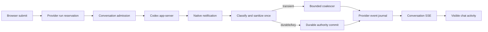

## Context

The browser already renders optimistic user content and a working indicator before `POST /api/codex/runs`, then consumes normalized Provider events over the conversation SSE stream. The backend reserves a run quickly through `ProviderRunCoordinator`, but the native Codex callback path performs work that scales with retained history before publishing each event:

- `_append_codex_activity` loads the complete bounded activity JSON file, scans it for the conversation sequence, and atomically rewrites up to 5,000 records for every native event under one global lock.
- `_append_codex_progress_comm_event` loads up to 1,000 communication records and rewrites the communication JSONL file for every progress update.
- `_handle_codex_chat` admits only one turn per Agent, while `CodexAppServerClient.execute` adds a second client-wide `_run_lock`; unrelated conversations therefore cannot use the app-server's request-ID multiplexing.
- `CodexAppServerClient` sleeps for a fixed 200 milliseconds after every terminal notification before assembling the result.
- the generic Provider journal and SSE transport are already bounded and indexed; their measured microsecond-scale overhead is not the primary target.

The primary stakeholder is a user continuing an existing Codex conversation in the Virtual Office chat window. The accepted specification treats user messages, approvals, final replies, and terminal outcomes as durable, while transient reasoning and delta activity may be lost on process failure. Existing public routes, normalized critical events, thread mappings, history, approval, cancellation, and error behavior remain compatible.

### Current and proposed critical paths

The fast path must not wait for activity-file projection or communication-progress rewrites before `J`. Durable/key events still commit to their existing authority before being exposed as committed.

## Goals / Non-Goals

**Goals:**

- Meet the confirmed warm continued-chat p95 SLOs with attributable measurements.
- Remove synchronous full-file activity/progress rewrites from the native-event-to-SSE path.
- preserve immediate delivery of the first displayable fragment and coalesce only later transient fragments.
- serialize turns by conversation while bounding app-server-wide parallelism.
- remove the unconditional 200 millisecond terminal delay using an explicit callback-drain fence.
- preserve durable state, event ordering, cancellation, approval, history, and rollback safety.

**Non-Goals:**

- Improve model inference or promise a first-text SLO.
- Optimize cold Codex startup, installation, authentication, Project, Meeting, Feishu, or another Provider.
- Replace the generic Provider repository, journal, or SSE protocol.
- Persist or recover every reasoning/delta fragment after restart.
- redesign the chat UI or public API.

## Decisions

### 1. Establish an instrumentation-first baseline with one correlation timeline

Every Codex run will carry content-free monotonic timestamps for `request_accepted`, `working_visible` (browser-local), `run_reserved`, `provider_request_sent`, `first_native_event`, `first_displayable_fragment`, `journal_published`, `sse_written`, `provider_terminal`, and `durable_terminal_committed` where applicable. Backend intervals use one monotonic clock; browser-visible intervals are measured independently in the browser and correlated by run ID rather than subtracting browser and server clocks.

The acceptance harness will use ten warm-up turns followed by at least 100 measured turns against an already running deterministic app-server fixture with an existing thread. It records sample count, failures, p50, p95, maximum, configuration, and concurrency. A real authenticated Codex smoke run records observational timings but does not replace the deterministic gate.

Alternative considered: infer improvement from the existing coordinator/event microbenchmarks. Rejected because those fixtures exclude the activity, communication-progress, app-server, SSE-write, and browser-visible boundaries that dominate this use case.

### 2. Introduce a Codex-specific event fast-path service and keep the generic journal unchanged

A focused service will accept normalized native Codex events and own:

- event classification (`transient`, `durable/key`, `terminal`);
- one-time bounded redaction/sanitization at ingress;
- per-conversation sequence allocation in memory;
- transient coalescing and forced ordering barriers;
- content-free timing/capacity counters;
- live activity snapshots used by existing polling recovery while the process remains alive.

The service publishes normalized events through `ProviderEventJournal`; it does not create a second SSE transport or run state machine. The existing `ProviderSSETransport` remains the sole framing/replay owner. Shared journal/SSE behavior is changed only where required to accept an already-sanitized internal DTO without changing external payloads; otherwise its existing sanitization remains as defense in depth.

Alternative considered: optimize `ProviderEventJournal` first. Rejected because its indexed replay is already bounded and measured in microseconds, while current Codex callbacks perform synchronous O(N) file operations before reaching it.

### 3. Separate durable authorities from transient compatibility projections

The following existing durable authorities remain authoritative:

| State | Durable authority |
|---|---|
| Accepted user message and final assistant reply | append-only agent-platform communication ledger |
| Thread/conversation mapping | existing atomic Codex thread mapping |
| Approval request and resolution | Provider approval/conversation history persistence, with stable approval ID |
| Failure, cancellation, and terminal result without a reply | append-only communication operation record keyed by run ID |

Transient reasoning, text deltas, tool progress, and the replaceable `codex-progress` communication row will be live in-memory projections. They will no longer trigger `_upsert_comm_progress_event` or an activity JSON rewrite for every native event. The existing activity endpoint will merge the bounded in-memory live view with legacy persisted activity when needed. A bounded compatibility snapshot may be updated outside the live callback, but failure of that projection cannot block SSE or redefine durable success.

Durable event commits are idempotent by stable run/turn/approval/event identity. A durable commit happens before the corresponding event is reported as durably resolved. Transient projection loss on crash is accepted; restart recovery reconstructs visible final state from the durable authorities rather than replaying partial deltas.

Alternative considered: introduce a new authoritative activity database or JSONL migration. Rejected for this phase because the product does not require transient recovery, and a new authority would expand migration and rollback risk without improving the critical durable chat contract.

### 4. Coalesce only subsequent transient fragments with bounded memory

The first displayable fragment for each run bypasses coalescing. Subsequent compatible text or reasoning fragments for the same `(agent, conversation, run, event class)` are combined by one dispatcher thread using a 33 millisecond window at low pressure and up to 100 milliseconds at high pressure.

Ordering barriers include approval, tool state transitions, cancellation, failure, completion, final message, conversation reset, and run replacement. A barrier synchronously drains earlier fragments for that run before publishing the key event. Text concatenation preserves source order; incompatible event classes are never combined.

Capacity is bounded to 256 active scope buckets, 200 fragments or 64 KiB per bucket, and 16 MiB globally. Reaching a per-bucket bound forces an immediate flush. Reaching the scope/global bound bypasses coalescing and publishes new fragments directly; it does not drop text or create an unbounded queue. Reasoning visibility policy and existing payload size limits continue to apply.

Alternative considered: batch all events on a fixed 100 millisecond timer. Rejected because it violates immediate first-fragment delivery and delays approvals/terminal state. A timer per fragment is also rejected because it creates unbounded thread/timer pressure.

### 5. Use conversation admission plus bounded app-server capacity

The Agent-wide `_codex_operation_lock(agent_id)` becomes a conversation-scoped admission lock keyed by `(agent_id, conversation_id)`. Same-conversation overlap preserves the current non-blocking busy response. Different conversations may proceed when capacity is available.

`CodexAppServerClient` replaces its client-wide `_run_lock` with:

- a per-thread lock for native-thread ordering;
- a non-blocking app-server semaphore configurable from 1 through 8, with a product default of 8 while preserving explicit capacity overrides;
- the existing operations map keyed by thread ID and JSONL request-ID routing;
- an explicit busy result when capacity is unavailable.

The runtime reader callback must remain bounded and must not perform disk scans, full rewrites, Provider network calls, or notification delivery. Before rollout above capacity 1, deterministic tests must prove two different threads can interleave responses, notifications, approval routing, cancellation, and terminal cleanup without cross-delivery. Failure of that proof keeps the capacity at 1 without reverting the other latency improvements.

Alternative considered: remove all locks. Rejected because two turns on one native thread can corrupt ordering and because Provider capacity must remain bounded. A worker queue is also rejected for this phase because existing callers expect a stable busy response rather than indefinite hidden queueing.

### 6. Replace the fixed terminal sleep with a callback-drain fence

The app-server reader processes JSONL messages in stream order. Each operation will track callback entry/exit and terminal observation. The operation's completion signal is released only after the terminal notification callback and all callbacks already admitted for that operation have exited. Result augmentation then runs immediately; there is no unconditional grace sleep.

Notifications that are explicitly defined as post-terminal metrics may update diagnostic state separately but cannot mutate the committed final reply. A bounded fallback fence handles malformed Provider ordering and reports a counter instead of adding a fixed delay to every successful turn.

Alternative considered: reduce the sleep from 200 to 20 milliseconds. Rejected because it remains timing-dependent and still penalizes every turn.

### 7. Put rollout controls around every behavior-changing optimization

The following startup-read configuration is validated and clamped; invalid values fail closed to the legacy path and emit a sanitized diagnostic:

- `VO_CODEX_CHAT_FAST_PATH_ENABLED` (default on; an explicit false value restores the legacy path after restart);
- `VO_CODEX_MAX_CONCURRENT_TURNS` (1-8; default 8);
- `VO_CODEX_STREAM_COALESCE_MIN_MS` (default/minimum 33);
- `VO_CODEX_STREAM_COALESCE_MAX_MS` (default/maximum 100).

These values are not hot-reloaded. Disabling requires a controlled restart: stop accepting new Codex runs, allow or cancel active runs, drain durable commits, discard transient buffers, and restart with the flag off. With the flag off, the existing admission, callback, persistence, and event path remains available for rollback until final acceptance.

### 8. Add bounded, content-free observability

Metrics distinguish accepted, busy-by-conversation, busy-by-capacity, transient bypass, coalesced fragments, forced flush, direct fallback, durable commit success/failure, projection failure, first native event, first displayed fragment, terminal fence wait, and active turns/buckets/bytes. Histograms cover the confirmed stage latencies and queue/fence durations.

Logs use run/conversation digests and event classes only. They must not include prompts, response/reasoning text, credentials, approval contents, raw Provider payloads, or unrestricted paths. Repeated projection or capacity failures are rate-limited to avoid log storms.

## Risks / Trade-offs

- **[Provider does not safely sustain the product default of 8 active threads]** → Preserve deterministic multiplexing correctness tests, monitor real-load pressure and cross-delivery signals, and override capacity downward without disabling the other fast-path latency improvements.
- **[Transient coalescing changes visible ordering or duplicates text]** → Use per-run ordered buckets, explicit barriers, stable sequence IDs, and original-vs-coalesced reconstruction tests.
- **[Async compatibility projection loses recent activity]** → Treat it as non-authoritative; durable user/final/approval/terminal state is committed through existing authorities and restart tests ignore transient loss.
- **[Global memory grows under many conversations]** → Enforce scope, fragment, byte, and global bounds; flush or bypass rather than queue without limit.
- **[Durable write failure after live transient output]** → Do not emit a key event as durably resolved; expose a bounded failure state while preserving already accepted user input.
- **[Feature-off path drifts]** → Maintain characterization tests for both flag states and require the off-path suite during rollout and rollback rehearsal.
- **[Instrumentation itself adds latency or leaks content]** → Use monotonic timestamps and numeric counters only; benchmark instrumentation-on overhead and apply existing redaction checks.
- **[User assumes first-text is covered by the 1-second SLO]** → Report first-native-event and first-text as separate metrics in UI diagnostics and acceptance evidence.

## Migration Plan

1. Capture failing-before baselines and operation counts for warm single-conversation, two-conversation, high-frequency event, approval, cancellation, terminal, cold/new-thread, and restart fixtures.
2. Land instrumentation and bounded fast-path components with `VO_CODEX_CHAT_FAST_PATH_ENABLED=0`; verify no behavior or latency regression.
3. Enable the fast path in deterministic tests at concurrency 1, verify the latency SLOs, transient loss contract, durable recovery, event reconstruction, and rollback path.
4. Prove app-server multiplexing, then enable concurrency 2 in an isolated local/BOE-equivalent environment. Observe busy reasons, active turns, coalescer pressure, durable failures, p95 latency, and cross-conversation isolation.
5. The product default is 8. Treat the existing two-thread multiplexing fixture as a correctness floor rather than a capacity-8 performance proof, and monitor CPU, memory, file-descriptor, workspace-I/O, and reader latency under real load.
6. For rollback, stop new Codex runs, finish or cancel active turns, drain durable state, discard transient buffers, restart with the flag off, and verify history/thread mapping/approval/final results. No data reverse migration is required.

## Open Questions

No product or architecture decision remains open before task planning. The deterministic Provider protocol fixture proves two-thread interleaving; the configured default of 8 is a product capacity choice and does not by itself constitute a real-Provider performance or saturation proof.
