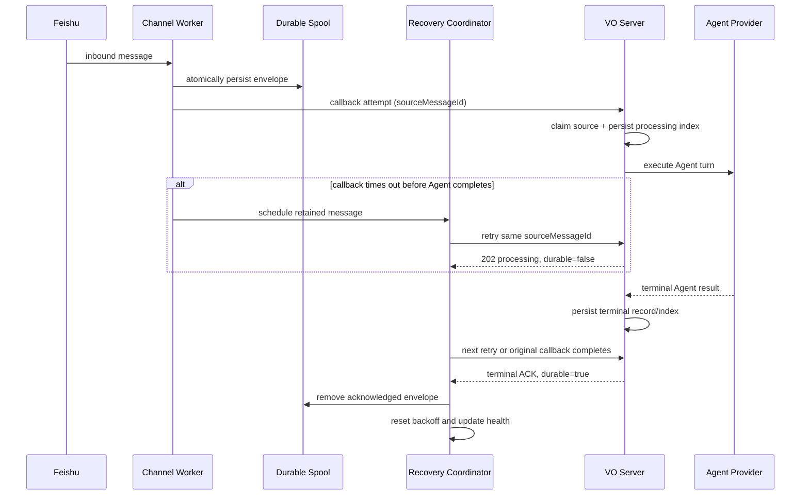

## Context

The Node Feishu Channel worker already persists each accepted inbound envelope before calling VO, but callback recovery is coupled to startup and selected connection-recovery paths. A normal callback failure leaves the spool entry in place without scheduling another replay. The SDK can therefore remain connected while VO processing is permanently degraded.

The current callback client also performs up to five long HTTP attempts internally, each with a default ten-minute timeout. This can occupy callback capacity for an extended period. At the VO boundary, a persisted `user_message` index is currently treated as an idempotency hit and can lead to a durable worker acknowledgement even though the corresponding Agent turn has not reached a terminal record. That behavior is unsafe for automatic replay after a VO crash or an uncertain callback result.

The existing constraints remain:

- The worker spool is bounded to 1,000 entries or 50 MiB and stores mode-0600 validated envelopes.
- VO owns source-message idempotency, per-conversation ordering, Agent routing, business history, and delivery records.
- The callback can legitimately outlive an ordinary HTTP request because an Agent turn may take minutes.
- Private and group conversations share the transport but require isolated ordering lanes.
- Existing management responses and settings UI must remain backward compatible and secret-safe.
- No second durable business queue or new external dependency is introduced.

## Goals / Non-Goals

**Goals:**

- Retry every retained inbound message independently of WebSocket reconnects and process restarts, with no retry-start gap greater than one minute while the worker is running.
- Preserve one user-visible Agent outcome per source message and deterministic order within each Feishu conversation.
- Prevent long or failed VO callbacks from exhausting all worker capacity or blocking unrelated conversations.
- Distinguish Feishu connection health from VO message-processing health in the status API and control panel.
- Keep recovery bounded, observable, redacted, testable with injected clocks/transports, and safely reversible.

**Non-Goals:**

- Replacing the existing synchronous VO Agent execution pipeline with a new durable Python job queue.
- Changing notification/card-action handling or adding independent retry semantics for standalone outbound commands.
- Changing provider conversation identity, Feishu history visibility, or representative-Agent selection.
- Changing the SDK WebSocket half-open/pong timeout policy; callback recovery must work without relying on a WebSocket state transition.

## Decisions

### 1. Separate message-processing recovery from connection recovery

Introduce a worker-owned processing recovery coordinator with its own timer, single-flight run, backoff state, and shutdown lifecycle. The current connection recovery timer remains responsible only for establishing the Feishu WebSocket.

The processing coordinator is awakened when:

- startup finds retained spool entries;
- an immediate callback attempt fails or returns a non-terminal acknowledgement;
- a new message is spooled behind older work;
- a callback succeeds while other entries remain;
- the SDK reports reconnected; or
- spool pressure/full state needs reevaluation.

It uses capped exponential backoff with bounded jitter. The default next-attempt delay starts at one second and is capped below 60 seconds (30 seconds plus at most five seconds jitter), so a newly responsive VO receives an attempt within the specified minute. Backoff resets after any durable acknowledgement. There is no maximum retry count and no failure path deletes a valid retained envelope.

Alternatives considered:

- **Reuse WebSocket reconnect recovery:** rejected because VO callback failure can coexist with a healthy WebSocket.
- **Replay only on the next Feishu event:** rejected because recovery would depend on user activity.
- **Periodic full-directory polling with no scheduler state:** rejected because it creates unnecessary scans and overlapping replay runs.

### 2. Make the spool the only transport recovery queue

The existing spool remains the authority for worker-to-VO delivery. No Python-side durable job queue is added. A valid entry is removed only after a terminal durable acknowledgement.

Spool enumeration becomes ordered and returns one bounded snapshot containing entry count, bytes, pressure/full flags, and `oldestPendingAt`. Entries are ordered by Feishu `createTime`, then worker `receivedAt`, then source message ID as a deterministic tie-breaker. Invalid/corrupt entries are retained, counted as blocked, and surfaced as an operator warning rather than silently skipped or deleted.

The current size and count limits remain unchanged. Directory scans remain O(N) with N capped at 1,000 and occur on spool mutation or a recovery wake-up, not on each UI poll.

### 3. Use one ordered execution lane per Feishu conversation

Immediate delivery and background replay use the same worker-level per-chat lane instead of relying only on the SDK's live-message queue. Each lane attempts only its oldest retained envelope. A later message in the same chat remains spooled until the older message reaches a terminal acknowledgement.

Different chats may recover concurrently through a bounded global semaphore. Recovery concurrency defaults to four and is included within the existing maximum of sixteen active callbacks. Queue-depth and spool limits continue to bound memory and disk use. A failed chat therefore cannot consume every callback slot or reorder another chat.

A message ID and chat ID cannot be active in both the live path and replay path. The coordinator tracks active IDs/lanes, and all wake-ups coalesce into one replay run.

Alternatives considered:

- **Sequentially replay the entire spool:** rejected because one slow conversation would block all other conversations.
- **Replay all files concurrently:** rejected because it breaks per-conversation ordering and can overwhelm VO after recovery.
- **Keep filename sorting:** rejected because Feishu message IDs do not encode source order.

### 4. Replace nested finite retries with one bounded transport attempt plus durable scheduling

`CallbackClient` performs one HTTP attempt per coordinator attempt. The default transport attempt timeout is 45 seconds and is clamped below one minute. Network failures, timeouts, 5xx responses, invalid acknowledgements, and explicit non-terminal acknowledgements are classified and returned to the coordinator, which owns indefinite retry timing.

The shorter HTTP deadline does not cancel VO business execution. If an Agent turn is still running, later probes receive a non-terminal `processing` response and retain the spool entry. This releases worker callback capacity while allowing the original VO thread to finish.

All repeated logs remain rate-limited. Counters continue to increment even when identical log messages are suppressed.

### 5. Acknowledge only terminal VO decisions as durable

Extend the callback response semantics without changing the envelope version:

- A completed, ignored, rejected, or otherwise terminal persisted business record returns the existing acknowledgement schema with `durable: true` and a terminal `state`.
- A source message currently owned by an active VO execution returns HTTP 202 with the same acknowledgement schema, `durable: false`, `state: processing`, and bounded `retryAfterMs` guidance.
- A response that cannot prove terminal persistence remains a retryable failure.

The worker accepts only terminal `durable: true` responses as permission to remove the spool file. Existing terminal duplicate deliveries return the same terminal acknowledgement and do not invoke the Agent or resend the authoritative reply.

VO source indexes are extended additively with a processing owner identifier and update time. VO keeps a process-local active-source registry:

- a duplicate owned by an active execution in the current VO process returns `processing` before waiting on the conversation lock;
- a completed index returns the existing terminal result;
- a processing index owned by a previous VO process can be reclaimed from the original spool envelope after restart;
- the conversation lock and provider idempotency key continue to protect business ordering and provider calls during reclamation.

Terminal ignored/rejected decisions are also indexed so an uncertain response does not append duplicate audit outcomes on every retry.

Automatic takeover of a source still marked active in the same process is intentionally disallowed: exactly-once execution is preferred over launching a second Agent turn when the first thread may still be running. A stuck active execution remains degraded and warning-visible until it completes or VO is restarted.

Restart takeover also uses a persisted execution phase. A source in `claimed` has not crossed the provider-dispatch boundary and can be reclaimed by a new VO process. A source in `dispatching` has crossed that boundary and is an uncertain external outcome; it MUST NOT be blindly dispatched again after restart. It remains non-terminal and warning-visible until durable provider evidence can be reconciled. Legacy processing indexes without a phase are treated as uncertain. This deliberately prefers at-most-once provider side effects over speculative liveness where the provider has no transactional idempotency contract.

Alternatives considered:

- **Treat persisted `user_message` as terminal:** rejected because a crash after that write can strand an incomplete Agent turn while causing the worker to delete its recovery copy.
- **Always redispatch a `processing` source:** rejected because an uncertain callback can still have a live Agent execution.
- **Build a new asynchronous VO job queue:** rejected for this change because it duplicates orchestration and expands migration scope.

### 6. Add an additive processing-health contract

The worker status gains a `processing` object independent of `sdk` connection state:

| Field | Meaning |
| --- | --- |
| `state` | `healthy`, `degraded`, or `recovering` |
| `backlog` | Valid retained envelope count |
| `blocked` | Corrupt/unreadable retained entry count |
| `oldestPendingAt` | Earliest retained receive/source timestamp |
| `lastAckAt` | Most recent terminal durable acknowledgement |
| `lastFailureAt` | Most recent callback failure |
| `nextRetryAt` | Scheduled processing-recovery wake-up |
| `recoveryActive` | Whether a replay run is currently active |
| `consecutiveFailures` | Current backoff progression |
| `warning` | Whether degraded duration exceeded the warning threshold |
| `lastErrorCategory` | Stable redacted failure category |

State derivation is deterministic:

- `healthy`: no backlog, no blocked entry, and no active recovery;
- `recovering`: backlog exists and a replay run is active or has made progress since the latest failure;
- `degraded`: backlog/blocked work exists and the latest attempt failed or is waiting for retry.

The warning threshold defaults to 60 seconds. Internal paths, message content, callback URLs, credentials, and raw exception bodies are not included. The Python management projection whitelists public worker fields instead of returning arbitrary nested status data; existing top-level compatibility fields remain available.

### 7. Add a dedicated control-panel processing status bar

Add a status element adjacent to the existing long-connection status. The existing line continues to render transport and SDK connection state; the new line renders processing state, backlog, oldest pending age, last successful acknowledgement, and recovery/warning detail.

The settings panel fetches the existing `/api/feishu-chat/config` response on open and polls it every five seconds only while the management panel is visible. Polling stops when the panel is hidden. Missing `processing` data from the legacy worker or during rollback renders an explicit unavailable/legacy state rather than a false healthy state.

All labels use the existing locale files. UI rendering escapes server values and receives only the server's redacted whitelist.

### 8. Use bounded configuration and a rollback switch

Add environment-backed worker settings with validated defaults:

- recovery enabled switch;
- callback attempt timeout, default 45 seconds, maximum 55 seconds;
- recovery base delay and maximum delay, with maximum plus jitter below 60 seconds;
- recovery concurrency, default four and capped by the global callback limit;
- warning threshold, default 60 seconds.

The recovery switch controls background replay scheduling only. Disabling it never deletes spool files and does not disable normal immediate delivery. This supports staged rollout and emergency rollback without data migration.

When recovery is disabled and a newly received message is ordered behind older retained work in the same chat, the live event performs one ordered drain attempt through its own source message. This is not timer-driven background retry: it stops on the first failed head and leaves all remaining files intact.

Processing warning age is recomputed by the worker heartbeat as well as spool/recovery mutations, so a quiet recovery-off worker still crosses the configured warning threshold.

## Protocol and State Flow

## Risks / Trade-offs

- **[Processing-state migration]** Existing `processing` indexes have no owner → treat them as reclaimable only when no active source exists in the current process; cover upgrade/restart cases with fixtures.
- **[Long Agent turn]** A 45-second worker timeout creates periodic status probes while VO continues processing → return fast 202 for active sources, use one source owner, and cap retry frequency.
- **[Provider duplicate]** VO may restart after the provider accepted work but before terminal persistence → reuse the source message as provider idempotency key and require restart fault-injection tests for every provider path in scope.
- **[Ordering starvation]** One permanently stuck source blocks later messages in the same conversation → preserve order by design, expose oldest age/warning, and allow other conversations to progress.
- **[Recovery surge]** A large backlog can overload VO when it returns → cap recovery chat concurrency, process one head per chat, and reset backoff gradually after acknowledgements.
- **[Disk pressure]** Indefinite retention can fill the bounded spool → retain the existing hard limit, disconnect intake at full, expose pressure/full state, and never silently evict.
- **[Status scan cost]** Computing oldest pending state scans spool files → keep N capped at 1,000 and compute on mutations/recovery wakes rather than UI reads.
- **[Public data leakage]** Existing nested worker status can contain internal file paths or raw errors → project a strict server-side whitelist and test secret/path canaries.
- **[Rollback behavior]** Old workers do not understand non-terminal 202 acknowledgements → deploy the compatible VO response first, keep the recovery switch off initially, and validate rollback with retained entries.

## Migration Plan

1. Before the first implementation task, create an isolated Git worktree and `codex/` development branch from the user-approved base revision.
2. Add deterministic failure-first tests for callback outage/recovery, terminal versus processing ACK, process restart reclaim, ordering, cross-chat progress, status redaction, and the control-panel state bar.
3. Deploy the additive VO ACK/index and sanitized status projection while recovery scheduling remains disabled.
4. Deploy the worker coordinator, ordered spool snapshot, bounded callback attempt, and additive processing status with recovery still disabled by override.
5. Deploy the control-panel status bar; verify legacy/missing status compatibility.
6. Enable recovery in a local/test tenant, then simulate connection refusal, accepted-but-unresponsive callback, VO restart during Agent execution, long Agent turn, large backlog, corrupt entry, and spool pressure.
7. Enable in the intended tenant only after zero unexplained loss/duplicate, per-chat ordering, sub-minute retry start, bounded concurrency, redacted status, and rollback rehearsal pass.
8. Roll back by disabling processing recovery. Retained spool files remain available for the previous startup/manual recovery behavior; code rollback requires verifying that only one worker owns the Chat App credentials.

## Open Questions

- No blocking design question remains for the confirmed scope.
- SDK WebSocket pong/half-open timeout hardening is related availability work but is intentionally outside this callback-recovery specification; expanding scope requires a specification update and renewed confirmation.
